---
hide:
  - navigation
search:
  exclude: true
---

## ISO Loaders

-   __OPL 1.2.0 Beta 2241__

    ---

    

    Open PS2 Loader which supports MMCE, SMB, APA, Fat32, ExFat, NBD

    [:material-cloud-download: OPL 1.2.0 Beta 2241](/docs/assets/SAVE-APPLICATION-SYSTEM/APP_OPL-120B2241.psu) 

-   __NHDDL__

    ---

    

     Frontend for Neutrino.

    [:material-file-document: Documentation](https://github.com/pcm720/nhddl)

    [:material-cloud-download: NHDDL](/docs/assets/SAVE-APPLICATION-SYSTEM/APP_NHDDL.psu)

-   __Neutrino__

    ---

    [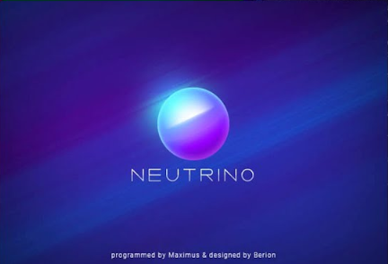](https://github.com/rickgaiser/neutrino)

    Neutrino is a small, fast and modular PS2 device emulator. A frontend such as NHDDL, PS2BBN DEP, OSD-XMB, XEB+ or PS2 Link is needed. 

    Supports: MBR/GPT Fat32/ExFat USB, APA HDD, Exfat HDD, UDPBD, MMCE, MX4SIO

    This app cannot be packaged as a PSU due to subfolders. 

    [:material-file-document: Documentation](https://github.com/rickgaiser/neutrino)

    [:material-cloud-download: Neutrino](/docs/assets/NON-SAS/NEUTRINO.zip)

-   __XEB+__

    ---

    

    Fully Lua Scripted dashboard experience that is extensable. Download and extract to [XEB+ USB folder](/docs/assets/NON-SAS/XEBPLUS.zip).

    This app cannot be packaged as a PSU due to subfolders and licensing.

    [:material-cloud-download: XEB+](https://www.psx-place.com/threads/xtremeeliteboot-s-dashboard-special-xmas-showcase.38959/)

    [XEB+ Neutrino Loader plugin by Sync On Luma](https://github.com/sync-on-luma/xebplus-neutrino-loader-plugin)

    [:material-cloud-download: XEB+ USB folder](/docs/assets/NON-SAS/XEBPLUS.zip)

-   __Unnofficial OPL__

    ---

    

    KrahJohnlitos last ditch attempt to make OPL great again! 

    Fat32/ExFat USB, APA HDD, Exfat HDD, APA Jail, UDPBD, MMCE, MX4SIO and Neutrino frontend.

    [:material-cloud-download: uOPL](/docs/assets/SAVE-APPLICATION-SYSTEM/APP_UOPL.psu)

    [:material-cloud-download: uOPL Betrayal](/docs/assets/SAVE-APPLICATION-SYSTEM/APP_UOPL-BETRAYAL.psu)

## Utilities

-   __Apollo Save Tool__

    ---

    [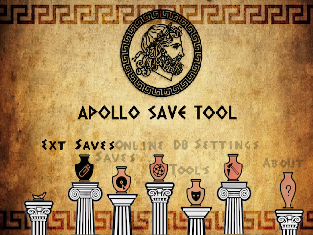](https://github.com/bucanero/apollo-ps2)

    Save file manager

    [:material-cloud-download: Apollo](/docs/assets/SAVE-APPLICATION-SYSTEM/APP_APOLLO.psu)

-   __Argon__

    ---

    [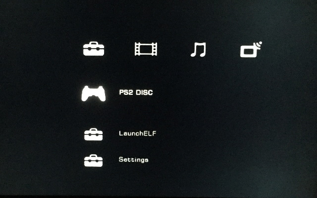](http://sourceforge.net/projects/argon-ps2/)

    SMS based video player with XMB GUI

    [:material-cloud-download: Argon](/docs/assets/SAVE-APPLICATION-SYSTEM/APP_ARGON.psu)

-   __Graphics Synthesizer Mode (GSM)__

    ---

    [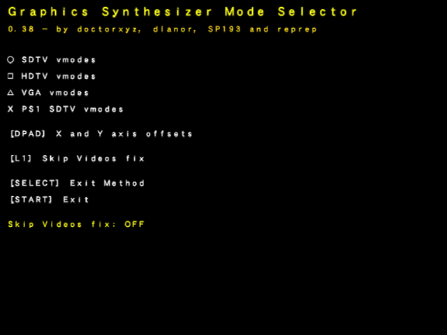](https://www.psx-place.com/resources/graphics-synthesizer-mode-selector-gsm.678/)

    Hooks into software to output different video modes. Caution: does break apps/games.

    [:material-cloud-download: GSM](/docs/assets/SAVE-APPLICATION-SYSTEM/APP_GSM.psu)

-   __Simple Media System (SMS)__

    ---

    

    Video Player

    [:material-cloud-download: SMS](/docs/assets/SAVE-APPLICATION-SYSTEM/APP_SMS.psu)

-   __wLaunch ELF (El Isra's Fork)__

    ---

    [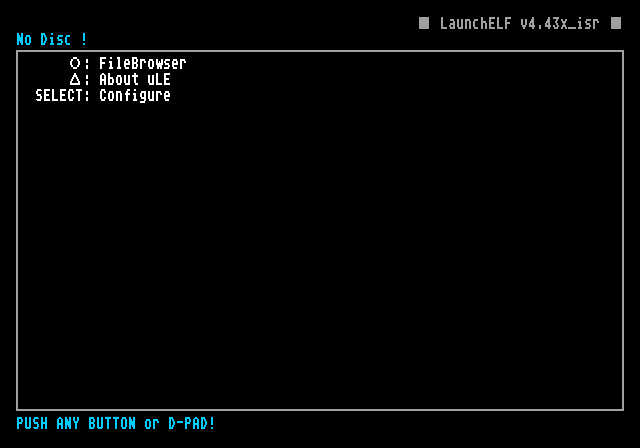](https://github.com/israpps/wLaunchELF_ISR)

    File manager with support for multiple devices.

    [:material-cloud-download: wLE ISR ExFat USB](/docs/assets/SAVE-APPLICATION-SYSTEM/APP_WLE-ISR-XF.psu)

    [:material-cloud-download: wLE ISR ExFat USB / MMCE](/docs/assets/SAVE-APPLICATION-SYSTEM/APP_WLE-ISR-XF-MM.psu)

    [:material-cloud-download: wLE ISR ExFat USB / MX4SIO](/docs/assets/SAVE-APPLICATION-SYSTEM/APP_WLE-ISR-XF-MX.psu)

    [:material-cloud-download: wLE ISR HDD](/docs/assets/SAVE-APPLICATION-SYSTEM/APP_WLE-ISR-HDD.psu)

-   __wLaunch Elf (krHACKen's Fork)__

    ---

    

    Launch PS1 VCDs via wLE!

    [:material-cloud-download: wLE KHN](/docs/assets/SAVE-APPLICATION-SYSTEM/APP_WLE-KHN.psu)

-   __PS2 Link__

    ---

    [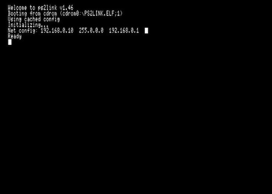](https://github.com/ps2dev/ps2link)

    Run apps over network, useful for debugging.

    [:material-cloud-download: PS2 Link](/docs/assets/SAVE-APPLICATION-SYSTEM/DBG_PS2LINK.psu)

    [:material-cloud-download: PS2 Link HighMem Loading](/docs/assets/SAVE-APPLICATION-SYSTEM/DBG_PS2LINK-HILDING.psu)

-   __Memory Card Annihilator__

    ---

    [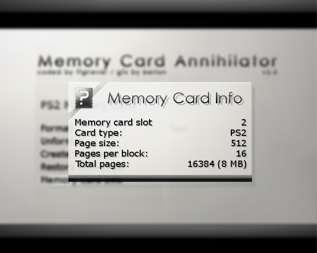](https://github.com/ffgriever-pl/Memory-Card-Annihilator)

    Format, Backup and Restore your normal memory cards.

    [:material-cloud-download: Memory Card Annihilator](/docs/assets/SAVE-APPLICATION-SYSTEM/DST_MCA.psu)

-   __PowerOff PS2 / Restart PS2__

    ---

    [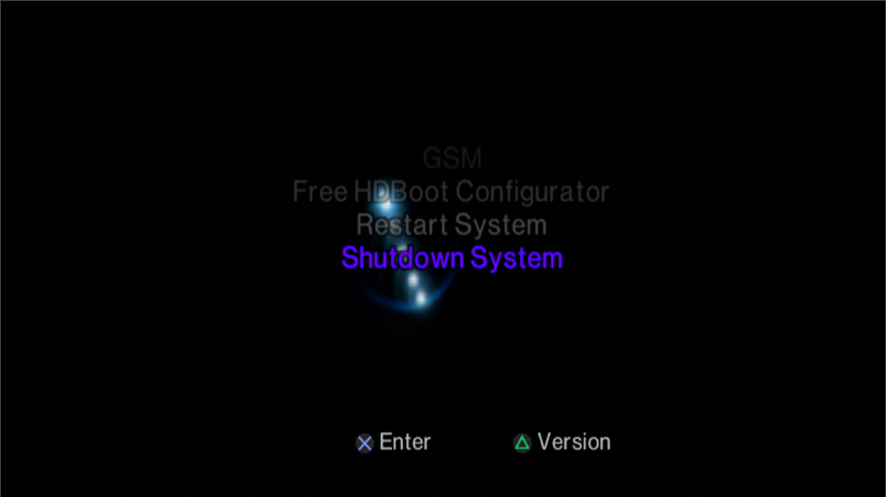](https://www.psx-place.com/resources/power-off-power-off-elf.349/)

    PowerOff or Restart the PS2.

    [:material-cloud-download: Memory Card Annihilator](/docs/assets/SAVE-APPLICATION-SYSTEM/POWEROFF.psu)

    [:material-cloud-download: Reboot](/docs/assets/SAVE-APPLICATION-SYSTEM/RESTART.psu)

## Emulators

-   __DKWDRV__

    ---

    

    Replacement for the Sony PS1DRV

    [:material-cloud-download: DKWDRV](/docs/assets/SAVE-APPLICATION-SYSTEM/PS1_DKWDRV.psu)

-   __POPSLoader__

    ---

    [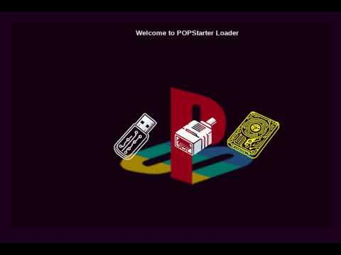](https://www.psx-place.com/resources/popsloader.1396/)

    Customizable POPStarter launcher.

    [:material-cloud-download: POPSLoader](/docs/assets/SAVE-APPLICATION-SYSTEM/PS1_POPSLOADER.psu)

-   __PicoDrive__

    ---

    

    A port of PicoDrive for the PS2

    [:material-cloud-download: PicoDrive](/docs/assets/SAVE-APPLICATION-SYSTEM/EMU_PICODRIVE.psu)

-   __Xbox 2 Playstation Emulator__

    ---

    [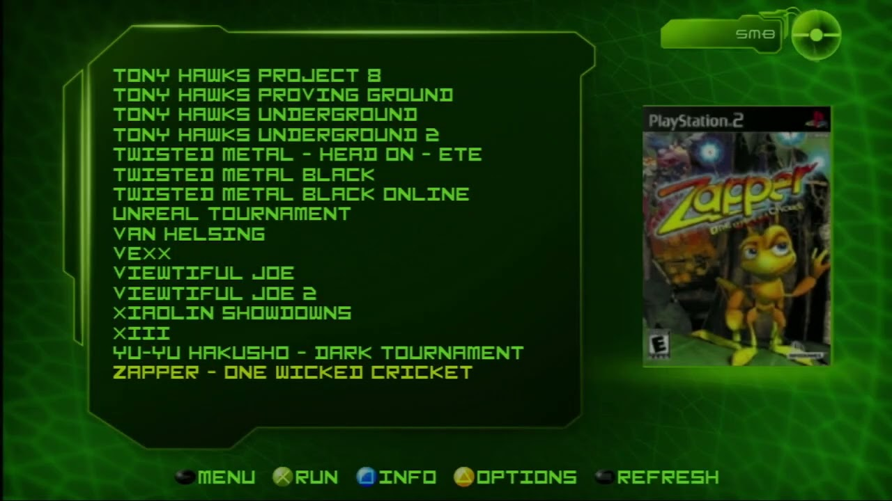](https://github.com/koraxial/Xbox-2-PlayStation-Emulator-AlFa)

    Original Xbox Emulator for the PS2 based off OPL 1.2.0 2081. Note: this was an April Fools joke but is a fully functional theme

    [:material-cloud-download: XB2PS2](/docs/assets/SAVE-APPLICATION-SYSTEM/EMU_X2P.psu)

    [:material-cloud-download: XB2PS2 Lite](/docs/assets/SAVE-APPLICATION-SYSTEM/EMU_X2PMC.psu)

## Diagnostic Service Tools

-   __[HDD Tester](https://github.com/GrimBrew/PS2HDDTester)__

    ---

    

    Speed test tool for internal HDD/SSD

    [:material-cloud-download: HDD Tester](/docs/assets/SAVE-APPLICATION-SYSTEM/DST_HDDTESTER.psu)

-   __[Pad Test](https://www.psx-place.com/resources/ps2-controller-tester-by-jbit.670/)__

    ---

    

    Test your controller(s)

    [:material-cloud-download: Pad Test](/docs/assets/SAVE-APPLICATION-SYSTEM/DST_PADTEST.psu)

-   __[PS2 Temps](https://www.psx-place.com/threads/ps2temps.27864/)__

    ---

    

    Show your consoles temperature, SCPH-50K and later.

    [:material-cloud-download: PS2 Temps](/docs/assets/SAVE-APPLICATION-SYSTEM/DST_PS2TEMPS.psu)

-   __[Mechacon Crash Tester](https://github.com/israpps/MechaconCrashTestAPP)__

    ---

    

    Test for SCPH-37K to SCPH-70K to inform if a PICFIX is needed to save lazer upon DSP crash.

    [:material-cloud-download: Mechacon Crash Tester](/docs/assets/SAVE-APPLICATION-SYSTEM/DST_MECHACON-CRASH-TESTER.psu)

## Games

-   __Hermes__

    ---

    [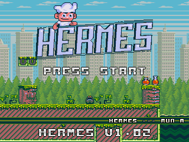](https://www.retroguru.com/hermes/)

    A game by Retroguru

    [:material-cloud-download: Hermes](/docs/assets/SAVE-APPLICATION-SYSTEM/GME_HERMES.psu)

