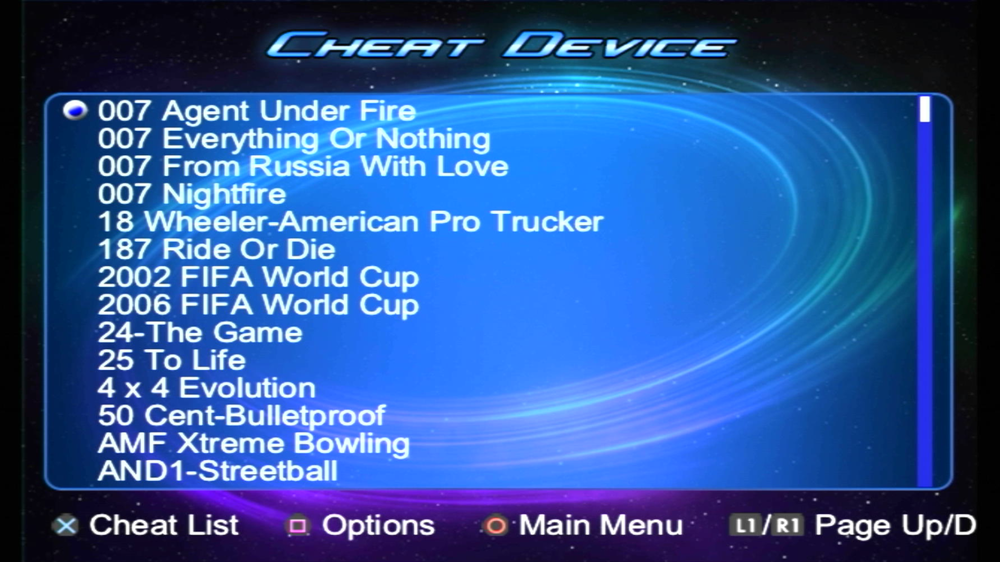
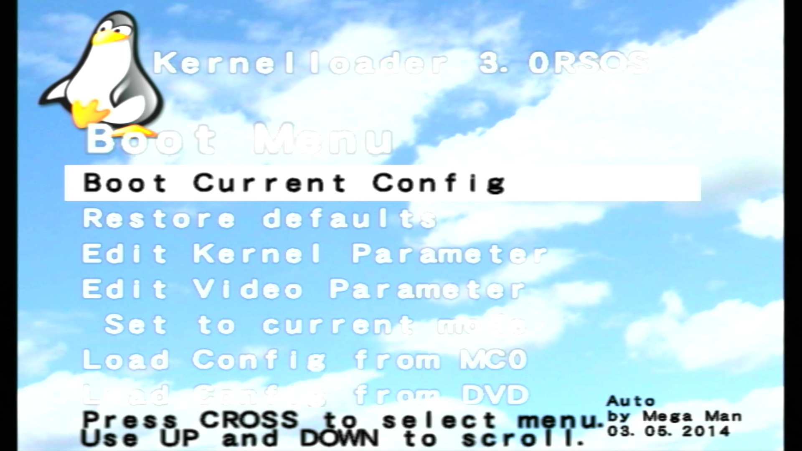
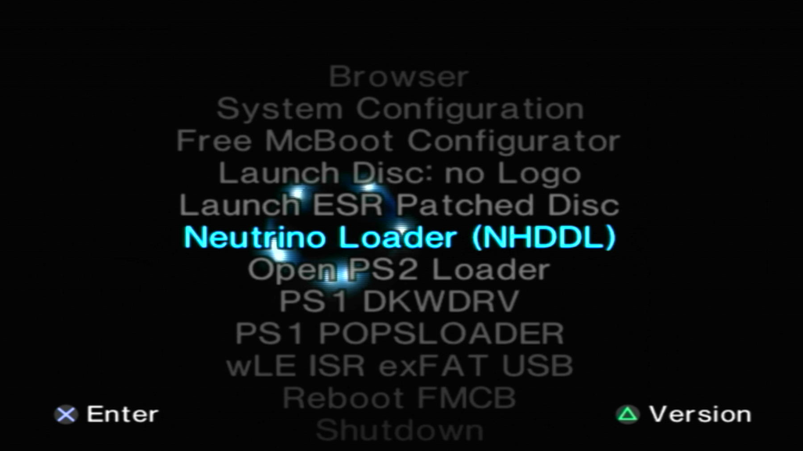
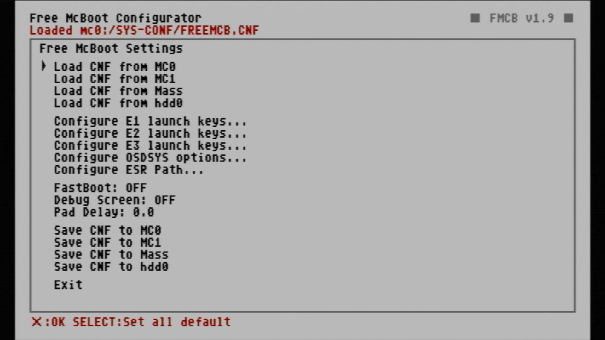

# Applications

## Common Homebrew Apps

-   __Apollo Save Tool__![sas-psu_pic][SAS-PSU]{ width="75" }

    ---

    

    Save file manager

    [:material-cloud-download: Apollo](https://downloads.ps2homebrewstore.com/SAS/APP_APOLLO.psu)

-   __Argon__![sas-psu_pic][SAS-PSU]{ width="75" }

    ---

    

    SMS based video player with XMB GUI

    [:material-cloud-download: Argon](https://downloads.ps2homebrewstore.com/SAS/APP_ARGON.psu)

-   __Cheat Device__![not-sas_pic][non-sas-zip]{ width="75" }

    ---
    
    

    Cheat Device is a game enhancer for PS2 games similar to Action Replay, GameShark, and CodeBreaker which supports booting discs and homebrew.

    [:material-cloud-download: Cheat Device PS2BBL Forwarder](https://downloads.ps2homebrewstore.com/SAS/APP_CHEATDEVICE-PS2BBL.psu)  
    PSU Paste to MemCard root

    [:material-cloud-download: Cheat Device USB](https://downloads.ps2homebrewstore.com/NON-SAS/APP_CHEATDEVICE-USB.psu)  
    Extract zip to `usb:/APPS/`

    [:material-cloud-download: Cheat Device MMCE](https://downloads.ps2homebrewstore.com/NON-SAS/APP_CHEATDEVICE-MMCE.psu)  
    Extract zip to `mmce?:/APPS/`

-   __ESR Launcher__![sas-psu_pic][sas-psu]{ width="75" }

    ---

    Incoming....broken link for now

    [:material-cloud-download: ESR Launcher](https://downloads.ps2homebrewstore.com/SAS/APP_ESR-LAUNCHER.psu)  

-   __Graphics Synthesizer Mode__![sas-psu_pic][sas-psu]{ width="75" }

    ---

    

    Hooks into software to output different video modes. Caution: does break apps/games.

    [:material-cloud-download: GSM](https://downloads.ps2homebrewstore.com/SAS/APP_GSM.psu)

-   __Kernel Loader__![sas-psu_pic][sas-psu]{ width="75" }

    ---

    

    Kernelloader is a bootloader for PS2 Linux and other PS2 operating systems.

    [:material-cloud-download: Kernel Loader](https://downloads.ps2homebrewstore.com/SAS/RTE_KERNELLDR3/psu)

-   __Simple Media System (SMS)__![sas-psu_pic][sas-psu]{ width="75" }

    ---

    

    Video Player

    [:material-cloud-download: SMS](https://downloads.ps2homebrewstore.com/SAS/APP_SMS.psu)

-   __wLaunch ELF (El Isra's Fork)__![sas-psu_pic][sas-zip]{ width="75" }

    ---

    

    File manager with support for multiple devices.  

    __RECOMMENDED__

    __XF__ - exFAT USB  
    __MM__ - MMCE  
    __MX__ - MX4SIO  
    __DS__ - DualShock 3/4 Wired  
    __NN__ - No-Network  

    [:material-cloud-download: wLE ISR Combined Download][WLE-ISR-COMBINED]

    [WLE-ISR-COMBINED]: https://downloads.ps2homebrewstore.com/SAS/APP_WLE-ISR-COMMON.zip

-   __wLE HDD Header Injection__![sas-psu_pic][sas-psu]{ width="75" }

    ---

    

    THIS MOD IS INTENDED ONLY FOR APA HEADER INJECTIONS (HDD MANAGER)

    [:material-cloud-download: wLE ISR HDD][WLE-ISR-HDD]

    [:material-cloud-download: wLE ISR HDD No-Network][WLE-ISR-HDD-NN]

    [:octicons-link-external-16: Header Samples][HDD-HEADER-SAMPLES]

    [WLE-ISR-HDD]: https://downloads.ps2homebrewstore.com/SAS/APP_WLE-ISR-HDD.psu
    [WLE-ISR-HDD-NN]: https://downloads.ps2homebrewstore.com/SAS/APP_WLE-ISR-HDD-NN.psu
    [HDD-HEADER-SAMPLES]: https://github.com/israpps/wLaunchELF_ISR_HDD/releases/download/latest/ULE-HEADER_SAMPLES.zip

-   __wLaunch Elf (krHACKen's Fork)__![sas-psu_pic][sas-psu]{ width="75" }

    ---

    

    Launch PS1 VCDs via wLE and allows system partitions that start with double underscores to be managed IE `hdd0:/__system`

    [:material-cloud-download: wLE KHN](https://downloads.ps2homebrewstore.com/SAS/APP_WLE-KHN.psu)

-   __wLE PSX XFW & DVR__![sas-psu_pic][sas-psu]{ width="75" }

    ---

    

    wLE fork for PSX allowing reading of `xfrom0:/`  
    [:material-cloud-download: wLE XFW](https://downloads.ps2homebrewstore.com/SAS/APP_WLE-XFW.psu)

    wLE fork for PSX allowing browsing and modifying of `hdd0_dvr:/__xdata` and `hdd0_dvr:/__xcontents`  
    [:material-cloud-download: wLE DVR](https://downloads.ps2homebrewstore.com/SAS/APP_WLE-DVR.psu)

-   __uLaunchElf 4.42d__![sas-psu_pic][sas-psu]{ width="75" }

    ---

    

    The original uLaunchElf file manager and ELF launcher from EP and Dlanor. 

    [:material-cloud-download: uLaunchELF 4.42d](https://downloads.ps2homebrewstore.com/SAS/APP_ULE.psu)

-   __PS2 Link__![sas-psu_pic][sas-psu]{ width="75" }

    ---

    

    Run apps over network, useful for debugging.

    [:material-cloud-download: PS2 Link](https://downloads.ps2homebrewstore.com/SAS/DBG_PS2LINK.psu)

    [:material-cloud-download: PS2 Link HighMem Loading](https://downloads.ps2homebrewstore.com/SAS/DBG_PS2LINK-HILDING.psu)

-   __Memory Card Annihilator__![sas-psu_pic][sas-psu]{ width="75" }

    ---

    

    Format, Backup and Restore your normal memory cards.

    [:material-cloud-download: Memory Card Annihilator](https://downloads.ps2homebrewstore.com/SAS/DST_MCA.psu)

-   __PowerOff PS2__![sas-psu_pic][sas-psu]{ width="75" }

    ---

    

    Turn off the PS2 console.

    [:material-cloud-download: PowerOff](https://downloads.ps2homebrewstore.com/SAS/POWEROFF.psu)

-   __Reboot PS2__![sas-psu_pic][sas-psu]{ width="75" }

    ---

    

    Reboot the PS2.

    [:material-cloud-download: Reboot](https://downloads.ps2homebrewstore.com/SAS/RESTART.psu)

## System Apps

-   __OSDMenu__![sas-psu_pic][sas-psu]{ width="75" }

    ---

    

    Hacked OSDSYS like FMCB, however can launch apps from memcard browser as well.

    Supports FAT32/exFAT USB, APA/exFAT HDD, MMCE, MX4SIO, MemCard, i.Link, UDPBD, CDROM. 
    
    Edit `mc?:/SYS-CONF/OSDMENU.CFG` as needed. OSDMenu does not check paths, so everything in config file will be listed.

    [:material-cloud-download: OSDMenu](https://downloads.ps2homebrewstore.com/SAS/SYS_OSDMENU.psu)

-   __FreeMCBoot Decrypted__![sas-psu_pic][sas-psu]{ width="75" }

    ---

    

    The Hacked OSDSYS that everyone knows, but is non-extensible and not open-source.
    Supports FAT32/exFAT USB, MemCard, CDROM.

    Edit `mc?:/SYS-CONF/FREEMCB.CNF` as needed or use the FreeMCBoot Configurator app.

    [:material-cloud-download: FMCBD 1.966](https://downloads.ps2homebrewstore.com/SAS/SYS_FMCBD-1966.psu)

    [:material-cloud-download: FMCBD 1.965](https://downloads.ps2homebrewstore.com/SAS/SYS_FMCBD-1965.psu)

    [:material-cloud-download: FMCBD 1.953](https://downloads.ps2homebrewstore.com/SAS/SYS_FMCBD-1953.psu)

    [:material-cloud-download: FMCBD 1.8C](https://downloads.ps2homebrewstore.com/SAS/SYS_FMCBD-18C.psu)

-   __FreeMCBoot Configurator__![sas-psu_pic][sas-psu]{ width="75" }

    ---

    

    GUI to modify the FreeMCBoot config file.

    [:material-cloud-download: FMCB Configurator](https://downloads.ps2homebrewstore.com/SAS/SYS_FMCB-CFG.psu)

## Run Time Environments

-   __Athena__![non-sas-ext_pic][non-sas-ext]{ width="75" }

    ---

    

    Make your own PS2 Homebrew with a Javascript interpreter

    [:octicons-link-external-16: Athena](https://github.com/DanielSant0s/AthenaEnv)

-   __Enceladus__![non-sas-ext_pic][non-sas-ext]{ width="75" }

    ---

    

    Make your own PS2 Homebrew with a Lua interpreter

    [:octicons-link-external-16: Enceladus](https://github.com/DanielSant0s/Enceladus)

[sas-psu]: ../assets/badges/SASPSU.png
[sas-zip]: ../assets/badges/SASZIP.png
[sas-7z]: ../assets/badges/SAS7Z.png
[sas-7zip]: ../assets/badges/SAS7ZIP.png
[sas-rar]: ../assets/badges/SASRAR.png
[sas-ext]: ../assets/badges/SASEXTLINK.png

[non-sas-psu]: ../assets/badges/NOTSASCOMPLIANTPSU.png
[non-sas-zip]: ../assets/badges/NOTSASCOMPLIANTZIP.png
[non-sas-7z]: ../assets/badges/NOTSASCOMPLIANT7Z.png
[non-sas-7zip]: ../assets/badges/NOTSASCOMPLIANT7ZIP.png
[non-sas-rar]: ../assets/badges/NOTSASCOMPLIANTRAR.png
[non-sas-ext]: ../assets/badges/NOTSASCOMPLIANTEXTLINK.png

[umcs-psu]: ../assets/badges/UMCSPSU.png
[umcs-zip]: ../assets/badges/UMCS7ZIP.png
[umcs-7z:]: ../assets/badges/UMCS7Z.png
[umcs-7zip]: ../assets/badges/UMCS7ZIP.png
[umcs-rar]: ../assets/badges/UMCSRAR.png
[umcs-ext]: ../assets/badges/UMCSEXTLINK.png