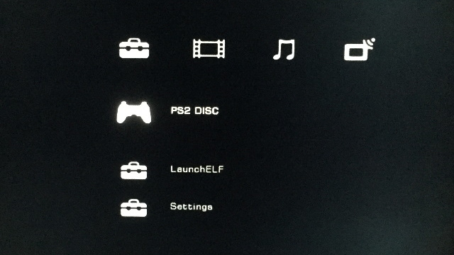
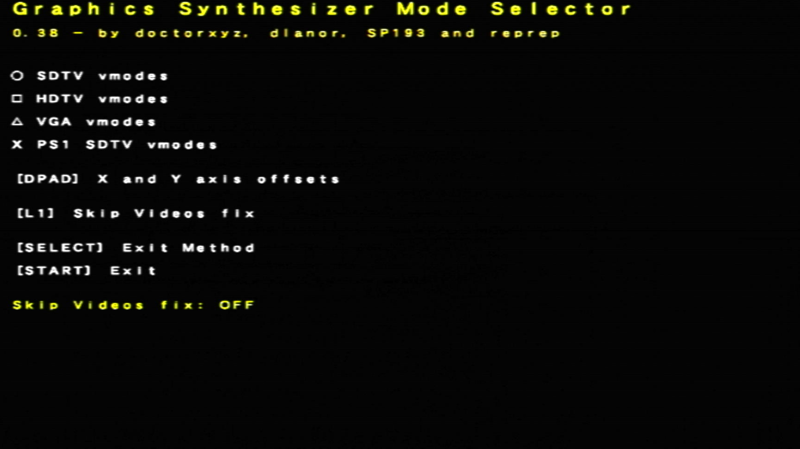
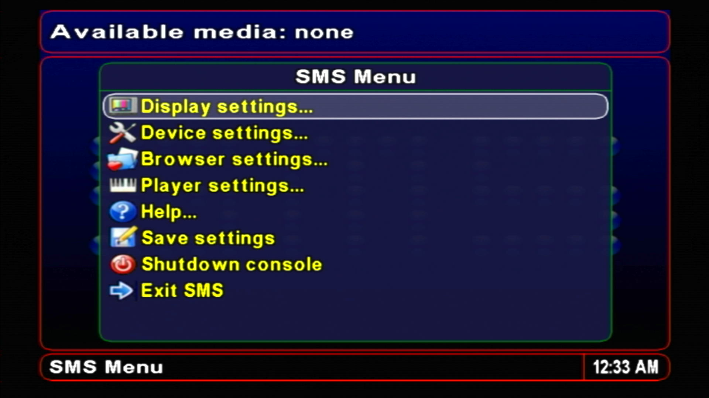
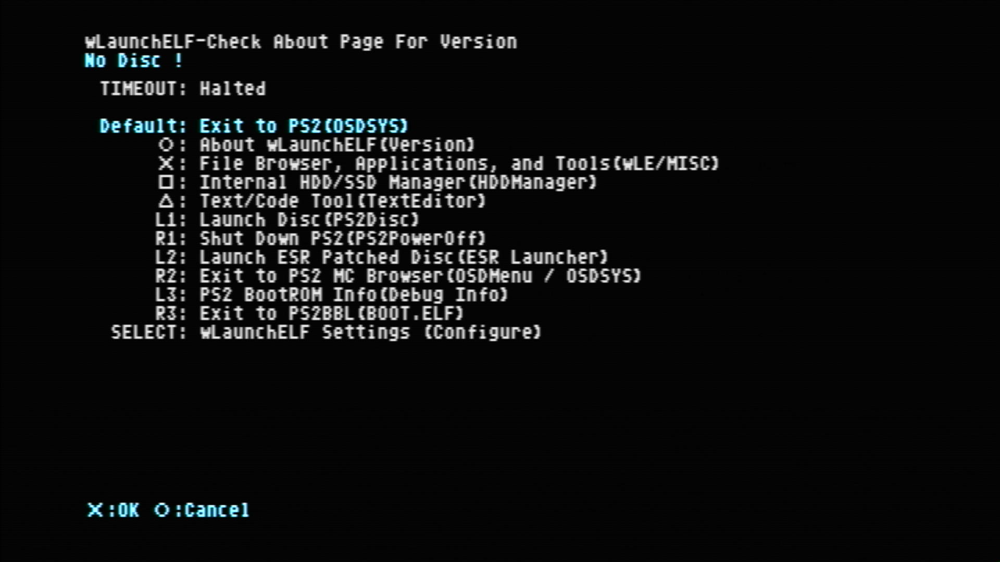
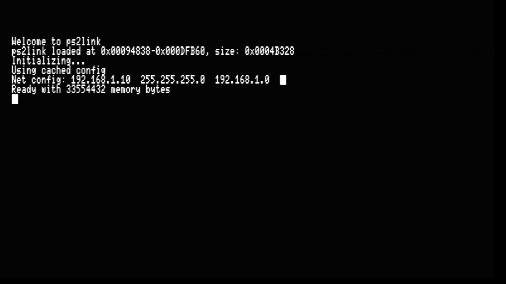
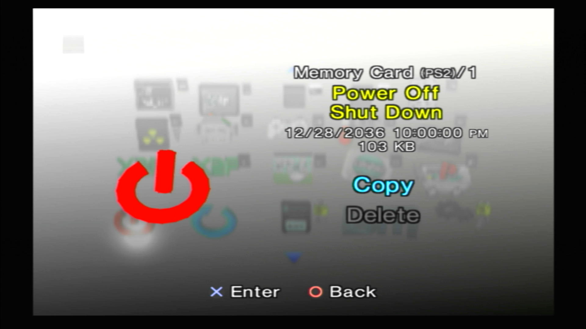
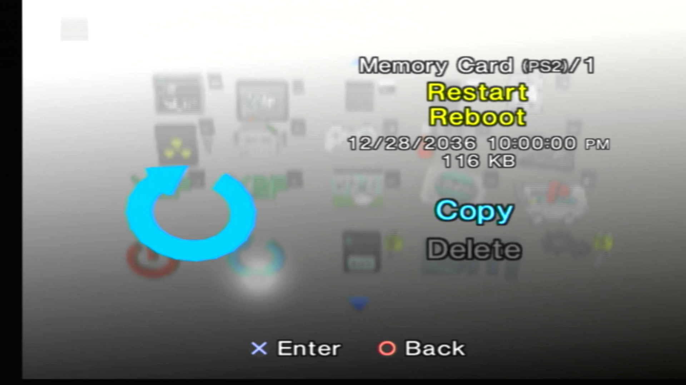

---
hide:
  - navigation
  - toc
---

# Applications

-   __Apollo Save Tool__{ width="75" align=right }

    ---

    

    Save file manager

    [:material-cloud-download: Apollo](../assets/SAVE-APPLICATION-SYSTEM/APP_APOLLO.psu)

-   __Argon__{ width="75" align=right }

    ---

    

    SMS based video player with XMB GUI

    [:material-cloud-download: Argon](../assets/SAVE-APPLICATION-SYSTEM/APP_ARGON.psu)

-   __Graphics Synthesizer Mode (GSM)__{ width="75" align=right }

    ---

    

    Hooks into software to output different video modes. Caution: does break apps/games.

    [:material-cloud-download: GSM](../assets/SAVE-APPLICATION-SYSTEM/APP_GSM.psu)

-   __Simple Media System (SMS)__{ width="75" align=right }

    ---

    

    Video Player

    [:material-cloud-download: SMS](../assets/SAVE-APPLICATION-SYSTEM/APP_SMS.psu)

-   __wLaunch ELF (El Isra's Fork)__{ width="75" align=right }

    ---

    

    File manager with support for multiple devices.

    [:material-cloud-download: wLE ISR ExFat USB](../assets/SAVE-APPLICATION-SYSTEM/APP_WLE-ISR-XF.psu)

    [:material-cloud-download: wLE ISR ExFat USB / MMCE](../assets/SAVE-APPLICATION-SYSTEM/APP_WLE-ISR-XF-MM.psu)

    [:material-cloud-download: wLE ISR ExFat USB / MX4SIO](../assets/SAVE-APPLICATION-SYSTEM/APP_WLE-ISR-XF-MX.psu)

    [:material-cloud-download: wLE ISR HDD](../assets/SAVE-APPLICATION-SYSTEM/APP_WLE-ISR-HDD.psu) Used for [:material-file-document: header injection](https://www.psx-place.com/threads/wlaunchelf-isr_hdd.34075/)

-   __wLaunch Elf (krHACKen's Fork)__{ width="75" align=right }

    ---

    

    Launch PS1 VCDs via wLE and allows system partitions that start with double underscores to be managed IE __system

    [:material-cloud-download: wLE KHN](../assets/SAVE-APPLICATION-SYSTEM/APP_WLE-KHN.psu)

-   __PS2 Link__{ width="75" align=right }

    ---

    

    Run apps over network, useful for debugging.

    [:material-cloud-download: PS2 Link](../assets/SAVE-APPLICATION-SYSTEM/DBG_PS2LINK.psu)

    [:material-cloud-download: PS2 Link HighMem Loading](../assets/SAVE-APPLICATION-SYSTEM/DBG_PS2LINK-HILDING.psu)

-   __Memory Card Annihilator__{ width="75" align=right }

    ---

    

    Format, Backup and Restore your normal memory cards.

    [:material-cloud-download: Memory Card Annihilator](../assets/SAVE-APPLICATION-SYSTEM/DST_MCA.psu)

-   __PowerOff PS2__{ width="75" align=right }

    ---

    

    Turn off the PS2 console.

    [:material-cloud-download: PowerOff](../assets/SAVE-APPLICATION-SYSTEM/POWEROFF.psu)

-   __Reboot PS2__{ width="75" align=right }

    ---

    

    Reboot the PS2.

    [:material-cloud-download: Reboot](../assets/SAVE-APPLICATION-SYSTEM/RESTART.psu)

