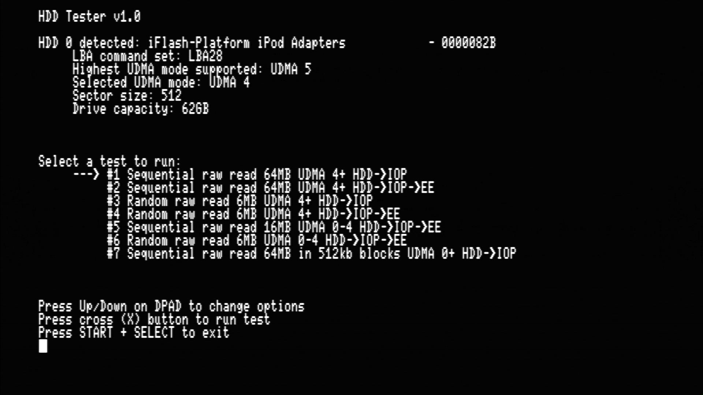
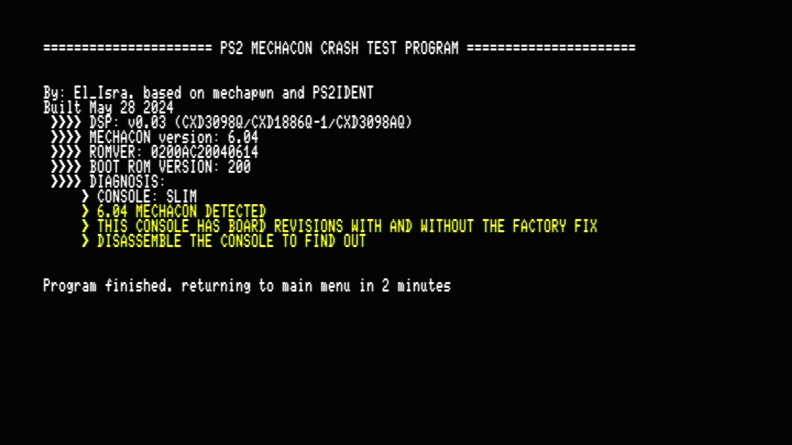
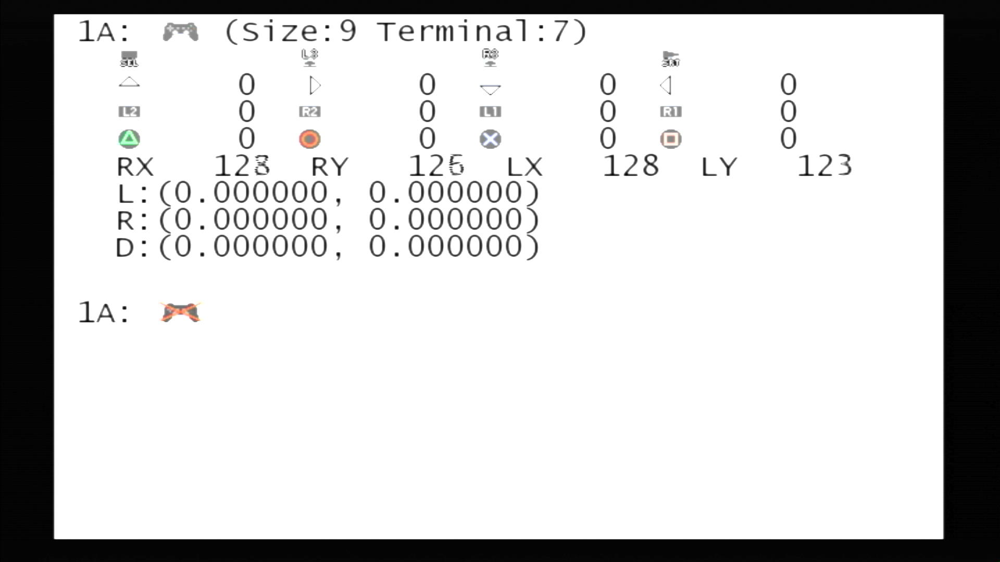
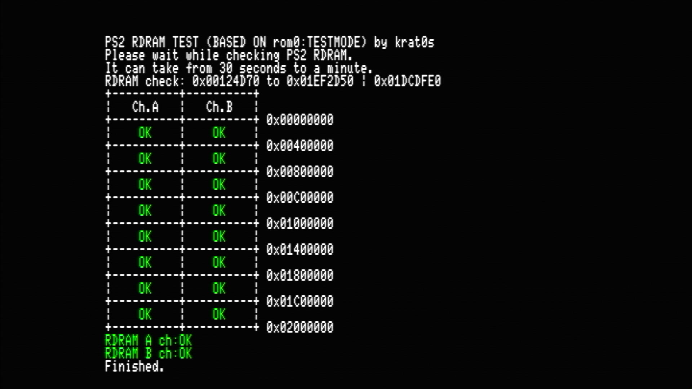
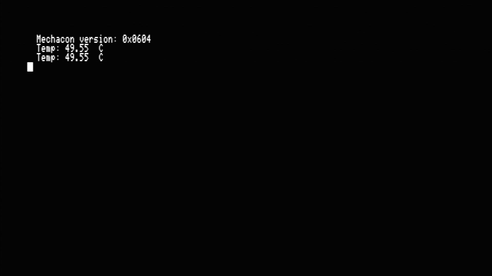
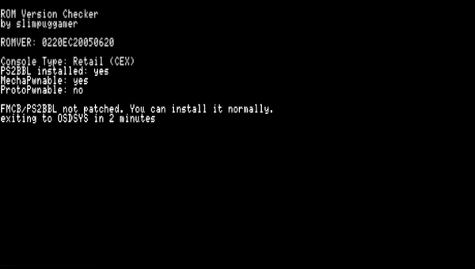

---
hide:
  - navigation
  - toc
---

# Diagnostic Service Tools

-   __[:material-cloud-download:](/docs/assets/SAVE-APPLICATION-SYSTEM/DST_HDDTESTER.psu) HDD Tester__

    ---

    

    Speed test tool for internal HDD/SSD

    [:material-cloud-download: HDD Tester](/docs/assets/SAVE-APPLICATION-SYSTEM/DST_HDDTESTER.psu)

-   __Mechacon Crash Tester__

    ---

    

    Test for SCPH-37K to SCPH-70K to inform if a [PICFIX](https://ps2modchiptutorials.com/misc/picfix/) or PICFIXv2 is needed to save lazer upon DSP crash.

    [:material-cloud-download: Mechacon Crash Tester](/docs/assets/SAVE-APPLICATION-SYSTEM/DST_MECHACON-CRASH-TESTER.psu)

-   __Pad Test__

    ---

    

    Test your controller(s)

    [:material-cloud-download: Pad Test](/docs/assets/SAVE-APPLICATION-SYSTEM/DST_PADTEST.psu)

-   __PS2 RDRAM Test__

    ---

    

    Test a PS2's RDRAM for faults.

    [:material-cloud-download: PS2 RDRAM Test](/docs/assets/SAVE-APPLICATION-SYSTEM/DST_PS2-RDRAMTEST.psu)

-   __PS2 Temps__

    ---

    

    Show your consoles temperature, SCPH-50K and later.

    [:material-cloud-download: PS2 Temps](/docs/assets/SAVE-APPLICATION-SYSTEM/DST_PS2TEMPS.psu)

-   __ROM Version Checker__

    ---

    

    Check if a PS2 supports: System Updates, MechaPwn, ProtoPwn

    INCOMING...[:material-cloud-download: ROM Version Check]()

