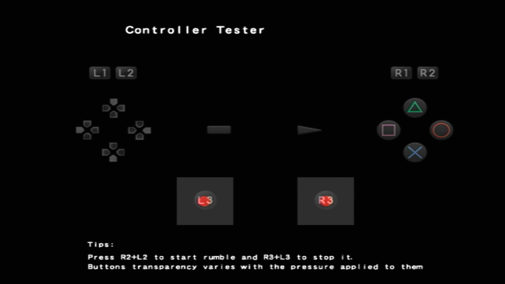
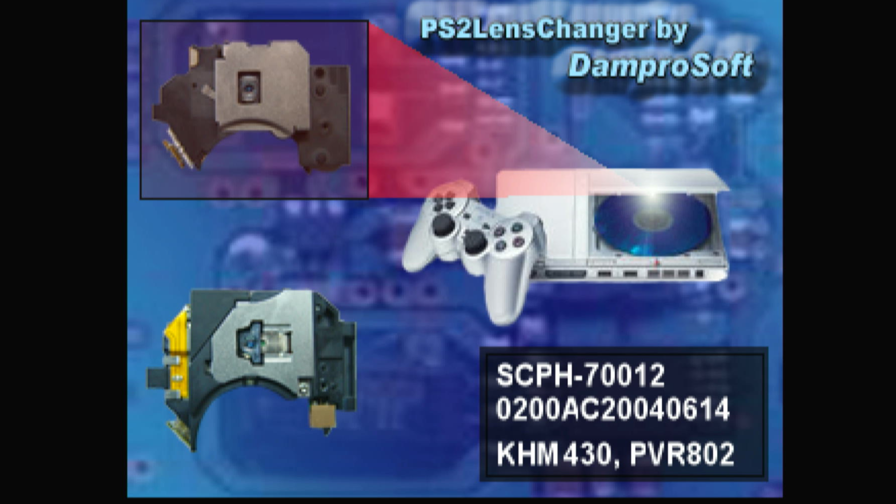
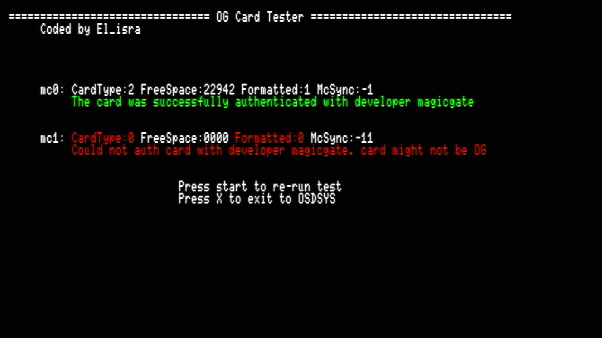
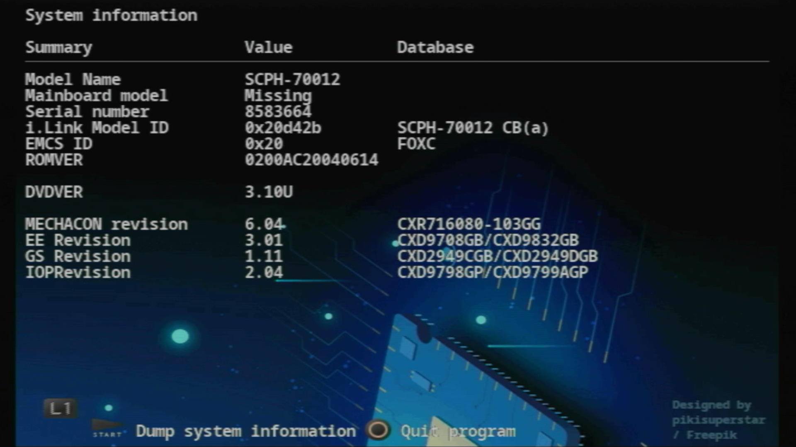

# Diagnostic Service Tools

-   __HDD Tester__![sas-psu_pic][sas-psu]{ width="75" }

    ---

    {:target="_blank"}

    Speed test tool for internal HDD/SSD

    [:material-cloud-download: HDD Tester](https://downloads.ps2homebrewstore.com/SAS/DST_HDDTESTER.psu)

-   __Mechacon Crash Tester__![sas-psu_pic][sas-psu]{ width="75" }

    ---

    {:target="_blank"}

    Test for SCPH-37K to SCPH-70K to inform if a [PICFIX](https://ps2modchiptutorials.com/misc/picfix/) or PICFIXv2 is needed to save lazer upon DSP crash.

    [:material-cloud-download: Mechacon Crash Tester](https://downloads.ps2homebrewstore.com/SAS/DST_MECHACON-CRASH-TESTER.psu)

-   __Pad Test__![sas-psu_pic][sas-psu]{ width="75" }

    ---

    {:target="_blank"}

    Test your controller(s)

    [:material-cloud-download: Pad Test](https://downloads.ps2homebrewstore.com/SAS/DST_PADTEST.psu)

-   __Controller Test__![non-sas-zip_pic][non-sas-zip]{ width="75" }

    ---

    {:target="_blank"}

    Nice gui to test your controller

    [:material-cloud-download: Pad Test](https://downloads.ps2homebrewstore.com/NON-SAS/DST_CONTROLLER.zip)  
    Extract zip to `mass:/APPS/`

-   __LensChanger__![sas-psu_pic][sas-psu]{ width="75" }

    ---

    {:target="_blank"}

    When swapping different laser types, this will apply default laser configuration for the laser you are installing. 

    NOTE: Recommend [PMAP Tune](https://github.com/ps2homebrew/PMAP){ target="blank" } instead if possible!

    [:material-cloud-download: LensChanger](https://downloads.ps2homebrewstore.com/SAS/DST_LENSCHANGER.psu)  

-   __Original MemCard Test__![sas-psu][sas-psu]{ width="75" }

    ---

    {:target="_blank"}

    Test that attempts to determine if your card is original and passess the correct MagicGate tests.

    [:material-cloud-download: Original MemCard Test](https://downloads.ps2homebrewstore.com/SAS/DST_OG-CARD-TEST.psu)  

-   __PS2Ident__![sas-psu_pic][sas-psu]{ width="75" }

    ---

    {:target="_blank"}

    Dumps PS2 ROM and MECHACON NVRAM and gathers data from the console for research purposes.

    [:material-cloud-download: PS2Ident](https://downloads.ps2homebrewstore.com/SAS/DST_PS2IDENT.psu)

-   __PS2 RDRAM Test__![sas-psu_pic][sas-psu]{ width="75" }

    ---

    {:target="_blank"}

    Test a PS2's RDRAM for faults.

    [:material-cloud-download: PS2 RDRAM Test](https://downloads.ps2homebrewstore.com/SAS/DST_PS2-RDRAMTEST.psu)

-   __PS2 Temps__![sas-psu_pic][sas-psu]{ width="75" }

    ---

    {:target="_blank"}

    Show your consoles temperature, SCPH-50K and later.

    [:material-cloud-download: PS2 Temps](https://downloads.ps2homebrewstore.com/SAS/DST_PS2TEMPS.psu)

-   __ROM Version Checker__![sas-psu_pic][sas-psu]{ width="75" }

    ---

    {:target="_blank"}

    Check if a PS2 supports: System Updates, MechaPwn, ProtoPwn

    [:material-cloud-download: ROM Version Checker](https://downloads.ps2homebrewstore.com/SAS/DST_ROMVERCHK.psu)

[sas-psu]: ../assets/badges/SASPSU.png
[sas-zip]: ../assets/badges/SASZIP.png
[sas-7z]: ../assets/badges/SAS7Z.png
[sas-7zip]: ../assets/badges/SAS7ZIP.png
[sas-rar]: ../assets/badges/SASRAR.png
[sas-ext]: ../assets/badges/SASEXTLINK.png

[non-sas-psu]: ../assets/badges/NOTSASCOMPLIANTPSU.png
[non-sas-zip]: ../assets/badges/NOTSASCOMPLIANTZIP.png
[non-sas-7z]: ../assets/badges/NOTSASCOMPLIANT7Z.png
[non-sas-7zip]: ../assets/badges/NOTSASCOMPLIANT7ZIP.png
[non-sas-rar]: ../assets/badges/NOTSASCOMPLIANTRAR.png
[non-sas-ext]: ../assets/badges/NOTSASCOMPLIANTEXTLINK.png

[umcs-psu]: ../assets/badges/UMCSPSU.png
[umcs-zip]: ../assets/badges/UMCS7ZIP.png
[umcs-7z:]: ../assets/badges/UMCS7Z.png
[umcs-7zip]: ../assets/badges/UMCS7ZIP.png
[umcs-rar]: ../assets/badges/UMCSRAR.png
[umcs-ext]: ../assets/badges/UMCSEXTLINK.png