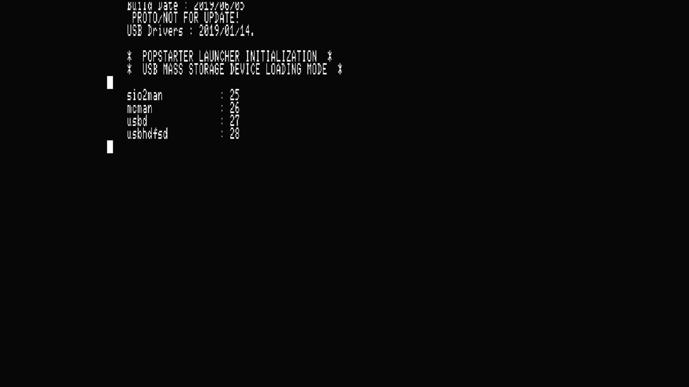
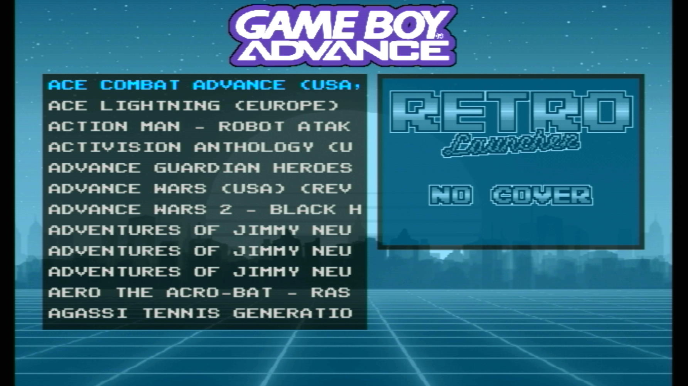

# Emulators

-   __DKWDRV__![sas-psu_pic][sas-psu]{ width="75" }

    ---

    {:target="_blank"}

    Replacement for the Sony PS1DRV

    [:material-cloud-download: DKWDRV 1.7.6h](https://downloads.ps2homebrewstore.com/SAS/PS1_DKWDRV.psu)

-   __POPSLoader__![sas-psu_pic][sas-psu]{ width="75" }

    ---

    {:target="_blank"}

    Customizable POPStarter launcher with a nice GUI to browse your PS1 collection.  
    USB & HDD supported.  
    DOES NOT SUPPORT MMCE/MX4SIO YET!  
    REQUIRES POPStarter and POPS.  

    [:material-cloud-download: POPSLoader](https://downloads.ps2homebrewstore.com/SAS/PS1_POPSLOADER.psu)

-   __POPStarter / POPS__![sas-zip_pic][sas-zip]{ width="75" }

    ---

    {:target="_blank"}

    Launches POPS with drivers in POPSTARTER folder. Picture above links to archived documentation.

    [:material-cloud-download: POPStarter Zip](https://downloads.ps2homebrewstore.com/SAS/POPSTARTER-CHOICES.zip) with USB exFAT, SMB, MMCE or MX4SIO choices.  

    [:material-cloud-download: POPS Folder](https://downloads.ps2homebrewstore.com/NON-SAS/POPS.zip) Unzip and place at the root of the device you wish to use.

-   __PicoDrive__![sas-psu_pic][sas-psu]{ width="75" }

    ---

    {:target="_blank"}

    A port of PicoDrive for the PS2

    [:material-cloud-download: PicoDrive 2.05](https://downloads.ps2homebrewstore.com/SAS/EMU_PICODRIVE/EMU_PICODRIVE205.psu)

    [:material-cloud-download: PicoDrive 1.51B](https://downloads.ps2homebrewstore.com/SAS/EMU_PICODRIVE/EMU_PICODRIVE151B.psu)

-   __RETROLauncher__{ width="75" }

    ---

    {:target="_blank"}

    ROM/ELF/ISO launcher that uses Retroarch, POPStarter, Neutrino, OPL and wLaunchELF ISR for the execution of the games/APPS written in LUA for Enceladus.

    [:material-cloud-download: RETROLauncher](https://downloads.ps2homebrewstore.com/NON-SAS/RETROLauncher.zip)  
    Extract zip and place in root of `mass:/`

-   __Xbox 2 Playstation Emulator__![sas-psu_pic][sas-psu]{ width="75" }

    ---

    {:target="_blank"}

    Original Xbox Emulator for the PS2.

    [:material-cloud-download: XB2PS2](https://downloads.ps2homebrewstore.com/SAS/EMU_X2P.psu)

[sas-psu]: ../assets/badges/SASPSU.png
[sas-zip]: ../assets/badges/SASZIP.png
[sas-7z]: ../assets/badges/SAS7Z.png
[sas-7zip]: ../assets/badges/SAS7ZIP.png
[sas-rar]: ../assets/badges/SASRAR.png
[sas-ext]: ../assets/badges/SASEXTLINK.png

[non-sas-psu]: ../assets/badges/NOTSASCOMPLIANTPSU.png
[non-sas-zip]: ../assets/badges/NOTSASCOMPLIANTZIP.png
[non-sas-7z]: ../assets/badges/NOTSASCOMPLIANT7Z.png
[non-sas-7zip]: ../assets/badges/NOTSASCOMPLIANT7ZIP.png
[non-sas-rar]: ../assets/badges/NOTSASCOMPLIANTRAR.png
[non-sas-ext]: ../assets/badges/NOTSASCOMPLIANTEXTLINK.png

[umcs-psu]: ../assets/badges/UMCSPSU.png
[umcs-zip]: ../assets/badges/UMCS7ZIP.png
[umcs-7z:]: ../assets/badges/UMCS7Z.png
[umcs-7zip]: ../assets/badges/UMCS7ZIP.png
[umcs-rar]: ../assets/badges/UMCSRAR.png
[umcs-ext]: ../assets/badges/UMCSEXTLINK.png