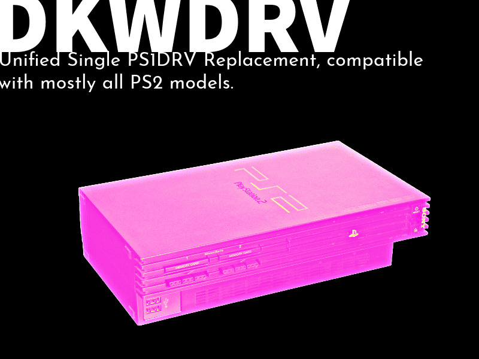
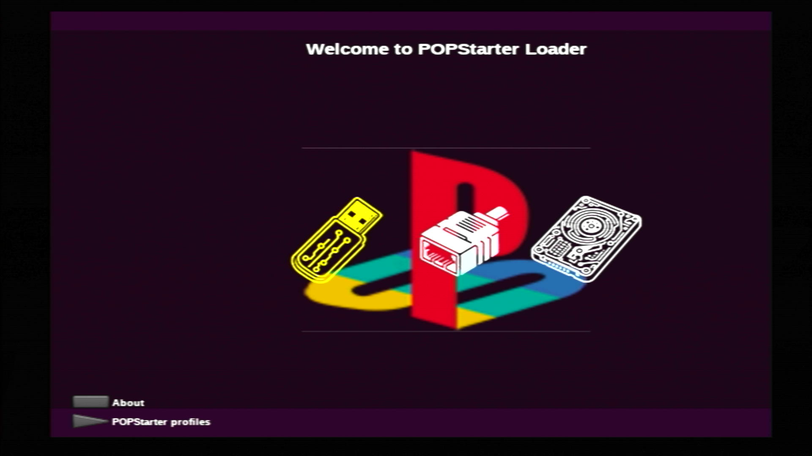
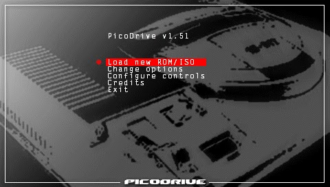

# Emulators

-   __DKWDRV__{ width="75" }

    ---

    

    Replacement for the Sony PS1DRV

    [:material-cloud-download: DKWDRV 1.7.6](../assets/SAVE-APPLICATION-SYSTEM/PS1_DKWDRV176.psu)

-   __POPSLoader__{ width="75" }

    ---

    

    Customizable POPStarter launcher.

    [:material-cloud-download: POPSLoader](../assets/SAVE-APPLICATION-SYSTEM/PS1_POPSLOADER.psu)

-   __PicoDrive__{ width="75" }

    ---

    

    A port of PicoDrive for the PS2

    [:material-cloud-download: PicoDrive 2.05](../assets/SAVE-APPLICATION-SYSTEM/EMU_PICODRIVE/EMU_PICODRIVE205/)

    [:material-cloud-download: PicoDrive 1.51B](../assets/SAVE-APPLICATION-SYSTEM/EMU_PICODRIVE/EMU_PICODRIVE151B/)

-   __Xbox 2 Playstation Emulator__{ width="75" }

    ---

    

    Original Xbox Emulator for the PS2.

    [:material-cloud-download: XB2PS2](../assets/SAVE-APPLICATION-SYSTEM/EMU_X2PMC.psu)

