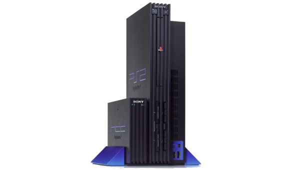
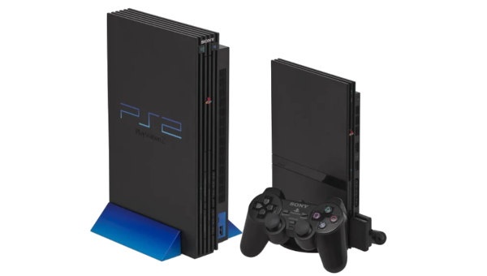
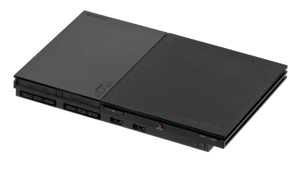

---
hide:
  - navigation
  - toc
---

Exploits

# Which PS2 Model do you have?

-   __SCPH-10K, SCPH-15K, and DTL-H10K(S)__

    ---

    
    

    You will use ProtoPwn!

    [:material-arrow-right-box: Click Here](protopwn.md)

-   __SCPH-18K through SCPH-90K 2.20 BOOTROM or PSX__

    ---

    

    You will use PS2BBL or OpenTuna!

    [:material-arrow-right-box: Click Here](ps2bbl.md)

    !!! tip "SCPH-900XX and unsure which BOOTROM you have?"

        Run [ROM Version Checker](../diag/index.md) to see your BOOTROM version to help choose the correct exploit! Proceed with this if you have BOOTROM 2.20.

-   __SCPH-90K 2.30 BOOTROM or PS2TV KDL-22PX300__

    ---

    

    You will use OpenTuna!

    [:material-arrow-right-box: Click Here](tuna.md)

    !!! tip "SCPH-900XX and unsure which BOOTROM you have?"

        Run [ROM Version Checker](../diag/index.md) to see your BOOTROM version to help choose the correct exploit! Proceed with this if you have BOOTROM 2.30.

