# Exploits: Which PS2 Model do you have?

-   __SCPH-10K, SCPH-15K, and DTL-H10K(S)__

    You will use ProtoPwn!

    ---

    [][protopwn]{ .md-button .md-button--stretch }

-   __SCPH-10K to SCPH-90K 2.20 BOOTROM, PSX__

    You will use LoadBOOTer or OpenTuna[^1]!

    ---

    [][loadbooter]{ .md-button .md-button--stretch }

-   __SCPH-90K 2.30 BOOTROM, PS2TV__

    You will use OpenTuna!

    ---

    [][opentuna]{ .md-button .md-button--stretch }

!!! info "SCPH-90K BOOTROM"

    Run [ROM Version Checker][diag] to see your BOOTROM version to help choose the correct exploit! Opentuna is needed if you have BOOTROM 2.30 or later, _OR_ if your memory card does not support MagicGate well enough. [KELFBinder][kelfbinder]{:target="_blank"} has a MagicGate test.

!!! question "Looking for Free MC Boot?"

    Don't worry! We have you covered! You can choose which menu app (Hacked OSDSYS) you want to land on later whether it be the new superior OSDMenu by PCM720, FMCB, wLE or even another app of your choice!  
    [:material-file-document-arrow-right: __Click Here for how it works!__][umcsconfig]{:target="_blank"}

## All exploits lead to BOOT.ELF

```mermaid
---
config:
  theme: mc
  layout: elk.forced
  look: classic
---
graph LR
       A(["POWER ON"]) L_A_B_0@-- "BOOTROM 1.00-2.20<br>Excluding DTL-H3000*" --> B["SIGNED OSDSYS UPDATE<br>B?EXEC-SYSTEM<br>(LoadBOOTer)<br>Chainload:<br>mc?:/BOOT/BOOT.ELF"]
    A L_A_n1_0@-- "BOOTROM 2.30, 2.50<br>DEV 1 Modchips<br>Memory Cards w/o MagicGate" --> n1["OPENTUNA/DEV 1 CHIPS<br>Chainload:<br>mc?:/BOOT/BOOT.ELF<br>"]
    n5@{ label: "<pre style=\"font-family:\"><code style=\"font-family:\">mc?:/SYS-CONF/PS2BBL.INI</code></pre>" } --> n6["AutoLaunch<br>or<br>Hotkeys"]
    n6 -- AutoLaunch --> n7@{ label: "<span style=\"--tw-scale-x:\"><b><span style=\"--tw-scale-x:\">PS2BBL.INI AUTOLAUNCH</span><br style=\"--tw-scale-x:\"></b></span><br style=\"--tw-scale-x:\"><span style=\"background-color:\">1: EMPTY</span><br style=\"--tw-scale-x:\"><br style=\"--tw-scale-x:\"><span style=\"background-color:\">2: EMPTY</span><br style=\"--tw-scale-x:\"><br style=\"--tw-scale-x:\"><span style=\"--tw-scale-x:\">3: SYS_OSDMENU</span><br style=\"--tw-scale-x:\"><br style=\"--tw-scale-x:\"><span style=\"--tw-scale-x:\">4: SYS_FMCBD-1966</span><br style=\"--tw-scale-x:\"><br style=\"--tw-scale-x:\"><span style=\"--tw-scale-x:\">5: SYS_FMCBD-1965</span><br style=\"--tw-scale-x:\"><br style=\"--tw-scale-x:\"><span style=\"--tw-scale-x:\">6: SYS_FMCBD-1955<br style=\"--tw-scale-x:\"></span><br style=\"--tw-scale-x:\"><span style=\"background-color:\">7: SYS_FMCBD-18C</span><br style=\"--tw-scale-x:\"><br style=\"--tw-scale-x:\"><span style=\"--tw-scale-x:\">8: BOOT/BOOT2.ELF (wLE ISR exFAT)<br style=\"--tw-scale-x:\"><br style=\"--tw-scale-x:\">9: OSDSYS</span>" }
    B L_B_n8_0@-- <br> --> n8["mc?:/BOOT/BOOT.ELF<br>(PS2BBL)<br>./CONFIG.INI<br>DOES NOT EXIST!"]
    n1 L_n1_n8_0@-- <br> --> n8
    n8 L_n8_n5_0@-- Next config<br>search<br>pattern --> n5
    n10@{ label: "<pre style=\"--tw-scale-x:\"><code style=\"--tw-scale-x:\">mc?:/SYS-CONF/PSXBBL.INI</code></pre>" } --> n6
    n8 L_n8_n10_0@-- "PSX DESR-XXXX" --> n10
    A L_A_n11_0@-- "SCPH-10000<br>SCPH-15000<br>DTL-H10000(S)" --> n11["OSDSYS UPDATE<br>BIEXEC-SYSTEM<br>(ProtoPwn)<br>Chainload:<br>mc?:/BOOT/BOOT.ELF"]
    n11 L_n11_n8_0@--> n8

    B@{ shape: hex}
    n1@{ shape: event}
    n5@{ shape: lin-proc}
    n6@{ shape: diam}
    n7@{ shape: lin-proc}
    n8@{ shape: delay}
    n10@{ shape: lin-proc}
    n11@{ shape: event}
    classDef Ash stroke-width:1px, stroke-dasharray:none, stroke:#999999, fill:#EEEEEE, color:#000000
    classDef Sky stroke-width:1px, stroke-dasharray:none, stroke:#374D7C, fill:#E2EBFF, color:#374D7C
    style A fill:#00C853
    style B color:#FFFFFF,fill:#AA00FF
    style n1 color:#00C853,fill:transparent
    style n5 fill:#FFF9C4,color:#00C853
    style n6 fill:#00C853,color:#000000
    style n7 fill:#FFF9C4
    style n8 fill:#FF6D00
    style n10 fill:#FFF9C4,color:#00C853
    style n11 color:#00C853,fill:transparent
    linkStyle 0 stroke:#AA00FF,fill:none
    linkStyle 1 stroke:#00C853,fill:none
    linkStyle 2 stroke:#00C853,fill:none
    linkStyle 3 stroke:#00C853,fill:none
    linkStyle 4 stroke:#FF6D00,fill:none
    linkStyle 5 stroke:#FF6D00,fill:none
    linkStyle 6 stroke:#00C853,fill:none
    linkStyle 7 stroke:#00C853,fill:none
    linkStyle 8 stroke:#00C853
    linkStyle 9 stroke:#00C853,fill:none
    linkStyle 10 stroke:#FF6D00,fill:none

    L_A_B_0@{ animation: slow } 
    L_A_n1_0@{ animation: slow } 
    L_B_n8_0@{ animation: slow } 
    L_n1_n8_0@{ animation: slow } 
    L_n8_n5_0@{ animation: slow } 
    L_n8_n10_0@{ animation: slow } 
    L_A_n11_0@{ animation: slow } 
    L_n11_n8_0@{ animation: slow }

```

[protopwn]: protopwn.md
[loadbooter]: loadbooter.md
[opentuna]: tuna.md
[kelfbinder]: kelfbinder-tutorial.md
[diag]: ../diag/index.md
[umcsconfig]: ../umcs/index.md#all-exploits-lead-to-bootelf

[^1]: OpenTuna is only used in this case if your memory card does not properly support MagicGate to sign the PS2BBL exploit.