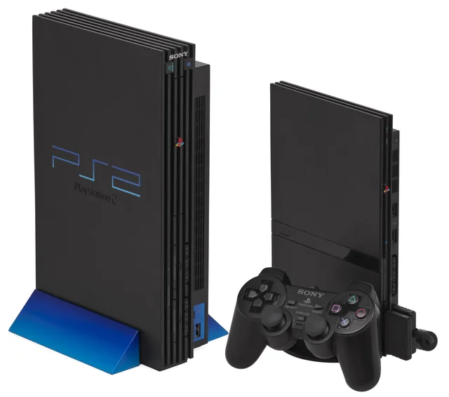
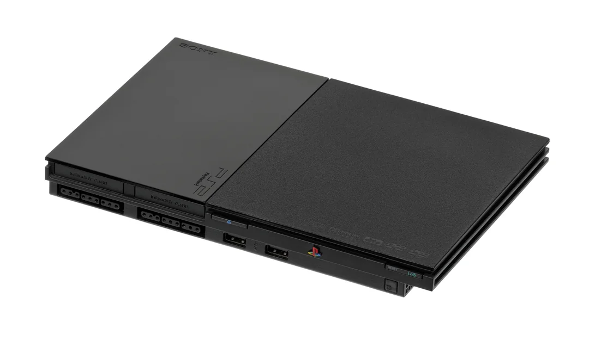

---
hide:
  - navigation
  - toc
---

Exploits

# Which PS2 Model do you have?

-   __SCPH-10000, SCPH-15000, and DTL-H10000(S)__

    ---

    

    You will use ProtoPwn!

    [:material-arrow-right-box: Click Here](protopwn.md)

-   __SCPH-18000 - SCPH-900XX 2.20 BOOTROM or PSX__

    ---

    

    You will use PS2BBL or OpenTuna, depending on your memory card!

    !!! tip "SCPH-900XX and unsure which BOOTROM you have?"

        Run [Mechacon Crash Tester](../diag/index.md) to see your BOOTROM version to help choose the correct exploit! Proceed with this if you have BOOTROM 2.20.

    [:material-arrow-right-box: Click Here](ps2bbl.md)

-   __SCPH-900XX 2.30 BOOTROM or KDL-22PX300__

    ---

    

    You will use OpenTuna!

    !!! tip "SCPH-900XX and unsure which BOOTROM you have?"

        Run [Mechacon Crash Tester](../diag/index.md) to see your BOOTROM version to help choose the correct exploit! Proceed with this if you have BOOTROM 2.30.

    [:material-arrow-right-box: Click Here](tuna.md)

