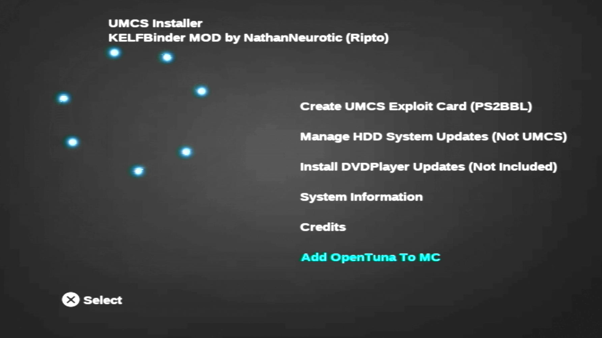
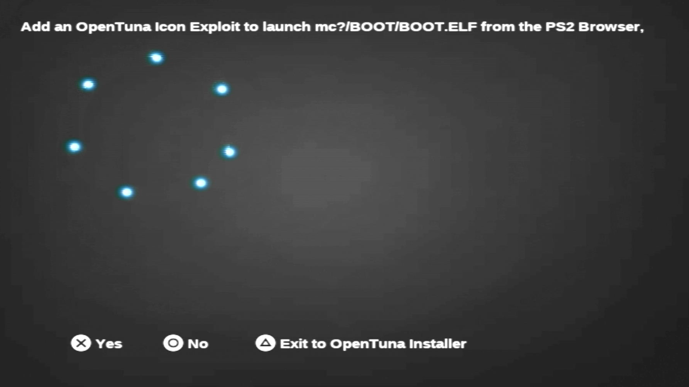
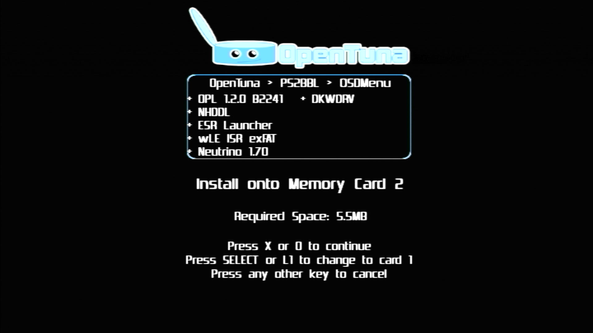
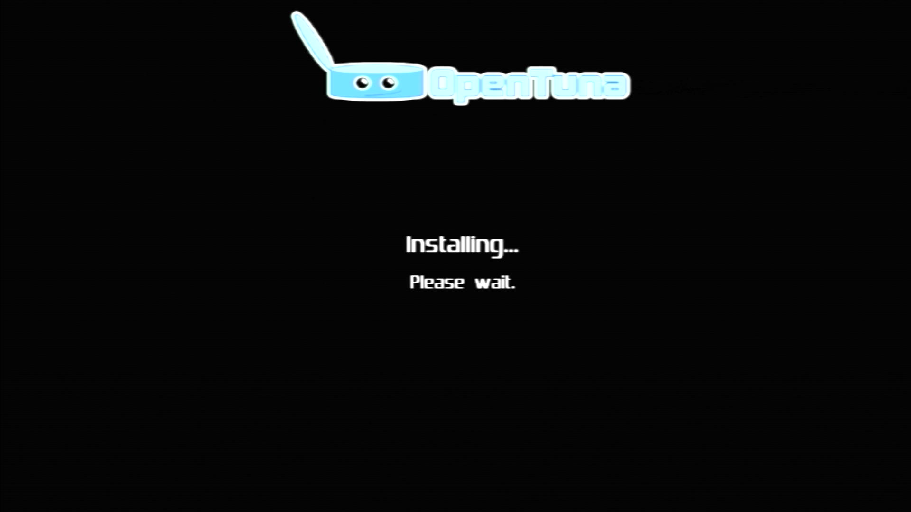
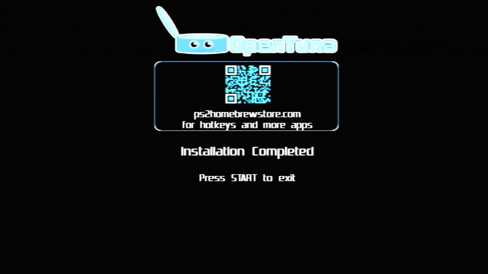
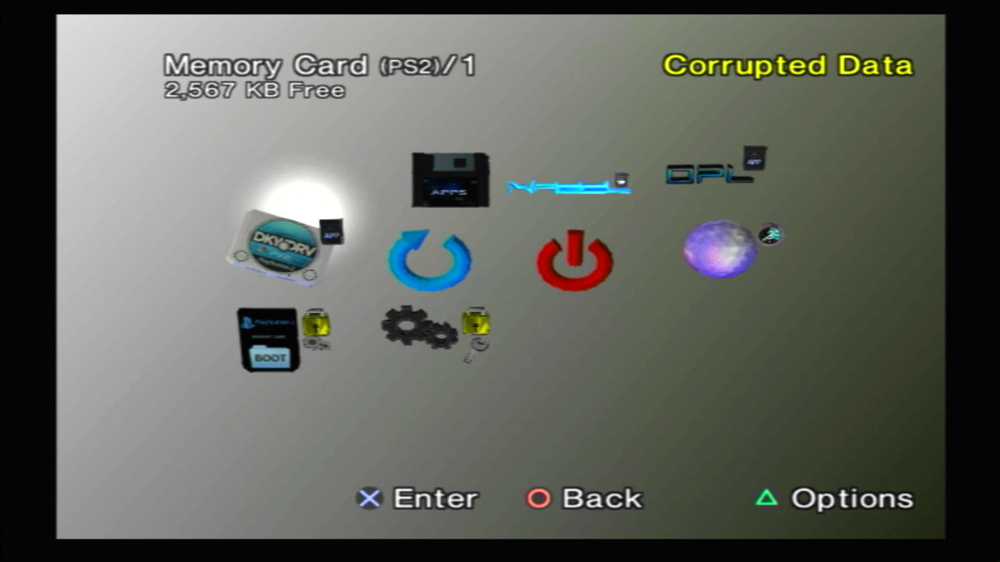
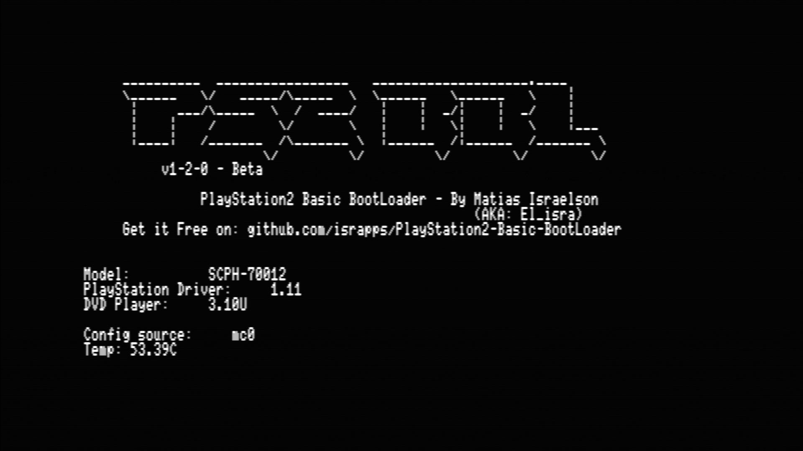
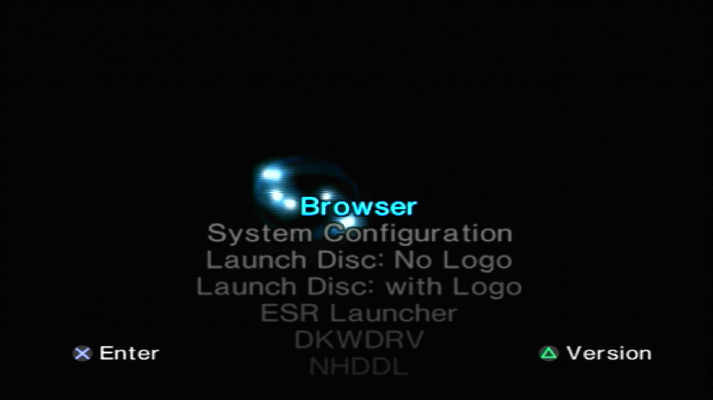
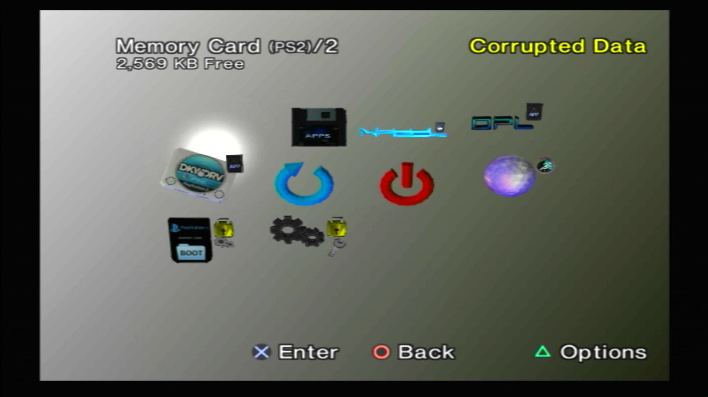

---
hide:
  - navigation
---

# Sony / Other Memory Card Exploits
KelfBinder and OpenTuna Installers

!!! warning "Possible file loss!"

    It is wise to have an empty/spare memory card to install these exploits onto. Otherwise the install may fail. KelfBinder and OpenTuna Installer attempts to delete any pre-existing setup that may conflict first, but it cannot predict how you setup/purchsed your memory ard that you are installing onto.

## KelfBinder

### Step 1: Disable IOP Reboot

1. Open wLE ISR exFAT. If not using wLE ISR (insert variant), you may ignore this step and skip to Step 2.

2. Go to FileBrowser > Misc > Configure > Startup Settings

3. Set `Reboot  IOP  when loading ELF: OFF`

{ width="800" data-gallery="kelfbinder" }

### Step 2: Launch KELFbinder

1. Using wLE ISR exAT Navigate back to `mass:/KELFbinder-UMCS/KELFbinder.elf` and press OK. Otherwise use your preffered way to launch homebrew apps.

2. If KELFbinder gets stuck/does not boot try running via another appliation. Last resort is to edit FMCB.CFG or OSDMENU.CFG and add as a hacked OSDSYS menu item. Here is a list of the [debug colors](https://israpps.github.io/KELFBinder/documentation/Troubleshooting.html) If your files are present, it usually means it can't find them due to the elf launcher rebooting the IOP processor or not supporting the needed arguments to send to KELFbinder.

{ width="800" data-gallery="kelfbinder" }

### Step 3: Determine exploit needed __BOOTROM CHECK__

1. In KELFbinder, select `System Information`

    { width="800" data-gallery="kelfbinder" }

2. Pay particular attention to `ROMVER =` and `Supports Updates =`

    1. If ROMVER first four digits are <= 0220 AND Supports Updates = YES, you can possibly proceed with KELFbinder. 

    2. If ROMVER first for digits are >= 0230 AND Supports Updates = NO, you will need to use OpenTuna. Press Quit and proceed to the [OpenTuna step.](#starting-opentuna-from-kelfbinder)

    { width="800" data-gallery="kelfbinder" }

3. Go back to main screen by pressing circle.

### Step 4: Determine exploit needed __MAGICGATE CHECK__

1. Select `Create UMCS Exploit Card (PS2BBL)

    { width="800" data-gallery="kelfbinder" }

2. Select MagicGate Test

    { width="800" data-gallery="kelfbinder" }

3. Choose the card you plan on installing an exploit to so that we can verify MagicGate functions as needed.

    { width="800" data-gallery="kelfbinder" }

4. If the test succeeds, press `X` to continue. Else if the test failed, go back to the main screen and proceed to the [OpenTuna step.](#starting-opentuna-from-kelfbinder)

    { width="800" data-gallery="kelfbinder" }

### Step 5: Create UMCS Exploit Card (PS2BBL)

1. If you are installing for this console select `Normal Install`. For other consoles, currently you are on your own. Sorry, advanced tutorial incoming later...

    { width="800" data-gallery="kelfbinder" }

2. Choose the card you plan on installing an exploit to.

    { width="800" data-gallery="kelfbinder" }

3. Either it contineud installing or game an error regarding space.

  1. If an error regarding space, pleaes delete data off of the card first to cretae. Recommed using wLE ISR exFAT to do so. Easist to just reboot console and open wLE ISR exFAT to do so.

  2. If install is proceeding, congrats, you will soon have an exploited memory card ready to go!

    { width="800" data-gallery="kelfbinder" }

4. Congrats, you are now softmodded/exploited! Reboot your PS2 and when PS2BBL runs you will be greeted by the PS2BBL spashscreen. Here you have a short window to press any controller hotkeys to auto run anything that has been defined in `mc?:/SYS-CONF/PS2BBL.INI`, and PS2BBL will try the AUTOLOAD order if no keys are pressed. 

    { width="800" data-gallery="kelfbinder" }

## Starting OpenTuna from KelfBinder 
Because ROMVER >= 0220 or MagicGate test failed, you will need to use OpenTuna

1. At main screen, select `Add OpenTuna to MC`

    { width="800" data-gallery="kelf_to_ot" }

2. Press Triangle to to "Exit to OpenTuna Installer"

    { width="800" data-gallery="kelf_to_ot" }

### OpenTuna Installer

1. Press `SELECT` to choose your memory card to install to. Then Press Cross or Circle to continue.

    { width="800" data-gallery="ot_installer" }

2. Be patient while OpenTuna removes potentially conflicting folders and installs OpenTuna

    { width="800" data-gallery="ot_installer" }

3. Install Complete! Please remove any other memory card if one was used so that only the destination you installed OpenTuna to is inserted to test.

    { width="800" data-gallery="ot_installer" }

4. Reboot the PS2 by pressing the Power/Reset button.

### Using OpenTuna to Exploit your PS2

1. Once your PS2 starts up, you will be greeted by the familiar "OSDSYS" as seen and press ENTER

    { width="800" data-gallery="tuna" }

2. Select your emory card with OpenTuna on it and press ENTER

    { width="800" data-gallery="tuna" }

3. The first icon is OpenTuna. It showing as "Corrupted Data" normal. Press BACK to start the exploit.

    !!! warning "Japanese save files with Kanji text"

        If Japanese save files with Kanji text exist, enter and exit this as quickly as possible by pressing BACK 2x otherwise the PS2 will most likely freeze.

    { width="800" data-gallery="tuna" }

4. Press BACK once more. You will see that the memory card has dissapeared. Do not alarm, this is to be expected.

    { width="800" data-gallery="tuna" }

5. Congrats, you are now softmodded/exploited! As OpenTuna runs `mc?:/BOOT/BOOT.ELF` you will be greeted by the PS2BBL spashscreen. Here you have a short window to press any controller hotkeys to auto run anything that has been defined in `mc?:/BOOT/CONFIG.INI`, and if that does not exist, `mc?:/SYS-CONF/PS2BBL.INI`, and PS2BBL will try the AUTOLOAD order once an `.INI` is found.

    { width="800" data-gallery="tuna" }

6.  You will be greeted with either the hacked OSDSYS or wLE ISR, again dependant on what exists as defined the config files.

    { width="800" data-gallery="tuna" }

7. If you choose to stay with OSDMenu as your hacked OSDSYS intead of FreeMCBoot, you can launch apps from the MC Browser!

    { width="800" data-gallery="tuna" }

  