---
hide:
  - navigation
---

# KELFbinder Tutorial

## Step 1: Disable IOP Reboot

1. Open wLE ISR exFAT

2. Goto FileBrowser > Misc > ....

3. Set `Reboot  IOP  when loading ELF: OFF`

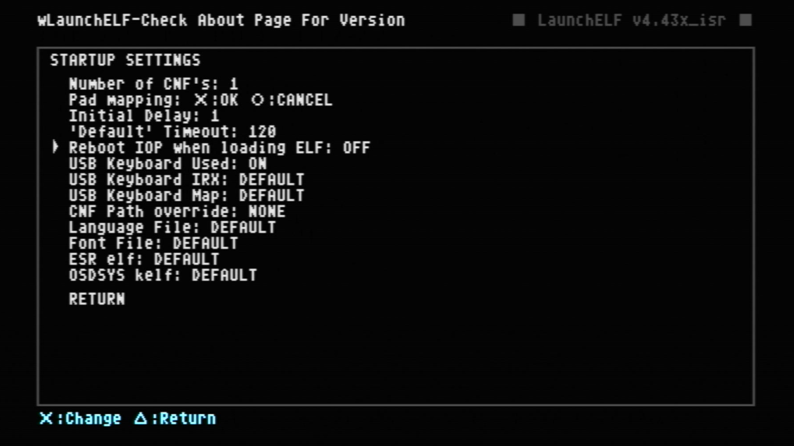{ width="800" }

## Step 2: Launch KELFbinder

1. Navigate back to `mass:/KELFbinder-UMCS/KELFbinder.elf` and press OK

2. If KELFbinder gets stuck/does not boot try running via another appliation. Last resort is to edit FMCB.CFG or OSDMENU.CFG and add as a hacked OSDSYS menu item. Here is a list of the [debug colors](https://israpps.github.io/KELFBinder/documentation/Troubleshooting.html) If your files are present, it usually means it can't find them due to the elf launcher rebooting the IOP processor or not supporting the needed arguments to send to KELFbinder.

  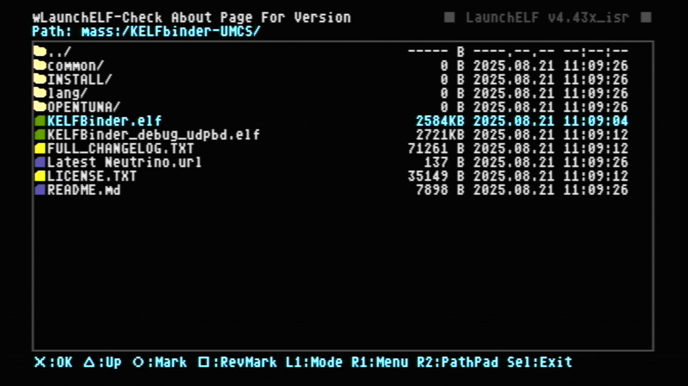{ width="800"}

## Step 3: Determine exploit needed __BOOTROM CHECK__

1. In KELFbinder, select `System Information`

    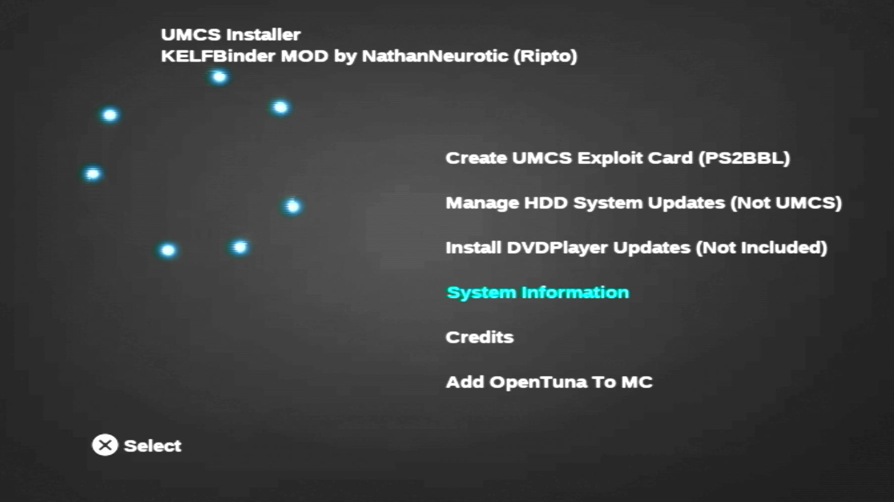{ width="800" }

2. Pay particular attention to `ROMVER =` and `Supports Updates =`

  1. If ROMVER <= 220 AND Supports Updates = YES, you can possibly proceed with KELFbinder. 

  2. If ROMVER >= 230 AND Supports Updates = NO, you will need to use OpenTuna. Proceed to the OpenTuna step.

    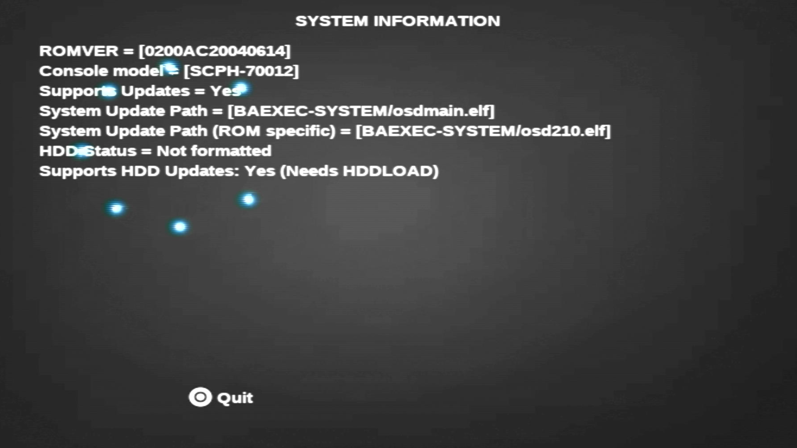{ width="800" }

3. Go back to main screen by pressing circle.

## Step 4: Determine exploit needed __MAGICGATE CHECK__

1. Select `Create UMCS Exploit Card (PS2BBL)

    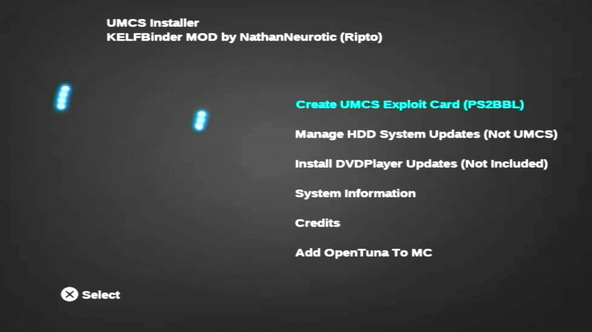{ width="800" }

2. Select MagicGate Test

    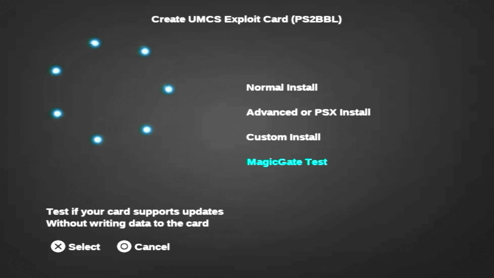{ width="800" }

3. Choose the card you plan on installing an exploit to so that we can verify MagicGate functions as needed.

    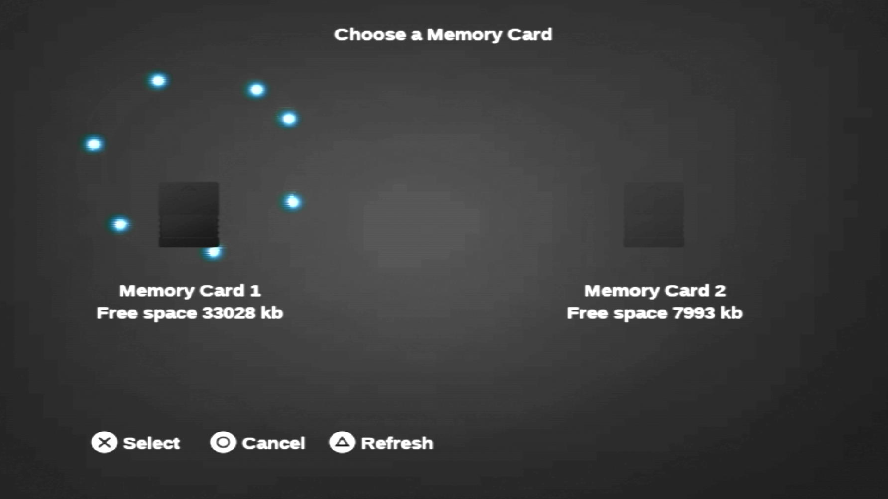{ width="800" }

4. If the test succeeds, press `X` to continue. Else if the test failed, go back to the main screen and proceed to the OpenTuna step.

    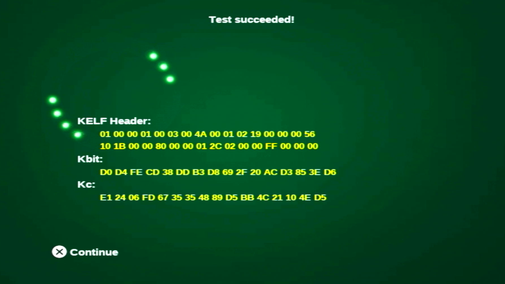{ width="800" }

## Step 5: Create UMCS Exploit Card (PS2BBL)

1. If you are installing for this console select `Normal Install`. For other consoles, currently you are on your own. Sorry, advanced tutorial incoming later...

    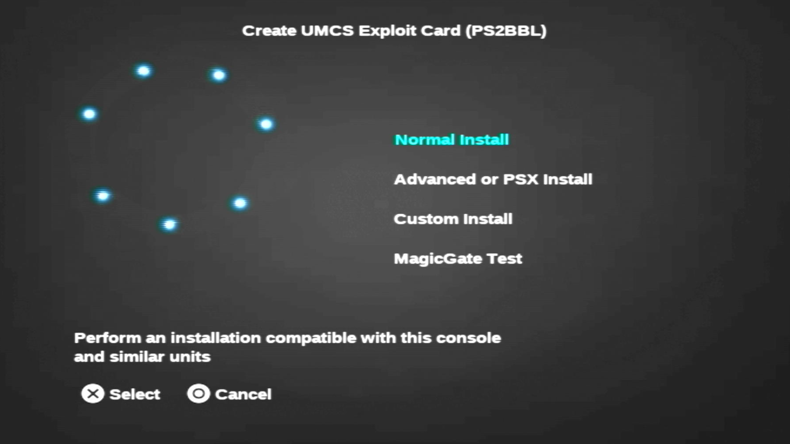{ width="800" }

2. Choose the card you plan on installing an exploit to.

    { width="800" }

3. Either it contineud installing or game an error regarding space.

  1. If an error regarding space, pleaes delete data off of the card first to cretae. Recommed using wLE ISR exFAT to do so. Easist to just reboot console and open wLE ISR exFAT to do so.

  2. If install is proceeding, congrats, you will soon have an exploited memory card ready to go!

    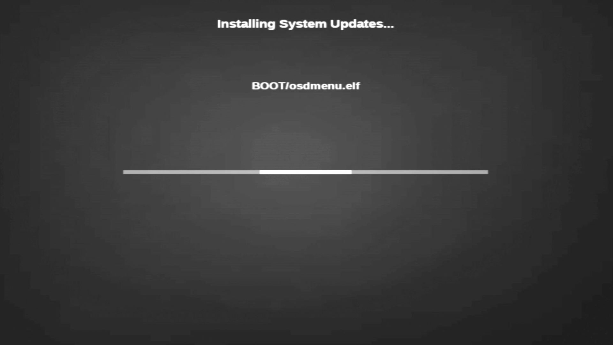{ width="800" }

4. Install complete! Reboot PS2 and enjoy your pre-setup memory card. You may need to configure other apps such as OPL / NHDDL to your needs. Please go to the source material documentation to setup other apps.

    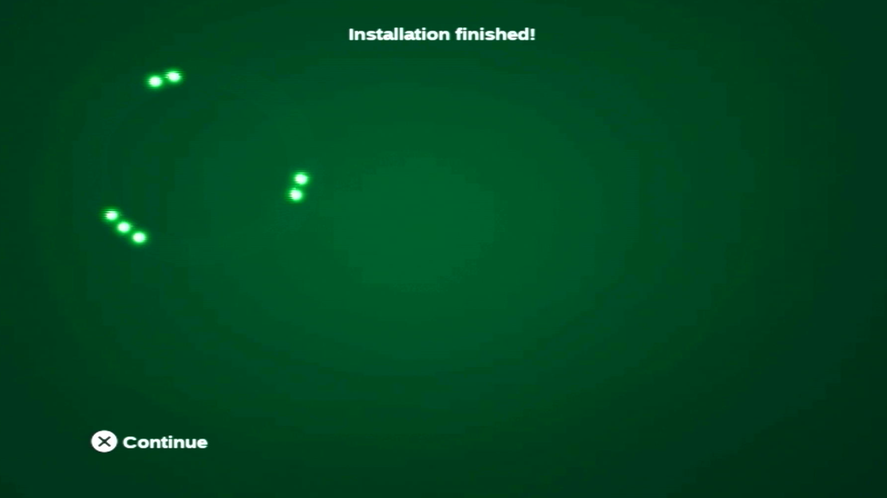{ width="800" }

  