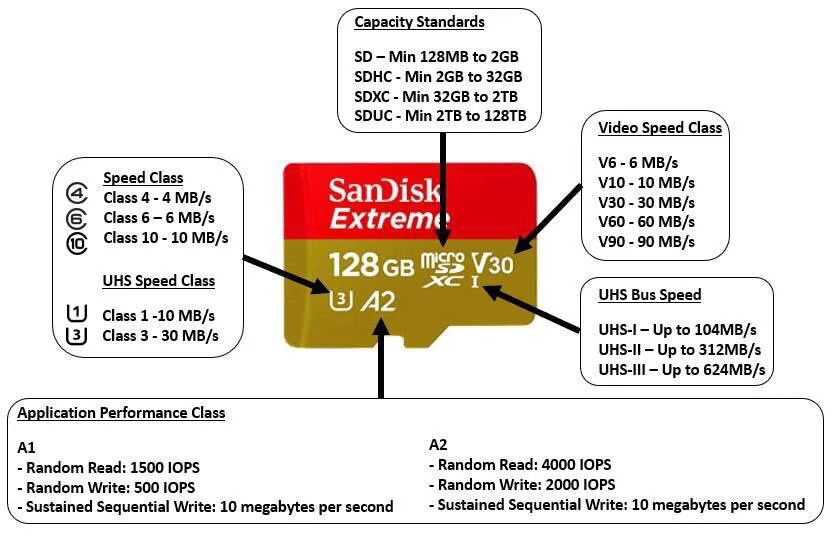
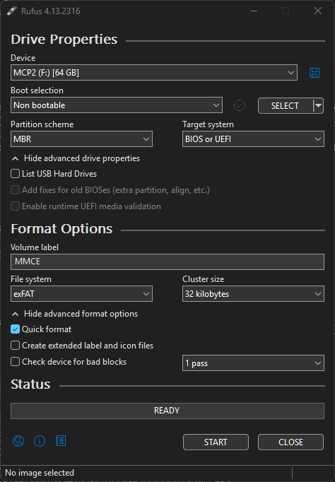
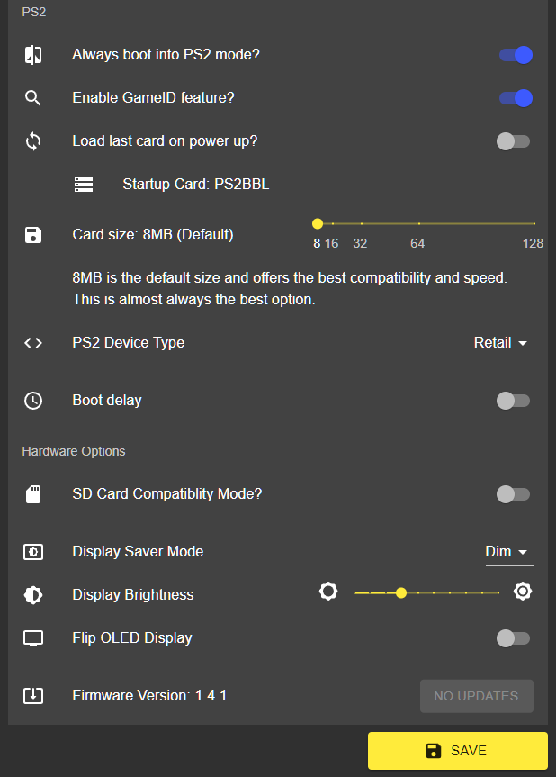
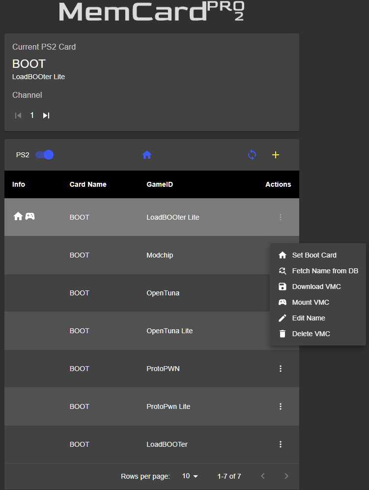

---
hide:
  - navigation
---

[Exploits](index.md) > [SCPH-18K to SCPH-90K 2.20 BOOTROM and PSX](loadbooter.md) > MCP2

# Great! Here is your LoadBOOTer download for MCP2:

## Prerequisite - SD Card Rating and Formatting

- If loading ISO's from micro SD card, an A2 class card is recommended.

- Optional but recommended to format SD card as MBR/exFAT with 32KB clusters. [Rufus](https://rufus.ie/en/) is a good tool to format the micro SD card as needed.

???+ info "SD Card Speed Rating and Formatting"

    ???+ warning "Data Loss!"

        Formatting the micro SD card WILL WIPE ALL DATA! Backup as needed.

    

    - { width="300" .on-glb data-gallery="pre-requisites" }
      ///caption
      Micro SD Card Meanings
      ///

    - { width="150" .on-glb data-gallery="pre-requisites" }
      ///caption
      __Step 2:__ Select `OSDMenu`. This site will not go over the other 2 HDD options
      ///

    

## Step 1 - MMCE Download
- [:material-cloud-download: Download MCP2 PS2BBL](https://downloads.ps2homebrewstore.com/MMCE-ALL.7z)  
- Extract the download to your MCP2 SD card.

## Step 2 - Firmware Update
- [:octicons-link-external-16: Download and update the MCP2 Firmware][mcp2fw]{ target="blank" }  
- Extract the zip and place on root of your SD card. Insert SD card into MCP2.  
- Plug into power or PS2 and power on. (_Tip: leave MCP2 plugged into USB power_) The MCP2 will show a progress bar updating the firmware.  
- DO NOT REMOVE USB/POWER WHILE UPDATE IS IN PROGRESS!

## Step 3 - MCP2 WiFi
- Using the [:octicons-link-external-16: MCP2 WEB UI directions][mcp2-webui]{ target="blank" }, make MCP2 join wifi and set SD card compatibility to disabled

???+ example "MCP2 Card Settings Screenshot:"

    { width="600"}

## Step 4 - MCP2 WEB UI
- Using the MCP2 WEB UI, set the bootcard to `PS2BBL` and Mount VMC. 

???+ example "MCP2 BootCard Settings Screenshot:"

    { width="600"}

[mcp2fw]: https://distribution.appcake.co.uk/install/8bitmods/apps/memcard-pro2/public

[mcp2-webui]: https://www.8bitmods.wiki/wireless-features

## Step 5 - Reboot
- Plug MCP2 into PS2 if you have not, then boot/reboot the PS2. You should see the screenshots below:

???+ example "Example of what you will encounter:"

    

    - { width="300" .on-glb data-gallery="ps2bbl" }
      ///caption
      __Step 1:__ Press controller button here for hotkeys or wait for it to autoboot what you have set for LK_AUTO_E? in `mc?:/SYS-CONF/PS2BBL.INI`
      ///
    - { width="300" .on-glb data-gallery="ps2bbl" }
      ///caption
      __Step 2:__ OSDMenu which is hacked OSDSYS. Edit `mc?:/SYS-CONF/OSDMENU.CNF` as desired. Simply remove `# ` per entry to show items that are hidden.
      ///
    - { width="300" .on-glb data-gallery="ps2bbl" }
      ///caption
      __TIP:__ You can launch apps from here!
      ///

    

## Step 6 - Configure OSDMenu (UNLESS PSX DESR-XXXX!)

- [:material-cloud-download: OSDMenu COnfigurator](https://downloads.ps2homebrewstore.com/NON-SAS/SYS_OSDMENU-CONFIGURATOR.zip)

- Download `OSDMenu Configurator` and place on device of choice (usb, mx4sio, mmce) at `device:/APPS/`  
  You should end up with `device:/APPS/SYS_OSDMENU-CONFIGURATOR/osdmenu-configurator.elf`

- Plug the device that you copied `OSDMenu Configurator` to into your PS2

- Scroll down until you reach OSDMenu and press Enter

???+ example "OSDMenu Configurator in OSDMenu"

    

    - { width="300" .on-glb data-gallery="protopwn" }
      ///caption
      __Step 1:__ Press Enter to launch `OSDMenu Configurator`
      ///

    - { width="300" .on-glb data-gallery="protopwn" }
      ///caption
      __Step 2:__ Select `OSDMenu`. This site will not go over the other 2 HDD options
      ///

    - { width="300" .on-glb data-gallery="protopwn" }
      ///caption
      __Step 3:__ Select `OSDMENU.CNF`
      ///

      - { width="300" .on-glb data-gallery="protopwn" }
      ///caption
      __Step 4:__ `OSDGSM.CNF` is [:octicons-link-external-16: eGSM (video modes)](https://github.com/pcm720/OSDMenu/tree/main/utils/loader#egsm){ target="blank" } for discs and apps.
      ///

      - { width="300" .on-glb data-gallery="protopwn" }
      ///caption
      __Step 4:__ Reference [:octicons-link-external-16: OSDMenu's documentation](https://github.com/pcm720/OSDMenu/blob/main/patcher/README.md#osdmenucnf){ target="blank" } to further understand each option.
      ///

    

## Step 7 -  Configure PS2BBL

- PS2BBL (Playstation 2 Basic BootLoader) is your hotkeys and autoboot. We use a fork called PS2BBL Extended which adds some quality of life features along side some advanced features. We hope to align it with OSDMenus feature set where applicable so your autolaunch options an align with OSDMenus features.

- I find it easiest to copy `mc?:/SYS-CONF/PS2BBL.INI` and paste to USB to edit via your computers text editor of choice. Then copy/paste back when done.  
__PSX DESR-XXXX NOTE:__ Edit `mc?:/SYS-CONF/PSXBBL.INI` instead.

- Please reference the documentation for [:octicons-link-external-16: PS2BBL Extended here.](https://github.com/saildot4k/PlayStation2-Basic-BootLoader-Extended/blob/main/README.md){ target="blank" }

## Step 8 - Configure Other Apps

- Apps such as OPL and [:octicons-link-external-16: NHDDL](https://github.com/pcm720/nhddl/blob/main/README.md) will need further configuration and or setup, such as puting your ISO's and art assets on. Follow each apps tutorial for such according to their webpage. Each developer is responsible for their own tutorials. `OPL` documentation is sadly lacking, `NHDDL's` is great. For NHDDL we recommend to launch via arguments as both `PS2BBL Extended` and `OSDMenu` support this. It is THE FASTEST way to load your ISO list.

## Boot Process:

```mermaid
---
config:
  theme: mc
  layout: elk.forced
  look: classic
---
graph LR
    A(["POWER ON"]) L_A_B_0@-- "BOOTROM 1.00-2.20<br>Excluding DTL-H3000*" --> B["SIGNED OSDSYS UPDATE<br>B?EXEC-SYSTEM<br>(LoadBOOTer)<br>Chainload:<br>mc?:/BOOT/BOOT.ELF"]
    A L_A_n1_0@-- "BOOTROM 2.30, 2.50<br>DEV 1 Modchips<br>Memory Cards w/o MagicGate" --> n1["OPENTUNA/DEV 1 CHIPS<br>Chainload:<br>mc?:/BOOT/BOOT.ELF<br>"]
    n5@{ label: "<pre style=\"font-family:\"><code style=\"font-family:\">mc?:/SYS-CONF/PS2BBL.INI</code></pre>" } --> n6["AutoLaunch<br>or<br>Hotkeys"]
    n6 -- AutoLaunch --> n7@{ label: "<span style=\"--tw-scale-x:\"><b><span style=\"--tw-scale-x:\">PS2BBL.INI AUTOLAUNCH</span><br style=\"--tw-scale-x:\"></b></span><br style=\"--tw-scale-x:\"><span style=\"background-color:\">1: EMPTY</span><br style=\"--tw-scale-x:\"><br style=\"--tw-scale-x:\"><span style=\"background-color:\">2: EMPTY</span><br style=\"--tw-scale-x:\"><br style=\"--tw-scale-x:\"><span style=\"--tw-scale-x:\">3: SYS_OSDMENU</span><br style=\"--tw-scale-x:\"><br style=\"--tw-scale-x:\"><span style=\"--tw-scale-x:\">4: SYS_FMCBD-1966</span><br style=\"--tw-scale-x:\"><br style=\"--tw-scale-x:\"><span style=\"--tw-scale-x:\">5: SYS_FMCBD-1965</span><br style=\"--tw-scale-x:\"><br style=\"--tw-scale-x:\"><span style=\"--tw-scale-x:\">6: SYS_FMCBD-1955<br style=\"--tw-scale-x:\"></span><br style=\"--tw-scale-x:\"><span style=\"background-color:\">7: SYS_FMCBD-18C</span><br style=\"--tw-scale-x:\"><br style=\"--tw-scale-x:\"><span style=\"--tw-scale-x:\">8: BOOT/BOOT2.ELF (wLE ISR exFAT)<br style=\"--tw-scale-x:\"><br style=\"--tw-scale-x:\">9: OSDSYS</span>" }
    B L_B_n8_0@-- <br> --> n8["mc?:/BOOT/BOOT.ELF<br>(PS2BBL)<br>./CONFIG.INI<br>DOES NOT EXIST!"]
    n1 L_n1_n8_0@-- <br> --> n8
    n8 L_n8_n5_0@-- Next config<br>search<br>pattern --> n5
    n10@{ label: "<pre style=\"--tw-scale-x:\"><code style=\"--tw-scale-x:\">mc?:/SYS-CONF/PSXBBL.INI</code></pre>" } --> n6
    n8 L_n8_n10_0@-- "PSX DESR-XXXX" --> n10
    A L_A_n11_0@-- "SCPH-10000<br>SCPH-15000<br>DTL-H10000(S)" --> n11["OSDSYS UPDATE<br>BIEXEC-SYSTEM<br>(ProtoPwn)<br>Chainload:<br>mc?:/BOOT/BOOT.ELF"]
    n11 L_n11_n8_0@--> n8

    B@{ shape: hex}
    n1@{ shape: event}
    n5@{ shape: lin-proc}
    n6@{ shape: diam}
    n7@{ shape: lin-proc}
    n8@{ shape: delay}
    n10@{ shape: lin-proc}
    n11@{ shape: event}
    classDef Ash stroke-width:1px, stroke-dasharray:none, stroke:#999999, fill:#EEEEEE, color:#000000
    classDef Sky stroke-width:1px, stroke-dasharray:none, stroke:#374D7C, fill:#E2EBFF, color:#374D7C
    style A fill:#00C853
    style B color:#FFFFFF,fill:#AA00FF
    style n1 color:#00C853,fill:transparent
    style n5 fill:#FFF9C4,color:#00C853
    style n6 fill:#00C853,color:#000000
    style n7 fill:#FFF9C4
    style n8 fill:#FF6D00
    style n10 fill:#FFF9C4,color:#00C853
    style n11 color:#00C853,fill:transparent
    linkStyle 0 stroke:#AA00FF,fill:none
    linkStyle 1 stroke:#00C853,fill:none
    linkStyle 2 stroke:#00C853,fill:none
    linkStyle 3 stroke:#00C853,fill:none
    linkStyle 4 stroke:#FF6D00,fill:none
    linkStyle 5 stroke:#FF6D00,fill:none
    linkStyle 6 stroke:#00C853,fill:none
    linkStyle 7 stroke:#00C853,fill:none
    linkStyle 8 stroke:#00C853
    linkStyle 9 stroke:#00C853,fill:none
    linkStyle 10 stroke:#FF6D00,fill:none

    L_A_B_0@{ animation: slow } 
    L_A_n1_0@{ animation: slow } 
    L_B_n8_0@{ animation: slow } 
    L_n1_n8_0@{ animation: slow } 
    L_n8_n5_0@{ animation: slow } 
    L_n8_n10_0@{ animation: slow } 
    L_A_n11_0@{ animation: slow } 
    L_n11_n8_0@{ animation: slow }

```

!!! info "Landing on your hacked OSDSYS of choice:"

    PS2BBL.INI and PSXBBL.INI are setup so that minimal config changes are needed if at all. To land on your hacked OSDSYS of choice, install the [OSDMenu/ FMCB Version XXXX](../apps/index.md#system-apps) as needed. If multiple are installed (such as the MMCE AIO downloads), you can delete in order from first to last to land on the desired app. This is especially useful for modchip users as they may not play well or at all with some or all of the OSDSYS such as I believe Mars Pro. In that case, just delete all of the SYS_OSDMENU and SYS_FMCB-XXXX folders. Modchip users may need to disable chip to do so.

## PS2BBL Hotkeys:

{ width="800" .on-glb }
///caption
Config @ mc?:/SYS-CONF/PS2BBL.INI
///

!!! warning "Emergency Mode"

    If something breaks on your setup but PS2BBL still boots, just hold `R1+START`. It will trigger emergency mode where PS2BBL will try to boot `RESCUE.ELF` from USB device Root on an endless loop. Recommended to rename wLE ISR Exfat to `RESCUE.ELF`

## __VMCs included:__
The MMCE download includes these bootcard VMC channels, which covers all Retail PS2s.

- PS2BBL and PS2BBL Lite
- OpenTuna and OpenTuna Lite
- ProtoPwn and ProtoPwn Lite
- Modchip

!!! question "Lite? What does that mean?"

    "Lite" VMCs only have exploit+[UMCS][umcs] installed. These will autoboot PS2BBL (hotkeys and autolaunch) to wLE ISR XF (file manager and elf loader).
    
    Otherwise VMCs come pre-installed with exploit+[UMCS]+homebrew. Homebrew that cannot be installed due to licensing or device requirements are not included: for example XEB+ and RETROLauncher.

[umcs]: ../umcs/index.md