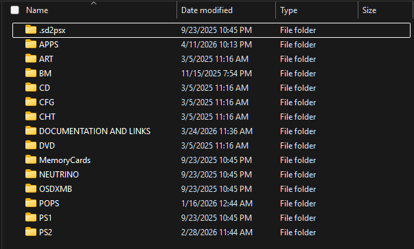

---
hide:
  - navigation

search:
  exclude: true

---

[Exploits](index.md) > [SCPH-10K to SCPH-90K 2.20 BOOTROM and PSX](loadbooter.md) > SD2PSX

# Great! Here is your LoadBOOTer download for SD2PSX / PSxMemCard Gen2:

## Prerequisite - SD Card Rating and Formatting

- If loading ISO's from micro SD card, an A2 class card is recommended.

- Optional but recommended to format SD card as MBR/exFAT with 32KB clusters. [:octicons-link-external-16: Rufus](https://rufus.ie/en/){ target="blank" } is a good tool to format the micro SD card as needed.

???+ info "SD Card Speed Rating and Formatting"

    ???+ warning "Data Loss!"

        Formatting the micro SD card WILL WIPE ALL DATA! Backup as needed.

    

    - { width="300" .on-glb data-gallery="pre-requisites" }
      ///caption
      Micro SD Card Meanings
      ///

    - { width="150" .on-glb data-gallery="pre-requisites" }
      ///caption
      __Step 2:__ Configure as shown. You may change volume label as desired.
      ///

    

## Step 1 - Firmware Update
- [:octicons-link-external-16: Download firmware.][sd2psxtd]{ target="blank"}
- Update the firmware: Press and hold either button, plug USB-C in via your computer, drag and drop the sd2psx.uf2 file you downloaded above to the "storage" device that popped up. Within ~10 seconds it should reboot and be safe to unplug.  

[sd2psxtd]: https://sd2psxtd.github.io/download

## Step 2 - MMCE Download

!!! warning "BOOT channels may be lost!"

    Caution, this will overwrite channels 1-7! Backup as needed. If you have saves, recommended to copy and PSU paste to usb and then convert to individual cards via [GDX Save Converter](https://github.com/GDX-X/sd2psx-save-converter)

- [:material-cloud-download: SD2PSX / PSxMemCard Gen 2 LoadBOOTer Download](https://downloads.ps2homebrewstore.com/MMCE-ALL.7z)
- Extract the download to your SD2PSX SD card. Wait for it to finish extracting.

???+ example "SD Card Contents after extracting"

    

    - { width="300" .on-glb data-gallery="protopwn" }
      ///caption
      This is what you should see on the root of your SD Card. __NOT__ MMCE-ALL!
      ///

    

- Insert SD Card into SD2PSX device.

## Step 3 - Set BOOT Channel

- Plug MMCE device into USB-C (Recommended) or PS2 (and power on PS2).  
- Set to channel 1: `LoadBOOTer` by short press of either button until you reach channel 1. You should see this splash screen:  

## Step 4  - Reboot
- Plug device into PS2 if you have not, then boot/reboot the PS2. You should see the screenshots below:

???+ example "Example of what you will encounter:"

    

    - { width="300" .on-glb data-gallery="ps2bbl" }
      ///caption
      __Step 1:__ Press controller button here for hotkeys or wait for it to autoboot what you have set for LK_AUTO_E? in `mc?:/SYS-CONF/PS2BBL.INI`
      ///
    - { width="300" .on-glb data-gallery="ps2bbl" }
      ///caption
      __Step 2:__ OSDMenu which is hacked OSDSYS. Edit `mc?:/SYS-CONF/OSDMENU.CNF` as desired. Simply remove `# ` per entry to show items that are hidden.
      ///
    - { width="300" .on-glb data-gallery="ps2bbl" }
      ///caption
      __TIP:__ You can launch apps from here!
      ///

    

## Step 5 - Configure PS2BBL Extended and Hacked OSDSYS

- Reboot your PS2, and hold down `R3` on controller to boot `R3Configurator`  
__NON PSX-DESR consoles only!__ The app can also be ran from your hacked OSDSYS by scrolling down to `R3Configurator` if you failed to press the button in time.

???+ example "R3Configurator Options"

    

    - { width="300" .on-glb data-gallery="protopwn" }
      ///caption
      __Step 1:__ Press `R3` to launch `R3Configurator`
      ///

    - { width="300" .on-glb data-gallery="protopwn" }
      ///caption
      __Optional:__ May also launch from hacked OSDSYS
      ///

    - { width="300" .on-glb data-gallery="protopwn" }
      ///caption
      __Step 2:__ Select `PS2BBL/PSXBBL as needed to configure Launch Keys and AutoBoot`
      ///

    - { width="300" .on-glb data-gallery="protopwn" }
      ///caption
      __Step 3:__ Select `Memory Card 1` PS2BBL/PSXBBL has a search order for it's config files...
      ///

    - { width="300" .on-glb data-gallery="protopwn" }
      ///caption
      __Step 4:__ Select `mc0:/SYS-CONF//PS2BBL.INI`
      ///

      - { width="300" .on-glb data-gallery="protopwn" }
      ///caption
      __Step 5:__ Now go explore and customize PS2BBL/PSXBBL as desired!
      ///

      - { width="300" .on-glb data-gallery="protopwn" }
      ///caption
      __Step 6:__ Once done go back to main page and select your hacked OSDSYS of choice. OSDMenu is default for us and superior to FMCB.
      ///

      - { width="300" .on-glb data-gallery="protopwn" }
      ///caption
      __Step 7:__ Select `OSDMENU.CNF`. OSDGSM.CNF is to force video modes for disc usage.
      ///

      - { width="300" .on-glb data-gallery="protopwn" }
      ///caption
      __Step 8:__ Now go explore and customize OSDMenu as desired!
      ///

    

- Please reference the documentation for [:octicons-link-external-16: PS2BBL Extended](https://github.com/saildot4k/PlayStation2-Basic-BootLoader-Extended/blob/main/README.md){ target="blank" } and [:octicons-link-external-16: OSDMenu](https://github.com/pcm720/OSDMenu/blob/main/patcher/README.md#osdmenucnf){ target="blank" }.

## Step 6 - Configure Other Apps

- Apps such as OPL and [:octicons-link-external-16: NHDDL](https://github.com/pcm720/nhddl/blob/main/README.md) will need further configuration and or setup, such as puting your ISO's and art assets on. Follow each apps tutorial for such according to their webpage. Each developer is responsible for their own tutorials. `OPL` documentation is sadly lacking, `NHDDL's` is great. For NHDDL we recommend to launch via arguments as both `PS2BBL Extended` and `OSDMenu` support this. It is THE FASTEST way to load your ISO list.

## Boot Process:

```mermaid
---
config:
  theme: mc
  layout: elk.forced
  look: classic
---
graph LR
    A(["POWER ON"]) L_A_B_0@-- "BOOTROM 1.00-2.20<br>Excluding DTL-H3000*" --> B["SIGNED OSDSYS UPDATE<br>B?EXEC-SYSTEM<br>(LoadBOOTer)<br>Chainload:<br>mc?:/BOOT/BOOT.ELF"]
    A L_A_n1_0@-- "BOOTROM 2.30, 2.50<br>DEV 1 Modchips<br>Memory Cards w/o MagicGate" --> n1["OPENTUNA/DEV 1 CHIPS<br>Chainload:<br>mc?:/BOOT/BOOT.ELF<br>"]
    n5@{ label: "<pre style=\"font-family:\"><code style=\"font-family:\">mc?:/SYS-CONF/PS2BBL.INI</code></pre>" } --> n6["AutoLaunch<br>or<br>Hotkeys"]
    n6 -- AutoLaunch --> n7@{ label: "<span style=\"--tw-scale-x:\"><b><span style=\"--tw-scale-x:\">PS2BBL.INI AUTOLAUNCH</span><br style=\"--tw-scale-x:\"></b></span><br style=\"--tw-scale-x:\"><span style=\"background-color:\">1: EMPTY</span><br style=\"--tw-scale-x:\"><br style=\"--tw-scale-x:\"><span style=\"background-color:\">2: EMPTY</span><br style=\"--tw-scale-x:\"><br style=\"--tw-scale-x:\"><span style=\"--tw-scale-x:\">3: SYS_OSDMENU</span><br style=\"--tw-scale-x:\"><br style=\"--tw-scale-x:\"><span style=\"--tw-scale-x:\">4: SYS_FMCBD-1966</span><br style=\"--tw-scale-x:\"><br style=\"--tw-scale-x:\"><span style=\"--tw-scale-x:\">5: SYS_FMCBD-1965</span><br style=\"--tw-scale-x:\"><br style=\"--tw-scale-x:\"><span style=\"--tw-scale-x:\">6: SYS_FMCBD-1955<br style=\"--tw-scale-x:\"></span><br style=\"--tw-scale-x:\"><span style=\"background-color:\">7: SYS_FMCBD-18C</span><br style=\"--tw-scale-x:\"><br style=\"--tw-scale-x:\"><span style=\"--tw-scale-x:\">8: BOOT/BOOT2.ELF (wLE ISR exFAT)<br style=\"--tw-scale-x:\"><br style=\"--tw-scale-x:\">9: OSDSYS</span>" }
    B L_B_n8_0@-- <br> --> n8["mc?:/BOOT/BOOT.ELF<br>(PS2BBL)<br>./CONFIG.INI<br>DOES NOT EXIST!"]
    n1 L_n1_n8_0@-- <br> --> n8
    n8 L_n8_n5_0@-- Next config<br>search<br>pattern --> n5
    n10@{ label: "<pre style=\"--tw-scale-x:\"><code style=\"--tw-scale-x:\">mc?:/SYS-CONF/PSXBBL.INI</code></pre>" } --> n6
    n8 L_n8_n10_0@-- "PSX DESR-XXXX" --> n10
    A L_A_n11_0@-- "SCPH-10000<br>SCPH-15000<br>DTL-H10000(S)" --> n11["OSDSYS UPDATE<br>BIEXEC-SYSTEM<br>(ProtoPwn)<br>Chainload:<br>mc?:/BOOT/BOOT.ELF"]
    n11 L_n11_n8_0@--> n8

    B@{ shape: hex}
    n1@{ shape: event}
    n5@{ shape: lin-proc}
    n6@{ shape: diam}
    n7@{ shape: lin-proc}
    n8@{ shape: delay}
    n10@{ shape: lin-proc}
    n11@{ shape: event}
    classDef Ash stroke-width:1px, stroke-dasharray:none, stroke:#999999, fill:#EEEEEE, color:#000000
    classDef Sky stroke-width:1px, stroke-dasharray:none, stroke:#374D7C, fill:#E2EBFF, color:#374D7C
    style A fill:#00C853
    style B color:#FFFFFF,fill:#AA00FF
    style n1 color:#00C853,fill:transparent
    style n5 fill:#FFF9C4,color:#00C853
    style n6 fill:#00C853,color:#000000
    style n7 fill:#FFF9C4
    style n8 fill:#FF6D00
    style n10 fill:#FFF9C4,color:#00C853
    style n11 color:#00C853,fill:transparent
    linkStyle 0 stroke:#AA00FF,fill:none
    linkStyle 1 stroke:#00C853,fill:none
    linkStyle 2 stroke:#00C853,fill:none
    linkStyle 3 stroke:#00C853,fill:none
    linkStyle 4 stroke:#FF6D00,fill:none
    linkStyle 5 stroke:#FF6D00,fill:none
    linkStyle 6 stroke:#00C853,fill:none
    linkStyle 7 stroke:#00C853,fill:none
    linkStyle 8 stroke:#00C853
    linkStyle 9 stroke:#00C853,fill:none
    linkStyle 10 stroke:#FF6D00,fill:none

    L_A_B_0@{ animation: slow } 
    L_A_n1_0@{ animation: slow } 
    L_B_n8_0@{ animation: slow } 
    L_n1_n8_0@{ animation: slow } 
    L_n8_n5_0@{ animation: slow } 
    L_n8_n10_0@{ animation: slow } 
    L_A_n11_0@{ animation: slow } 
    L_n11_n8_0@{ animation: slow }

```

!!! info "Landing on your hacked OSDSYS of choice:"

    PS2BBL.INI and PSXBBL.INI are setup so that minimal config changes are needed if at all. To land on your hacked OSDSYS of choice, install the [OSDMenu/ FMCB Version XXXX](../apps/index.md#system-apps) as needed. If multiple are installed (such as the MMCE AIO downloads), you can delete in order from first to last to land on the desired app. This is especially useful for modchip users as they may not play well or at all with some or all of the OSDSYS such as I believe Mars Pro. In that case, just delete all of the SYS_OSDMENU and SYS_FMCB-XXXX folders. Modchip users may need to disable chip to do so.

## PS2BBL Hotkeys:

{ width="800" .on-glb }
///caption
Config @ mc?:/SYS-CONF/PS2BBL.INI
///

!!! warning "Emergency Mode"

    If something breaks on your setup but PS2BBL still boots, just hold `R1+START`. It will trigger emergency mode where PS2BBL will try to boot `RESCUE.ELF` from USB device Root on an endless loop. Recommended to rename wLE ISR Exfat to `RESCUE.ELF`

## Channels included:
The MMCE download includes these bootcard VMC channels, which covers all Retail PS2s.

!!! question "Lite? What does that mean?"

    "Lite" VMCs only have exploit+[UMCS][umcs] installed. These will autoboot PS2BBL (hotkeys and autolaunch) to wLE ISR XF (file manager and elf loader).
    
    Otherwise VMCs come pre-installed with exploit+[UMCS]+homebrew. Homebrew that cannot be installed due to licensing or device requirements are not included: for example XEB+ and RETROLauncher.

[umcs]: ../umcs/index.md

