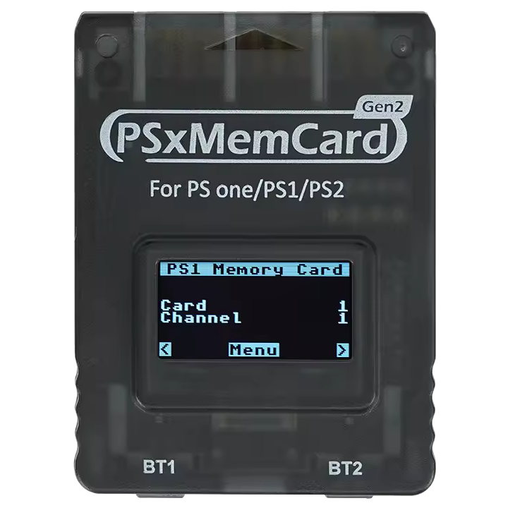
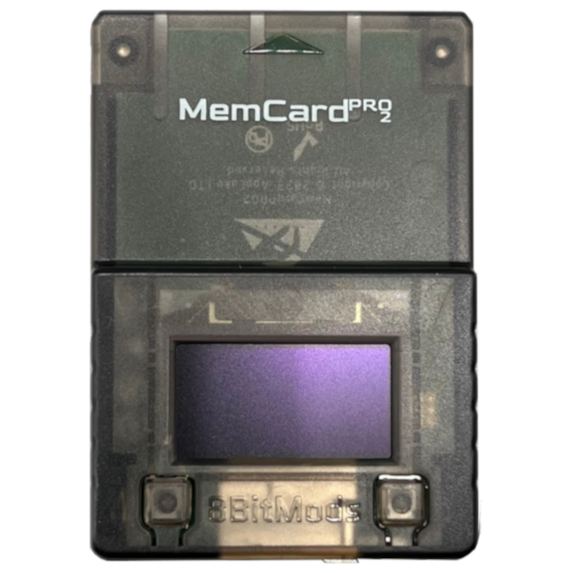
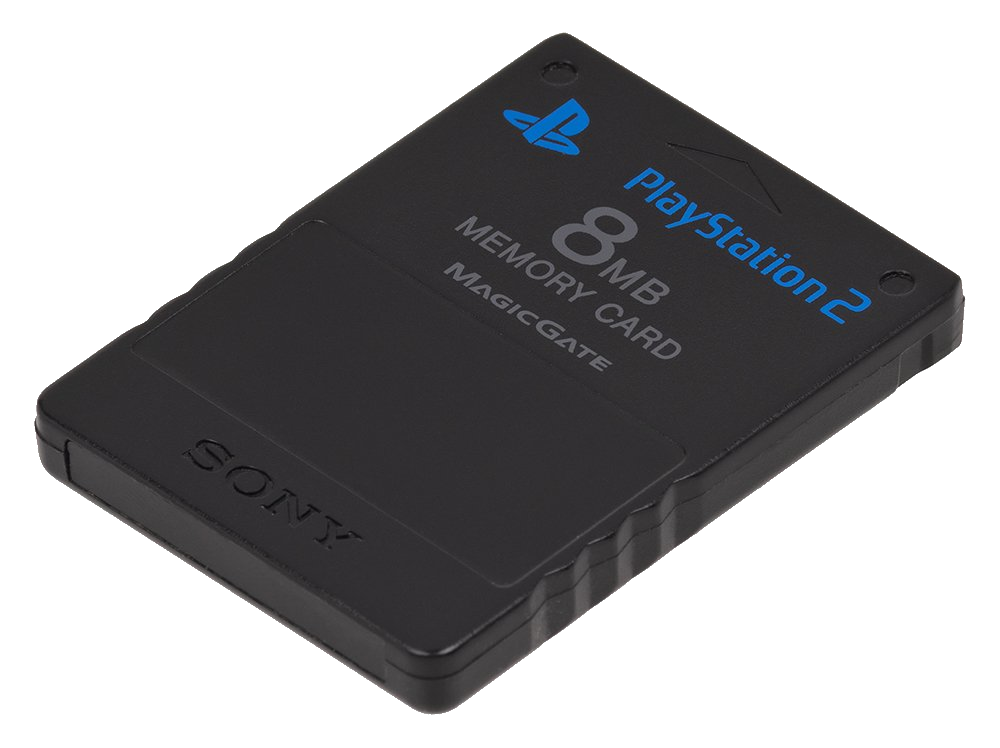

---
hide:
  - navigation
  - toc

search:
  exclude: true
---

[Exploits](index.md) > SCPH-10K to SCPH-90K 2.20 BOOTROM and PSX

# Which Memory Card do you have?

-   __SD2PSX / PSxMemCard Gen2__

    ---

    { .md-button .md-button--stretch }

-   __MemCard PRO2__

    ---

    { .md-button .md-button--stretch }

-   __Sony / other__

    ---

    { .md-button .md-button--stretch }

    !!! info "Currently working exploit needed to progress"

        To progress further you will already need a currently working exploit such as a working PS2BBL, FMCB, FHDB, FDVDB etc. setup.  It is highly advised to purchase an MMCE device if you are able to and come back once acquired, otherwise proceed!

