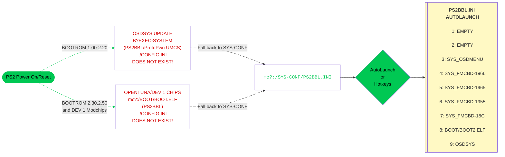

---
hide:
  - navigation

---

[Exploits](index.md) > [SCPH-10K, SCPH-15K, and DTL-H10K(S)](protopwn.md) > Sony/other MemCard

# Great! Here is your ProtoPwn download for Sony/other memcards:

## Step 1 - How to use .psu
Read this tutorial first: [:material-help-circle: PSU Paste Tutorial](../site_tutorial/index.md){ target="blank" }

## Step 2 - Download Integral Files  
Download ProtoPwn, BOOT, SYS-CONF, copy and psuPaste via wLE ISR exFAT to your memory card.

- [:material-cloud-download: ProtoPwn](https://downloads.ps2homebrewstore.com/EXPLOITS/ProtoPWN.psu)  
  Exploit

- [:material-cloud-download: BOOT](https://downloads.ps2homebrewstore.com/SAS/BOOT.psu), [:material-cloud-download: BOOT MMCE](https://downloads.ps2homebrewstore.com/SAS/BOOT-MMCE.psu) or [:material-cloud-download: BOOT MX4SIO](https://downloads.ps2homebrewstore.com/SAS/BOOT-MX4SIO.psu)  
  BOOT folder

- [:material-cloud-download: SYS-CONF](https://downloads.ps2homebrewstore.com/SAS/SYS-CONF.psu)  
  System Configuration folder

## Step 3 - Recommended Homebrew  
Download these optional but recommended apps and psuPaste via wLE ISR exFAT.

- [:material-cloud-download: OSDMenu](https://downloads.ps2homebrewstore.com/SAS/SYS_OSDMENU.psu)  
  A modern take on FMCB with many many more features which has support for most devices.

- [:material-cloud-download: wLE ISR exFAT MX4SIO](https://downloads.ps2homebrewstore.com/SAS/APP_WLE-ISR-XF-MX.psu)  
  File maanagger with MX4SIO support

- [:material-cloud-download: wLE ISR exFAT MMCE](https://downloads.ps2homebrewstore.com/SAS/APP_WLE-ISR-XF-MM.psu)  
  File Manager with MMCE support

- [:material-cloud-download: NHDDL (selct `Nightly` and `Download PSU`)](https://pcm720.github.io/nhddl-psu/){ target="blank" }  
  Front-end for Neutrino to display PS2 ISOS and launch them

- [:material-cloud-download: Neutrino (NOT a PSU. Unzip to root of USB and `MC Paste` via wLE)](https://downloads.ps2homebrewstore.com/NON-SAS/NEUTRINO.zip)  
  Backed ISO loader which focuses on compatibility

- [:material-cloud-download: OPL 1.2.0 Beta 2249](https://downloads.ps2homebrewstore.com/SAS/APP_OPL/APP_OPL120B2249.psu)  
  Open PS2 Loader: ISO loader that everyone knows...

- [:material-cloud-download: DKWDRV](https://downloads.ps2homebrewstore.com/SAS/PS1_DKWDRV.psu)  
  In Development PS1 Launcher which aims to replace PS1DRV

- [:material-cloud-download: POPSLoader](https://downloads.ps2homebrewstore.com/SAS/PS1_POPSLOADER.psu)  
  Front end for POPS emulator to play PS1 `.VCD` files.

- [:material-cloud-download: Restart](https://downloads.ps2homebrewstore.com/SAS/RESTART.psu)  
  Restart your PS2

- [:material-cloud-download: PowerOff](https://downloads.ps2homebrewstore.com/SAS/POWEROFF.psu)  
  Shutodwn your PS2

## Step 4 - OSDMenu Configurator

- [:material-cloud-download: OSDMenu COnfigurator](https://downloads.ps2homebrewstore.com/NON-SAS/SYS_OSDMENU-CONFIGURATOR.zip)

- Download `OSDMenu Configurator` and place on device of choice (usb, mx4sio, mmce) at `device:/APPS/`  
  You should end up with `device:/APPS/SYS_OSDMENU-CONFIGURATOR/osdmenu-configurator.elf`  
  You will launch `OSDMenu Configurator` to configure your new hacked OSDSYS (OSDMenu) to show, hide, and edit options as desired once your PS2 is up and running in next step.

## Step 5 - Reboot!
Reboot your PS2. The screenshots below are what you should see:

???+ example "Example of what you will encounter:"

    

    - { width="300" .on-glb data-gallery="protopwn" }
      ///caption
      __Step 1:__ Press controller button here for hotkeys or wait for it to autoboot what you have set for LK_AUTO_E? in `mc?:/SYS-CONF/PS2BBL.INI`
      ///
    - { width="300" .on-glb data-gallery="protopwn" }
      ///caption
      __Step 2:__ OSDMenu which is hacked OSDSYS. Edit `mc?:/SYS-CONF/OSDMENU.CNF` as desired. Simply remove `# ` per entry to show items that are hidden.
      ///
    - { width="300" .on-glb data-gallery="protopwn" }
      ///caption
      __TIP:__ You can launch apps from here!
      ///

    

## Boot Process

!!! info "Landing on your hacked OSDSYS of choice:"

    PS2BBL.INI and PSXBBL.INI are setup so that minimal config changes are needed if at all. To land on your hacked OSDSYS of choice, install the [OSDMenu/ FMCB Version XXXX](../apps/index.md#system-apps) as needed. If multiple are installed (such as the MMCE AIO downloads), you can delete in order from first to last to land on the desired app. This is especially useful for modchip users as they may not play well or at all with some or all of the OSDSYS such as I believe Mars Pro. In that case, just delete all of the SYS_OSDMENU and SYS_FMCB-XXXX folders. Modchip users may need to disable chip to do so.

## PS2BBL Hotkeys:

{ width="800" .on-glb }
///caption
Config @ mc?:/SYS-CONF/PS2BBL.INI
///

!!! warning "Emergency Mode"

    If something breaks on your setup but PS2BBL still boots, just hold `R1+START`. It will trigger emergency mode where PS2BBL will try to boot `RESCUE.ELF` from USB device Root on an endless loop. Recommended to rename wLE ISR Exfat to `RESCUE.ELF`

[umcs]: ../umcs/index.md
