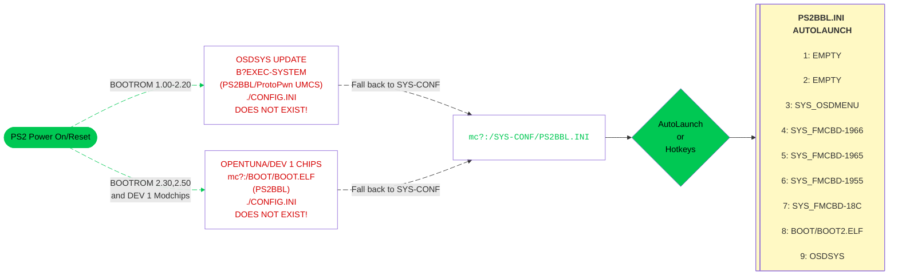

---
hide:
  - navigation

---

[Exploits](index.md) > [SCPH-18K to SCPH-90K 2.20 BOOTROM and PSX](ps2bbl.md) > Sony/Other Memcard

# Great! Here is your PS2BBL download for Sony/other memcards:

## Step 1
- [:material-cloud-download: Download KELFBinder][KELFBinder-dl]

## Step 2
- [:material-help-circle: KELFBinder/OpenTuna Installer Tutorial PLEASE READ!!](../exploits/kelfbinder-tutorial.md){ target="blank" }

??? warning "KELFBinder MagicGate test fails, and/or my bootrom is 2.30 or later!"

    If the MagicGate test fails or your bootrom is 2.30 or later, you need to use OpenTuna. You can still run KELFBinder, but chose to install OpenTuna via the KELFBinder Installer or OpenTuna Installers found [here](tuna-mc.md).

    !!! danger "Using the wrong OpenTuna version:"

        Using the incorrect OpenTuna version for your memory card may corrupt the file system. If you are unsure, run [ROM Version Check](../diag/index.md) to see your BOOTROM info version to help choose the correct OpenTuna exploit! This is included in the KELFBinder download labeled in `KELFBinder-UMCS/INSTALL/CORE/BACKDOOR.ELF`

        Otherwise if installing for another console use these below:

        [:material-help-circle: PSU Paste Tutorial](../site_tutorial/index.md){ target="blank" }

        [:material-cloud-download: OpenTuna 1.10-1.60 __SCPH-18XXX to 3XXXX__](https://downloads.ps2homebrewstore.com/EXPLOITS/OpenTuna_FAT-110-120-150-160.psu)

        [:material-cloud-download: OpenTuna 1.70 __SCPH-50XXX (some)__](https://downloads.ps2homebrewstore.com/EXPLOITS/OpenTuna_FAT-170.psu)

        [:material-cloud-download: OpenTuna 1.90-2.50 __SCPH-50xxx (some) / 7xxxx / 9xxxx and KDL__](https://downloads.ps2homebrewstore.com/EXPLOITS/OpenTuna_Slims-190-200-220-230.psu)

        These 2 folders `BOOT` and `SYS-CONF` are needed to complete a manual OpenTuna installation

        [:material-cloud-download: BOOT](https://downloads.ps2homebrewstore.com/SAS/BOOT.psu), [:material-cloud-download: BOOT MMCE](https://downloads.ps2homebrewstore.com/SAS/BOOT-MMCE.psu) or [:material-cloud-download: BOOT MX4SIO](https://downloads.ps2homebrewstore.com/SAS/BOOT-MX4SIO.psu)

        [:material-cloud-download: SYS-CONF](https://downloads.ps2homebrewstore.com/SAS/SYS-CONF.psu)

        And to complete the install to align with the configs in `SYS-CONF`

        [:material-cloud-download: OSDMenu](https://downloads.ps2homebrewstore.com/SAS/SYS_OSDMENU.psu)

        [:material-cloud-download: NHDDL (selct nightly!)](https://pcm720.github.io/nhddl-psu/)

        [:material-cloud-download: OPL 1.2.0 Beta 2241](https://downloads.ps2homebrewstore.com/SAS/APP_OPL/APP_OPL120B2241.psu)

        [:material-cloud-download: Neutrino (NOT a PSU. Unzip to root of USB and `MC Paste` via wLE)](https://downloads.ps2homebrewstore.com//NON-SAS/NEUTRINO.zip)

        [:material-cloud-download: DKWDRV](https://downloads.ps2homebrewstore.com/SAS/PS1_DKWDRV.psu)

        [:material-cloud-download: Restart](https://downloads.ps2homebrewstore.com/SAS/RESTART.psu)
        
        [:material-cloud-download: PowerOff](https://downloads.ps2homebrewstore.com/SAS/POWEROFF.psu)

## Step 4

- Reboot your PS2. You may need to remove the exploit or memory card you used to create this card. See the screenshots below:

??? example "Example of what you will encounter:"

    

    - { width="300" .on-glb data-gallery="ps2bbl" }
      ///caption
      __Step 1:__ Press controller button here for hotkeys or wait for it to autoboot what you have set for LK_AUTO_E? in `mc?:/SYS-CONF/PS2BBL.INI`
      ///
    - { width="300" .on-glb data-gallery="ps2bbl" }
      ///caption
      __Step 2:__ OSDMenu which is hacked OSDSYS. Edit `mc?:/SYS-CONF/OSDMENU.CNF` as desired. Simply remove `# ` per entry to show items that are hidden.
      ///
    - { width="300" .on-glb data-gallery="ps2bbl" }
      ///caption
      __TIP:__ You can launch apps from here!
      ///

    

## Step 5 _(FOR PSX DESR-XXXX owners)_

- [:material-cloud-download: DOWNLOAD PSX BOOT Folder](https://downloads.ps2homebrewstore.com/SAS/BOOT-PSX.psu)

- Follow [this site tutorial](../site_tutorial/index.md){ target="blank" } to copy and PSU paste the download to your memory card.

## Boot Process:

!!! info "Landing on your hacked OSDSYS of choice:"

    PS2BBL.INI and PSXBBL.INI are setup so that minimal config changes are needed if at all. To land on your hacked OSDSYS of choice, install the [OSDMenu/ FMCB Version XXXX](../apps/index.md#system-apps) as needed. If multiple are installed (such as the MMCE AIO downloads), you can delete in order from first to last to land on the desired app. This is especially useful for modchip users as they may not play well or at all with some or all of the OSDSYS such as I believe Mars Pro. In that case, just delete all of the SYS_OSDMENU and SYS_FMCB-XXXX folders. Modchip users may need to disable chip to do so.

## PS2BBL Hotkeys:

{ width="800" .on-glb }
///caption
Config @ mc?:/SYS-CONF/PS2BBL.INI
///

!!! warning "Emergency Mode"

    If something breaks on your setup but PS2BBL still boots, just hold `R1+START`. It will trigger emergency mode where PS2BBL will try to boot `RESCUE.ELF` from USB device Root on an endless loop. Recommended to rename wLE ISR Exfat to `RESCUE.ELF`

[KELFBinder-dl]: https://github.com/saildot4k/KELFBinder-UMCS/releases/download/latest/KELFBinder-UMCS.7z
