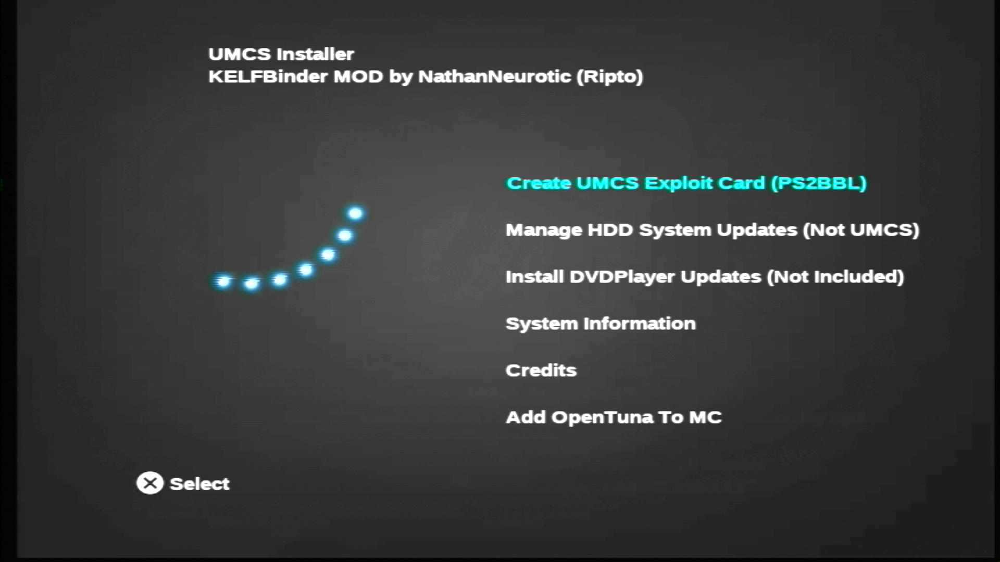

---
hide:
  - navigation
  - toc
---

[Exploits](index.md) > [SCPH-18K to SCPH-90K 2.20 BOOTROM and PSX](ps2bbl.md) > Sony/Other Memcard

- { width="300" .on-glb data-gallery="ps2bbl" }
  ///caption
  KelfBinder Installer
  ///
- { width="300" .on-glb data-gallery="ps2bbl" }
  ///caption
  OSDMenu
  ///
- { width="300" .on-glb data-gallery="ps2bbl" }
  ///caption
  You can also launch apps from here!
  ///

# Great! Here is your PS2BBL download for Sony/other memcards:

[:material-help-circle: KelfBinder/OpenTuna Installer Tutorial PLEASE READ!!](../kelfbinder-tutorial)

[:material-cloud-download: KelfBinder](https://github.com/saildot4k/KELFbinder-UMCS/releases/download/latest/KELFbinder-UMCS.7z)

!!! warning "Kelfbinder MagicGate test fails, and/or my bootrom is 2.30 or later!"

    If the MagicGate test fails or your bootrom is 2.30 or later, you need to use OpenTuna. You can still run KelfBinder, but chose to install OpenTuna via the KelfBinder Installer or OpenTuna Installers found [here](tuna-mc.md).

    !!! danger "Using the wrong OpenTuna version:"

        Using the incorrect OpenTuna version for your memory card may corrupt the file system. If you are unsure, run [ROM Version Check](../diag/index.md) to see your BOOTROM info version to help choose the correct OpenTuna exploit! This is included in the KelfBinder download labeled in `KelfBinder-UMCS/INSTALL/CORE/BACKDOOR.ELF`

        Otherwise if installing for another console use these below:

        [:material-help-circle: PSU Paste Tutorial](../site_tutorial/index.md)

        [:material-cloud-download: OpenTuna 1.10-1.60 __SCPH-18XXX to 3XXXX__](../assets/SAVE-APPLICATION-SYSTEM/Exploits/ALL/OpenTuna_FAT-110-120-150-160.psu)

        [:material-cloud-download: OpenTuna 1.70 __SCPH-50XXX (some)__](../assets/SAVE-APPLICATION-SYSTEM/Exploits/ALL/OpenTuna_FAT-170.psu)

        [:material-cloud-download: OpenTuna 1.90-2.50 __SCPH-50xxx (some) / 7xxxx / 9xxxx and KDL__](../assets/SAVE-APPLICATION-SYSTEM/Exploits/ALL/OpenTuna_Slims-190-200-220-230.psu)

        These 2 folders `BOOT` and `SYS-CONF` are needed to complete a manual OpenTuna installation

        [:material-cloud-download: BOOT](../assets/SAVE-APPLICATION-SYSTEM/BOOT.psu), [:material-cloud-download: BOOT MMCE](../assets/SAVE-APPLICATION-SYSTEM/BOOT-MMCE.psu) or [:material-cloud-download: BOOT MX4SIO](../assets/SAVE-APPLICATION-SYSTEM/BOOT-MX4SIO.psu)

        [:material-cloud-download: SYS-CONF](../assets/SAVE-APPLICATION-SYSTEM/SYS-CONF.psu)

        And to complete the install to align with the configs in `SYS-CONF`

        [:material-cloud-download: NHDDL (selct nightly!)](https://pcm720.github.io/nhddl-psu/)

        [:material-cloud-download: OPL 1.2.0 Beta 2241](../assets/SAVE-APPLICATION-SYSTEM/APP_OPL120B2241.psu)

        [:material-cloud-download: Neutrino (NOT a PSU. Unzip to root of USB and `MC Paste` via wLE)](../assets/NON-SAS/NEUTRINO.zip)

        [:material-cloud-download: DKWDRV](../assets/SAVE-APPLICATION-SYSTEM/PS1_DKWDRV.psu)

        [:material-cloud-download: Restart](../assets/SAVE-APPLICATION-SYSTEM/RESTART.psu)
        
        [:material-cloud-download: PowerOff](..//assets/SAVE-APPLICATION-SYSTEM/POWEROFF.psu)

## Hotkeys
{ width="800" .on-glib }
///caption
Config @ mc?:/SYS-CONF/PS2BBL.INI
///

!!! warning "Emergency Mode"

    If something breaks on your setup but PS2BBL still boots, just hold `R1+START`. It will trigger emergency mode where PS2BBL will try to boot `RESCUE.ELF` from USB device Root on an endless loop. Recommended to rename wLE ISR Exfat to `RESCUE.ELF`