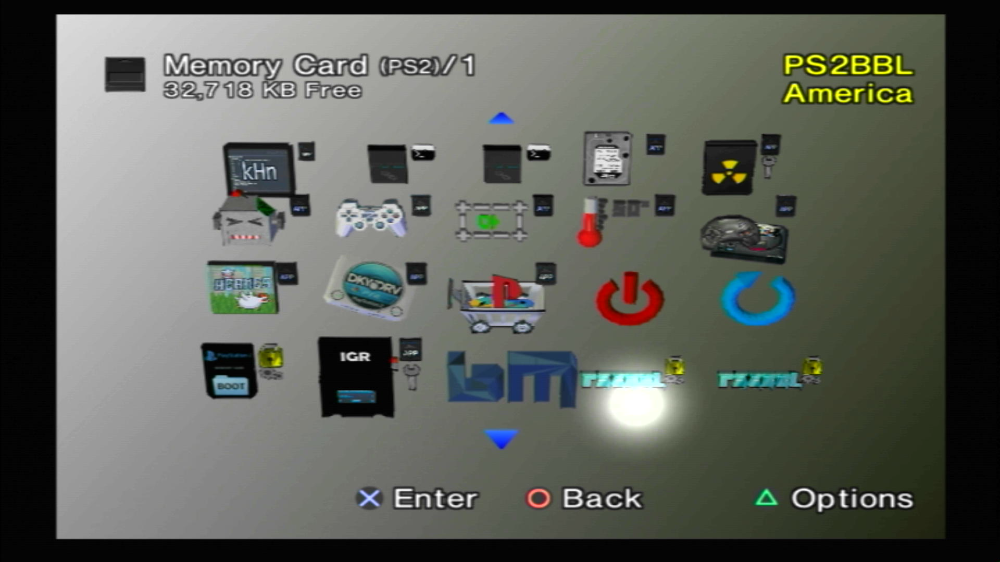

---
hide:
  - navigation
  - toc
---

[Exploits](index.md) > [SCPH-18000 - SCPH-900XX 2.20 BOOTROM or PSX](ps2bbl.md) > MCP2

- { width="300" .on-glb data-gallery="ps2bbl" }
  ///caption
  OSDMenu
  ///
- { width="300" .on-glb data-gallery="ps2bbl" }
  ///caption
  You can launch apps from here!
  ///

# Great! Here is your PS2BBL download for MCP2:

-   __MemCard PRO2 PS2BBL__

    ---
    
    { width="300" } 

    Extract the download to your MCP2 sdcard. Using the MCP2 web UI, set the bootcard. Make sure sd card compatibility is disabled.

    [:material-cloud-download: MCP2 PS2BBL AIO](../assets/MEMCARDPRO2-PS2BBL-AIO.zip)

    [:material-cloud-download: MCP2 PS2BBL Barebones](../assets/MEMCARDPRO2-PS2BBL.zip)

## Hotkeys
{ width="800" .on-glb }
///caption
Config @ mc?:/SYS-CONF/PS2BBL.INI
///

!!! warning "Emergency Mode"

    If something breaks on your setup but PS2BBL still boots, just hold `R1+START`. It will trigger emergency mode where PS2BBL will try to boot `RESCUE.ELF` from USB device Root on an endless loop. Recommended to rename wLE ISR Exfat to `RESCUE.ELF`