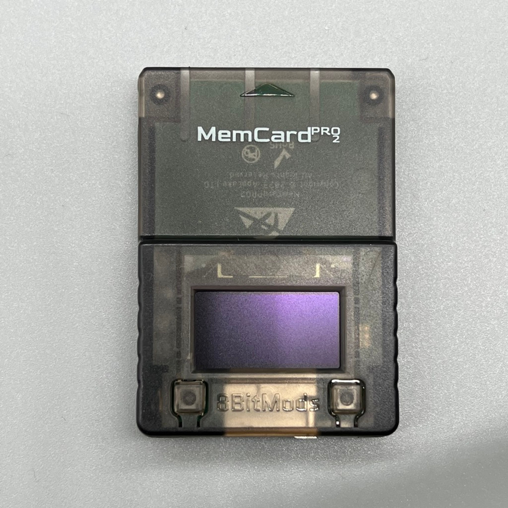

---
hide:
  - navigation
  - toc
---

[Exploits](index.md) > SCPH-18000 - SCPH-900XX 2.20 BOOTROM or PSX

# Which Memory Card do you have?

-   __SD2PSX / PSxMemcard Gen2__

    ---

    

    [:material-arrow-right-box:  Click Here](ps2bbl-sd2psx.md)

-   __MemCard Pro 2__

    ---

    

    [:material-arrow-right-box:  Click Here](ps2bbl-mcp2.md)

-   __Sony / Other__

    ---

    

    PS2BBL or OpenTuna if you have a non-OEM memory card the that does not support MagicGate.

    !!! info "Currently working exploit needed to progress"

        To progress further you will already need a currently working exploit such as a working PS2BBL, FMCB, FHDB, FDVDB etc. setup.  It is highly advised to purchase an MMCE device if you are able to and come back once acquired. [Otherwise continue!](ps2bbl-mc.md)

