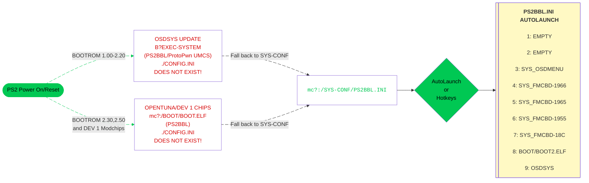

---
hide:
  - navigation

---

[Exploits](index.md) > [SCPH-90K 2.30 BOOTROM and PS2TV](tuna.md) > Sony/other MemCard

# Great! Here is your OpenTuna download for Sony/other memcards:

## Step 1

- [:material-cloud-download: Download OpenTuna AIO Installer (5.5MB Freespace needed!)](https://github.com/saildot4k/OpenTuna_2_PS2BBL_2_OSDMenu/releases/download/latest/OPENTUNAtoPS2BBL-INSTALLER-AIO.ELF)  
--or--
- [:material-cloud-download: Download OpenTuna Barebones Installer (2.5MB Freespace needed!)](https://github.com/saildot4k/OpenTuna_2_PS2BBL_2_OSDMenu/releases/download/latest/OPENTUNAtoPS2BBL-INSTALLER-AIO.ELF)

??? info "Alternative downloads for those that prefer to PSU paste."

    Download, copy and PSU paste OpenTuna, BOOT and SYS-CONF to the root of your memory card.

    - [:material-help-circle: PSU Paste Tutorial](../site_tutorial/index.md){ target="blank }

    - [:material-cloud-download: OpenTuna 1.90-2.50](https://downloads.ps2homebrewstore.com/EXPLOITS/OpenTuna_Slims-190-200-220-230.psu)

    - [:material-cloud-download: BOOT][BOOT], [:material-cloud-download: BOOT MMCE][BOOT-MMCE] or [:material-cloud-download: BOOT MX4SIO][BOOT-MX4SIO]

    [BOOT]: https://downloads.ps2homebrewstore.com/SAS/BOOT.psu
    [BOOT-MMCE]: https://downloads.ps2homebrewstore.com/SAS/BOOT-MMCE.psu
    [BOOT-MX4SIO]: https://downloads.ps2homebrewstore.com/SAS/BOOT.psu

    - [:material-cloud-download: SYS-CONF](https://downloads.ps2homebrewstore.com/SAS/SYS-CONF.psu)

    Download these optional but recommended apps and psuPaste via wLE ISR exFAT.

    - [:material-cloud-download: OSDMenu](https://downloads.ps2homebrewstore.com/SAS/SYS_OSDMENU.psu)

    - [:material-cloud-download: NHDDL (selct nightly!)](https://pcm720.github.io/nhddl-psu/)

    - [:material-cloud-download: OPL 1.2.0 Beta 2249](https://downloads.ps2homebrewstore.com/SAS/APP_OPL120B2249.psu)

    - [:material-cloud-download: Neutrino (NOT a PSU. Unzip to root of USB and `MC Paste` via wLE)](https://downloads.ps2homebrewstore.com/NON-SAS/NEUTRINO.zip)

    - [:material-cloud-download: wLE ISR exFAT MX4SIO](https://downloads.ps2homebrewstore.com/SAS/APP_WLE-ISR-XF-MX.psu)

    - [:material-cloud-download: wLE ISR exFAT MMCE](https://downloads.ps2homebrewstore.com/SAS/APP_WLE-ISR-XF-MM.psu)

    - [:material-cloud-download: DKWDRV](https://downloads.ps2homebrewstore.com/SAS/PS1_DKWDRV.psu)

    - [:material-cloud-download: Restart](https://downloads.ps2homebrewstore.com/SAS/RESTART.psu)
    
    - [:material-cloud-download: PowerOff](https://downloads.ps2homebrewstore.com/SAS/POWEROFF.psu)

## Step 2

- If you opted to use the OpenTuna AIO or Barebones installer, please read and follow the [:material-help-circle: OpenTuna Installer Tutorial](kelfbinder-tutorial.md/#opentuna-installer). Otherwise skip to Step 3.

## Step 3

- [:material-cloud-download: OSDMenu COnfigurator](https://downloads.ps2homebrewstore.com/NON-SAS/SYS_OSDMENU-CONFIGURATOR.zip)

- Download `OSDMenu Configurator` and place on device of choice (usb, mx4sio, mmce) at `device:/APPS/`  
You should end up with `device:/APPS/SYS_OSDMENU-CONFIGURATOR/osdmenu-configurator.elf`  
You will launch `OSDMenu Configurator` to configure your new hacked OSDSYS (OSDMenu) to show, hide, and edit options as desired once your PS2 is up and running in next step.

## Step 3

- Reboot your PS2 with the modified memory card. You may need to remove whatever exploit/card you used to initially run an exploit or homebrew.

- Follow the steps in the screenshots below to run your newly setup card.

???+ example "Example of what you will encounter:"

    

    - { width="300" .on-glb data-gallery="opentuna" }
      ///caption
      __Step 1:__ Select `Browser`
      ///

    - { width="300" .on-glb data-gallery="opentuna" }
      ///caption
      __Step 2:__ Select `Memory Card 1`
      ///

    - { width="300" .on-glb data-gallery="opentuna" }
      ///caption
      __Step 3:__ Press `Back`
      ///

    - { width="300" .on-glb data-gallery="opentuna" }
      ///caption
      __Step 4:__ Press `Back`
      ///

    - { width="300" .on-glb data-gallery="opentuna" }
      ///caption
      __Step 5:__ Press controller button here for hotkeys or wait for it to autoboot what you have set for LK_AUTO_E? in `mc?:/SYS-CONF/PS2BBL.INI`
      ///
    - { width="300" .on-glb data-gallery="opentuna" }
      ///caption
      __Step 6:__ OSDMenu which is hacked OSDSYS. Edit `mc?:/SYS-CONF/OSDMENU.CNF` as desired. Simply remove `# ` per entry to show items that are hidden.
      ///
    - { width="300" .on-glb data-gallery="opentuna" }
      ///caption
      __TIP:__ You can launch apps from here!
      ///

    

## Boot Process:

!!! info "Landing on your hacked OSDSYS of choice:"

    PS2BBL.INI and PSXBBL.INI are setup so that minimal config changes are needed if at all. To land on your hacked OSDSYS of choice, install the [OSDMenu/ FMCB Version XXXX](../apps/index.md#system-apps) as needed. If multiple are installed (such as the MMCE AIO downloads), you can delete in order from first to last to land on the desired app. This is especially useful for modchip users as they may not play well or at all with some or all of the OSDSYS such as I believe Mars Pro. In that case, just delete all of the SYS_OSDMENU and SYS_FMCB-XXXX folders. Modchip users may need to disable chip to do so.

## PS2BBL Hotkeys:

{ width="800" .on-glb }
///caption
Config @ mc?:/SYS-CONF/PS2BBL.INI
///

!!! warning "Emergency Mode"

    If something breaks on your setup but PS2BBL still boots, just hold `R1+START`. It will trigger emergency mode where PS2BBL will try to boot `RESCUE.ELF` from USB device Root on an endless loop. Recommended to rename wLE ISR Exfat to `RESCUE.ELF`