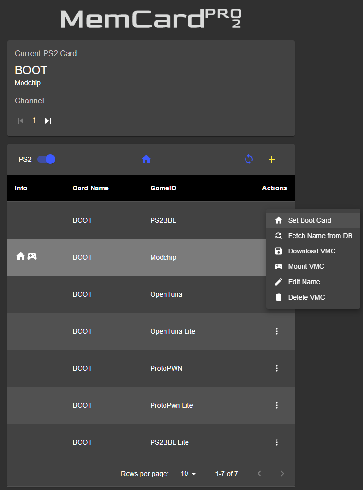
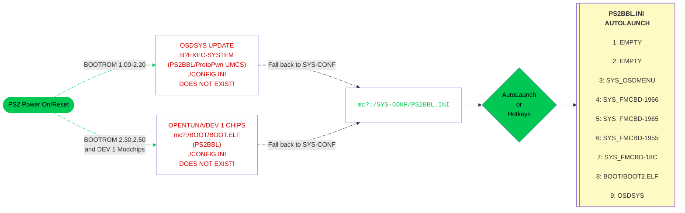

---
hide:
  - navigation
---

[Exploits](index.md) > [SCPH-90K 2.30 BOOTROM and PS2TV](tuna.md) > MCP2

# Great! Here is your OpenTuna download for MCP2:

## Step 1
- [:material-cloud-download: Download MCP2 OpenTuna](https://downloads.ps2homebrewstore.com/MMCE-ALL.7z)  
- Extract the download to your MCP2 SD card.

## Step 2
- [:octicons-link-external-16: Download and update the MCP2 Firmware][mcp2fw]{ target="blank" }  
- Extract the zip and place on root of your SD card. Insert SD card into MCP2.  
- Plug into power or PS2 and power on. (_Tip: leave MCP2 plugged into USB power_) The MCP2 will show a progress bar updating the firmware.  
- DO NOT REMOVE USB/POWER WHILE UPDATE IS IN PROGRESS!

## Step 3
- Using the [:octicons-link-external-16: MCP2 WEB UI directions][mcp2-webui]{ target="blank" }, make MCP2 join wifi and set SD card compatibility to disabled

??? example "MCP2 Card Settings Screenshot:"

    { width="600"}

## Step 4
- Using the MCP2 WEB UI, set the bootcard to `OpenTuna` and Mount VMC. 

??? example "MCP2 BootCard Settings Screenshot:"

    { width="600"}

[mcp2fw]: https://distribution.appcake.co.uk/install/8bitmods/apps/memcard-pro2/public

[mcp2-webui]: https://www.8bitmods.wiki/wireless-features

## Step 5
- Plug MCP2 into PS2 if you have not, then boot/reboot the PS2. You should see the screenshots below:

??? example "Example of what you will encounter:"

    

    - { width="300" .on-glb data-gallery="opentuna" }
      ///caption
      __Step 1:__ Select `Browser`
      ///

    - { width="300" .on-glb data-gallery="opentuna" }
      ///caption
      __Step 2:__ Select `Memory Card 1`
      ///

    - { width="300" .on-glb data-gallery="opentuna" }
      ///caption
      __Step 3:__ Press `Back`
      ///

    - { width="300" .on-glb data-gallery="opentuna" }
      ///caption
      __Step 4:__ Press `Back`
      ///

    - { width="300" .on-glb data-gallery="opentuna" }
      ///caption
      __Step 5:__ Press controller button here for hotkeys or wait for it to autoboot what you have set for LK_AUTO_E? in `mc?:/SYS-CONF/PS2BBL.INI`
      ///
    - { width="300" .on-glb data-gallery="opentuna" }
      ///caption
      __Step 6:__ OSDMenu which is hacked OSDSYS. Edit `mc?:/SYS-CONF/OSDMENU.CNF` as desired. Simply remove `# ` per entry to show items that are hidden.
      ///
    - { width="300" .on-glb data-gallery="opentuna" }
      ///caption
      __TIP:__ You can launch apps from here!
      ///

    

## Step 6

- Scroll down to the 3rd from bottom entry: OSDMenu Configurator. You will use this to show, hide, and edit your OSDMenu configuration. As OSDMenu shows all enabled entries, not just all found paths, we have configured a clean minimal setup that you may wish to change. 

## Boot Process:

!!! info "Landing on your hacked OSDSYS of choice:"

    PS2BBL.INI and PSXBBL.INI are setup so that minimal config changes are needed if at all. To land on your hacked OSDSYS of choice, install the [OSDMenu/ FMCB Version XXXX](../apps/index.md#system-apps) as needed. If multiple are installed (such as the MMCE AIO downloads), you can delete in order from first to last to land on the desired app. This is especially useful for modchip users as they may not play well or at all with some or all of the OSDSYS such as I believe Mars Pro. In that case, just delete all of the SYS_OSDMENU and SYS_FMCB-XXXX folders. Modchip users may need to disable chip to do so.

## PS2BBL Hotkeys:

{ width="800" .on-glb }
///caption
Config @ mc?:/SYS-CONF/PS2BBL.INI
///

!!! warning "Emergency Mode"

    If something breaks on your setup but PS2BBL still boots, just hold `R1+START`. It will trigger emergency mode where PS2BBL will try to boot `RESCUE.ELF` from USB device Root on an endless loop. Recommended to rename wLE ISR Exfat to `RESCUE.ELF`

## __VMCs included:__

- PS2BBL and PS2BBL Lite
- OpenTuna and OpenTuna Lite
- ProtoPwn and ProtoPwn Lite
- Modchip

!!! question "Lite? What does that mean?"

    "Lite" VMCs only have exploit+[UMCS][umcs] installed. These will autoboot PS2BBL (hotkeys and autolaunch) to wLE ISR XF (file manager and elf loader).
    
    Otherwise VMCs come pre-installed with exploit+[UMCS]+homebrew. Homebrew that cannot be installed due to licensing or device requirements are not included: for example XEB+ and RETROLauncher.

[umcs]: ../umcs/index.md