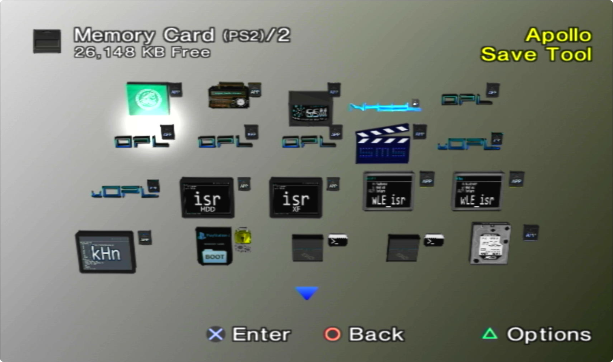

---
hide:
  - navigation
  - toc
---

[Exploits](index.md) > [SCPH-900XX 2.30 BOOTROM or KDL-22PX300](tuna.md) > MCP2

# Great! Here is your OpenTuna download for MCP2:

-   __MCP2 OpenTuna__

    ---
    
    { width="300" } 

    Extract the download to your MCP2 sdcard. Using the MCP2 web UI, set the bootcard. Make sure sd card compatibility is disabled.

    [:material-cloud-download: MCP2 OpenTuna AIO](../assets/MEMCARDPRO2-OPENTUNA-AIO.zip)

    [:material-cloud-download: MCP2 OpenTuna Barebones](../assets/MEMCARDPRO2-OPENTUNA.zip)

## Hotkeys
{ width="800" .on-glib }
///caption
Config @ mc?:/SYS-CONF/PS2BBL.INI
///

!!! warning "Emergency Mode"

    If something breaks on your setup but PS2BBL still boots, just hold `R1+START`. It will trigger emergency mode where PS2BBL will try to boot `RESCUE.ELF` from USB device Root on an endless loop. Recommended to rename wLE ISR Exfat to `RESCUE.ELF`