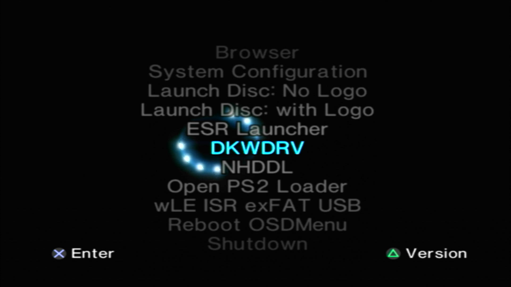
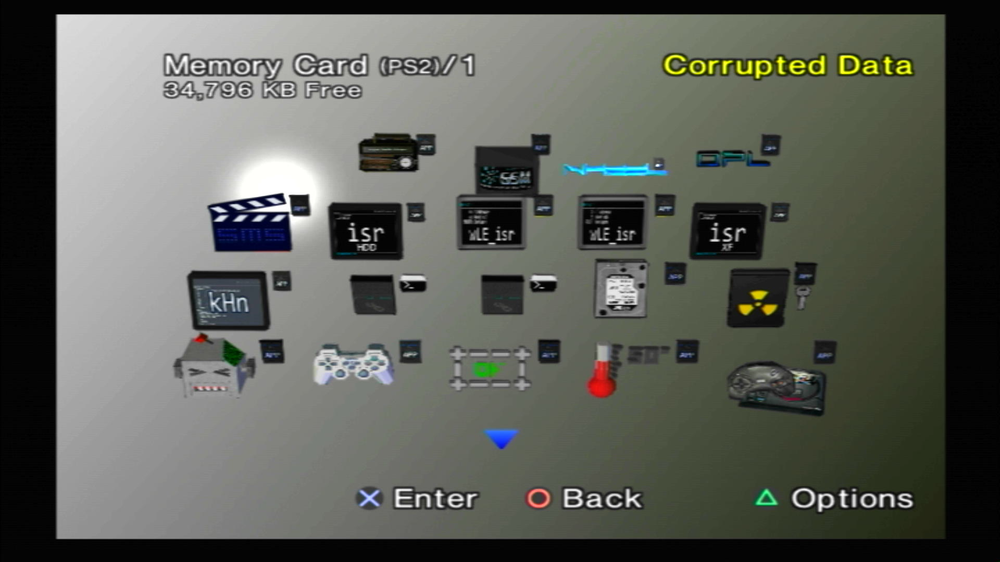
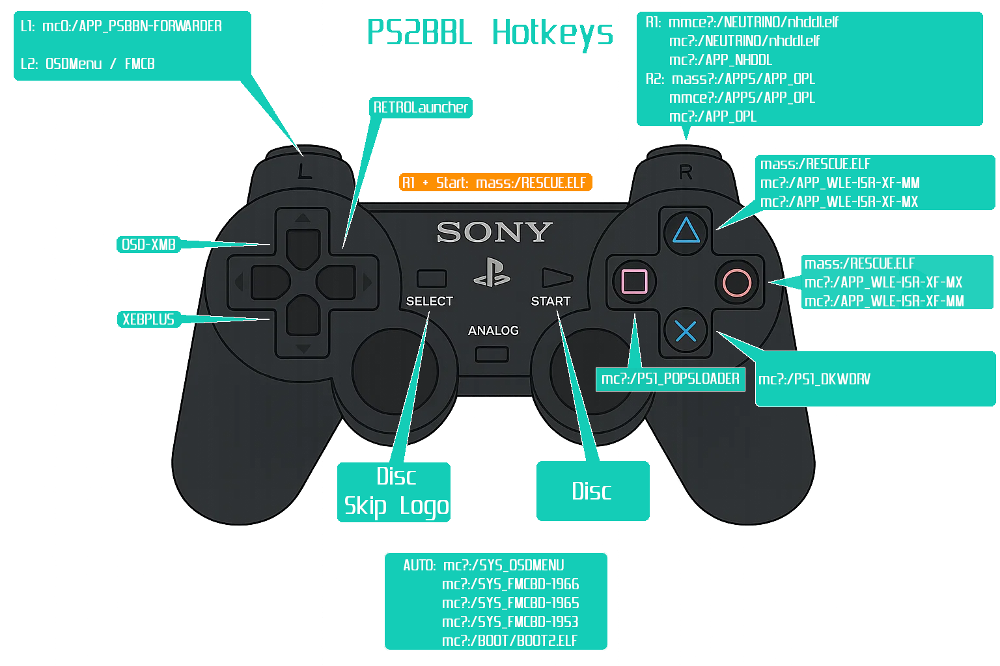

---
hide:
  - navigation
  - toc
---

[Exploits](index.md) > [SCPH-900XX 2.30 BOOTROM or KDL-22PX300](tuna.md) > MCP2

- { width="300" .on-glb data-gallery="tuna" }
  ///caption
  OSDMenu
  ///
- { width="300" .on-glb data-gallery="tuna" }
  ///caption
  Navigate here and press back twice to run exploit. You can also launch apps from here!
  ///

# Great! Here is your OpenTuna download for MCP2:

-   __MemCard PRO2 OpenTuna__

    ---

    Extract the download to your MCP2 sdcard. Using the MCP2 WEB UI, set the bootcard to `Tuna AIO Slims`. Make sure sd card compatibility is disabled.

    [:material-cloud-download: MCP2 OpenTuna AIO](../assets/MMCE-ALL.7z)

    __VMCs included:__

    - PS2BBL AIO
    - PS2BBL
    - Tuna AIO Slims
    - Tuna Slims
    - ProtoPwn AIO
    - ProtoPwn
    - Modchip AIO

## Hotkeys
{ width="800" .on-glb }
///caption
Config @ mc?:/SYS-CONF/PS2BBL.INI
///

!!! warning "Emergency Mode"

    If something breaks on your setup but PS2BBL still boots, just hold `R1+START`. It will trigger emergency mode where PS2BBL will try to boot `RESCUE.ELF` from USB device Root on an endless loop. Recommended to rename wLE ISR Exfat to `RESCUE.ELF`