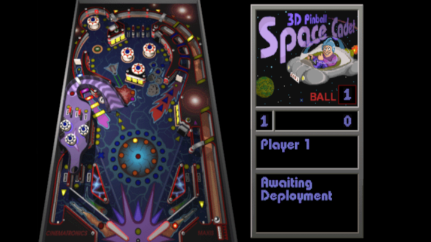
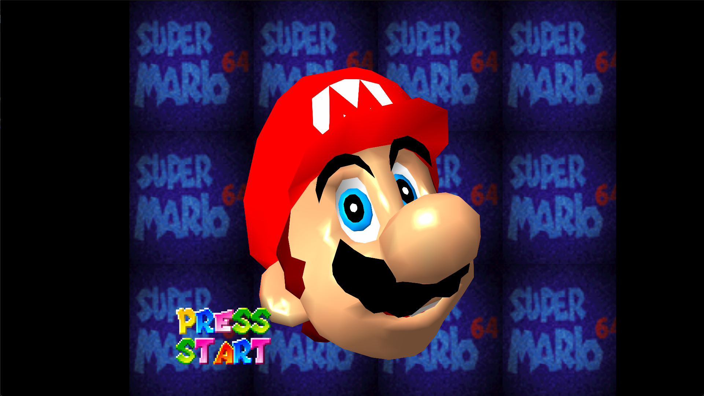

# Games

-   __3D Pinball__![non-sas-zip_pic][non-sas-zip]{ width="75" }

    ---

    [{ width="450" }](https://github.com/headshot2017/3dpinball-ps2){:target="_blank"}

    3D Pinball from Windows XP. Note: may or may not work.

    [:material-cloud-download: 3D Pinball Player](https://downloads.ps2homebrewstore.com/SAS/GME_3DPINBALL-PLAYER.psu)  
    PSU Paste to `mc?:/`

    [:material-cloud-download: 3D Pinball Assets](https://downloads.ps2homebrewstore.com/NON-SAS/3DPINBALL.zip)  
    Extract zip to `mass:/APPS/3DPINBALL`

-   __Hermes__![sas-psu_pic][sas-psu]{ width="75" }

    ---

    [{ width="450" }](https://www.retroguru.com/hermes/){:target="_blank"}

    A game by Retroguru

    [:material-cloud-download: Hermes](https://downloads.ps2homebrewstore.com/SAS/GME_HERMES.psu)

-   __Super Mario 64__![sas-psu_pic][sas-psu]{ width="75" }

    ---

    [{ width="450" }](https://archive.org/details/super-mario-64-for-ps-2){:target="_blank"}

    A game by Retroguru

    [:material-cloud-download: Super Mario 64](https://downloads.ps2homebrewstore.com/SAS/GME_SM64.psu)

[sas-psu]: ../assets/badges/SASPSU.png
[sas-zip]: ../assets/badges/SASZIP.png
[sas-7z]: ../assets/badges/SAS7Z.png
[sas-7zip]: ../assets/badges/SAS7ZIP.png
[sas-rar]: ../assets/badges/SASRAR.png
[sas-ext]: ../assets/badges/SASEXTLINK.png

[non-sas-psu]: ../assets/badges/NOTSASCOMPLIANTPSU.png
[non-sas-zip]: ../assets/badges/NOTSASCOMPLIANTZIP.png
[non-sas-7z]: ../assets/badges/NOTSASCOMPLIANT7Z.png
[non-sas-7zip]: ../assets/badges/NOTSASCOMPLIANT7ZIP.png
[non-sas-rar]: ../assets/badges/NOTSASCOMPLIANTRAR.png
[non-sas-ext]: ../assets/badges/NOTSASCOMPLIANTEXTLINK.png

[umcs-psu]: ../assets/badges/UMCSPSU.png
[umcs-zip]: ../assets/badges/UMCS7ZIP.png
[umcs-7z:]: ../assets/badges/UMCS7Z.png
[umcs-7zip]: ../assets/badges/UMCS7ZIP.png
[umcs-rar]: ../assets/badges/UMCSRAR.png
[umcs-ext]: ../assets/badges/UMCSEXTLINK.png