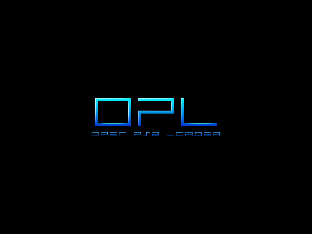
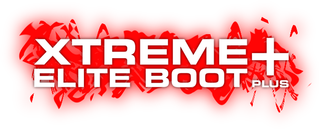

---
hide:
  - navigation
  - toc
---

# ISO Loaders

-   __OPL 1.2.0 Beta 2241__

    ---

    

    Open PS2 Loader which supports MMCE, SMB, APA, Fat32, ExFat, NBD

    [:material-cloud-download: OPL 1.2.0 Beta 2241](/docs/assets/SAVE-APPLICATION-SYSTEM/APP_OPL-120B2241.psu) 

-   __NHDDL__

    ---

    

     Frontend for Neutrino that supports Fat32/ExFat USB, APA HDD, Exfat HDD, UDPBD, MMCE, MX4SIO. 

    [:material-file-document: Documentation](https://github.com/pcm720/nhddl)

    [:material-cloud-download: NHDDL](/docs/assets/SAVE-APPLICATION-SYSTEM/APP_NHDDL.psu)

-   __Neutrino__

    ---

    

    Neutrino is a mall, fast and modular PS2 device emulator. A frontend such as NHDDL, PS2BBN DEP, OSD-XMB, XEB+ or PS2 Link is needed. 

    Supports: Fat32/ExFat USB, APA HDD, Exfat HDD, UDPBD, MMCE, MX4SIO

    This app cannot be packaged as a PSU due to subfolders. 

    [:material-file-document: Documentation](https://github.com/rickgaiser/neutrino)

    [:material-cloud-download: Neutrino](/docs/assets/NON-SAS/NEUTRINO.zip)

-   __XEB+__

    ---

    

    Fully Lua Scripted dashboard experience that is extensable. Download and extract to [XEB+ USB folder](/docs/assets/NON-SAS/XEBPLUS.zip).

    This app cannot be packaged as a PSU due to subfolders and licensing.

    [:material-cloud-download: XEB+](https://www.psx-place.com/threads/xtremeeliteboot-s-dashboard-special-xmas-showcase.38959/)

    [XEB+ Neutrino Loader plugin by Sync On Luma](https://github.com/sync-on-luma/xebplus-neutrino-loader-plugin)

    [:material-cloud-download: XEB+ USB folder](/docs/assets/NON-SAS/XEBPLUS.zip)

-   __Unnofficial OPL__

    ---

    

    KrahJohnlitos last ditch attempt to make OPL great again! 

    Fat32/ExFat USB, APA HDD, Exfat HDD, APA Jail, UDPBD, MMCE, MX4SIO and Neutrino frontend.

    [:material-cloud-download: uOPL](/docs/assets/SAVE-APPLICATION-SYSTEM/APP_UOPL.psu)

    [:material-cloud-download: uOPL Betrayal](/docs/assets/SAVE-APPLICATION-SYSTEM/APP_UOPL-BETRAYAL.psu)

