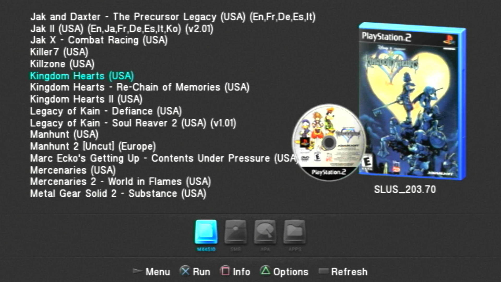
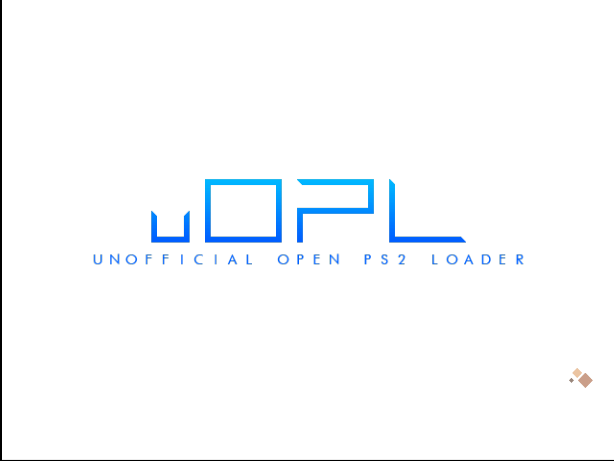
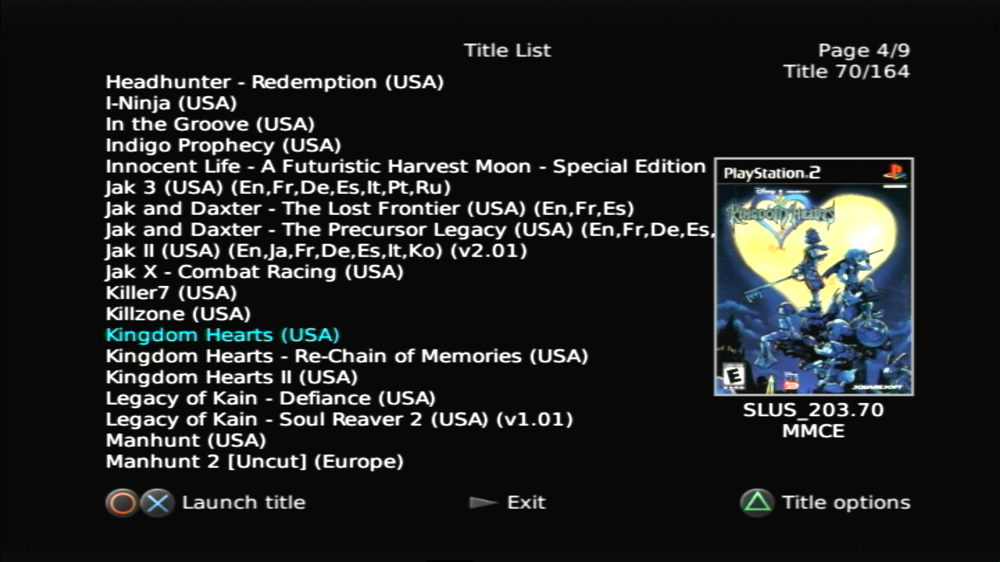
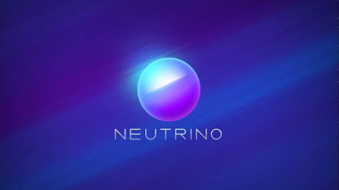
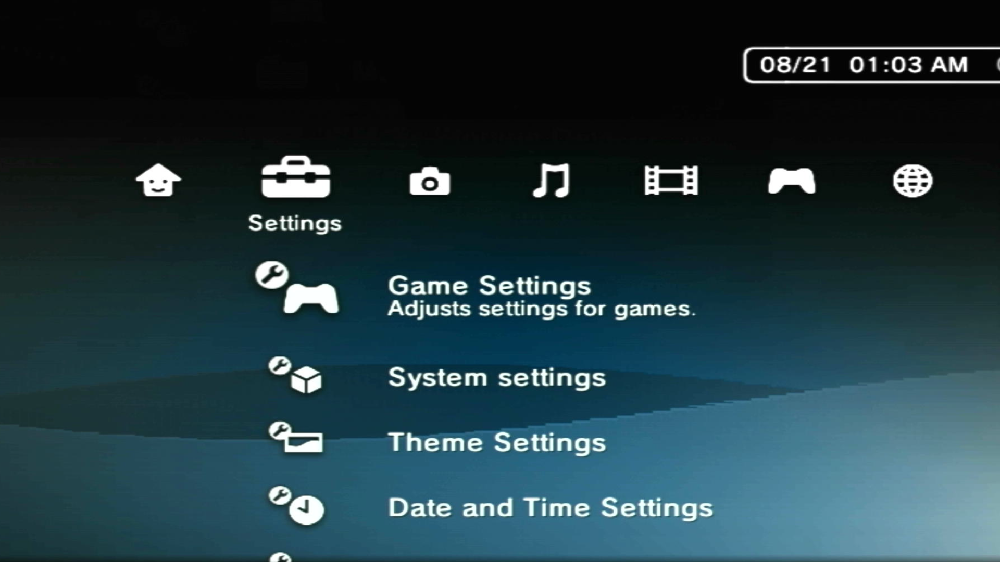
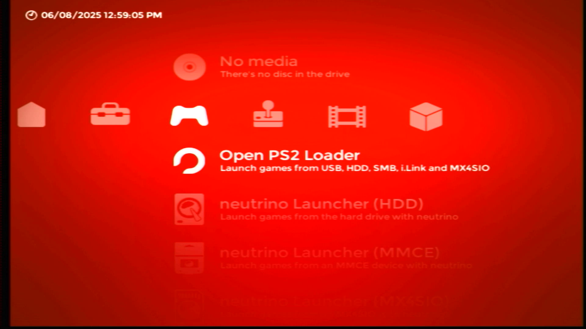

# ISO Loaders

-   __OPL__{ width="75" }

    ---

    

    Open PS2 Loader which supports MMCE, SMB, APA, Fat32, ExFat, NBD (2241)

    [:material-cloud-download: OPL 1.2.0 Beta 2241](../assets/SAVE-APPLICATION-SYSTEM/APP_OPL/APP_OPL120B2241.psu) RECOMMENDED

    [:material-cloud-download: OPL 1.2.0 Beta 2212](../assets/SAVE-APPLICATION-SYSTEM/APP_OPL/APP_OPL120B2212.psu)

    [:material-cloud-download: OPL 1.2.0 Beta 2049](../assets/SAVE-APPLICATION-SYSTEM/APP_OPL/APP_OPL120B2049GID.psu)

    !!! tip "PS2BBL hotkey"

        `R2` when the PS2BBL logo appears

-   __Unofficial OPL__{ width="75" }

    ---

    

    KrahJohnlitos last ditch attempt to make OPL great again! 

    Fat32/ExFat USB, APA HDD, Exfat HDD, APA Jail, UDPBD, MMCE, MX4SIO and Neutrino frontend.

    [:material-cloud-download: uOPL](../assets/SAVE-APPLICATION-SYSTEM/APP_OPL/APP_UOPL.psu)

    [:material-cloud-download: uOPL Betrayal](../assets/SAVE-APPLICATION-SYSTEM/APP_OPL/APP_UOPL-BETRAYAL.psu) 

    !!! tip "PS2BBL hotkey"

        `R2` when the PS2BBL logo appears

-   __NHDDL__{ width="75" }

    ---

    

    Frontend for Neutrino that supports Fat32/ExFat USB, APA HDD, Exfat HDD, UDPBD, MMCE, MX4SIO. 

    PS2BBL hotkey pre-configured: `R1`

    [:material-file-document: Documentation](https://github.com/pcm720/nhddl)

    [:material-cloud-download: NHDDL](../assets/SAVE-APPLICATION-SYSTEM/APP_NHDDL.psu)

    !!! tip "PS2BBL hotkey"

        `R1` when the PS2BBL logo appears

-   __Neutrino__{ width="75" }

    ---

    

    Neutrino is a small, fast and modular PS2 device emulator. A frontend such as NHDDL, PS2BBN DEP, OSD-XMB, XEB+ or PS2 Link is needed. 

    Supports: MBR/GPT Fat32/ExFat USB, APA HDD, Exfat HDD, UDPBD, MMCE, MX4SIO

    This app cannot be packaged as a PSU due to subfolders. Extract to `mc?:/` or `mmce:/` It will self extract to a `NEUTRINO` folder. 

    [:material-file-document: Documentation](https://github.com/rickgaiser/neutrino)

    [:material-cloud-download: Neutrino](../assets/NON-SAS/NEUTRINO.zip)

-   __OSD-XMB__{ width="75" }

    ---

    

    GUI resembling the PS3/PSP XMB Style.

    Supports: MBR/GPT Fat32/ExFat USB, APA HDD, Exfat HDD, MMCE, MX4SIO

    This app cannot be packaged as a PSU due to subfolders. 

    [:material-file-document: Documentation](https://github.com/HiroTex/OSD-XMB)

    [:material-cloud-download: OSD-XMB](../assets/NON-SAS/OSDXMB20.zip) Extract to root of USB.

    !!! tip "PS2BBL hotkey"

        `D-PAD UP` when the PS2BBL logo appears.

-   __XEB+__{ width="75" }

    ---

    

    Fully Lua Scripted dashboard experience that is extensable.

    This app cannot be packaged as a PSU due to subfolders and licensing.

    [:material-cloud-download: XEB+](https://www.psx-place.com/threads/xtremeeliteboot-s-dashboard-special-xmas-showcase.38959/)

    [:material-cloud-download: XEB+ USB folder](../assets/NON-SAS/XEBPLUS.zip) Place above contents in this folder and place at root of USB.

    [XEB+ Neutrino Loader plugin by Sync On Luma](https://github.com/sync-on-luma/xebplus-neutrino-loader-plugin)

    !!! tip "PS2BBL hotkey"
    
        `D-PAD DOWN` when the PS2BBL logo appears.

    

