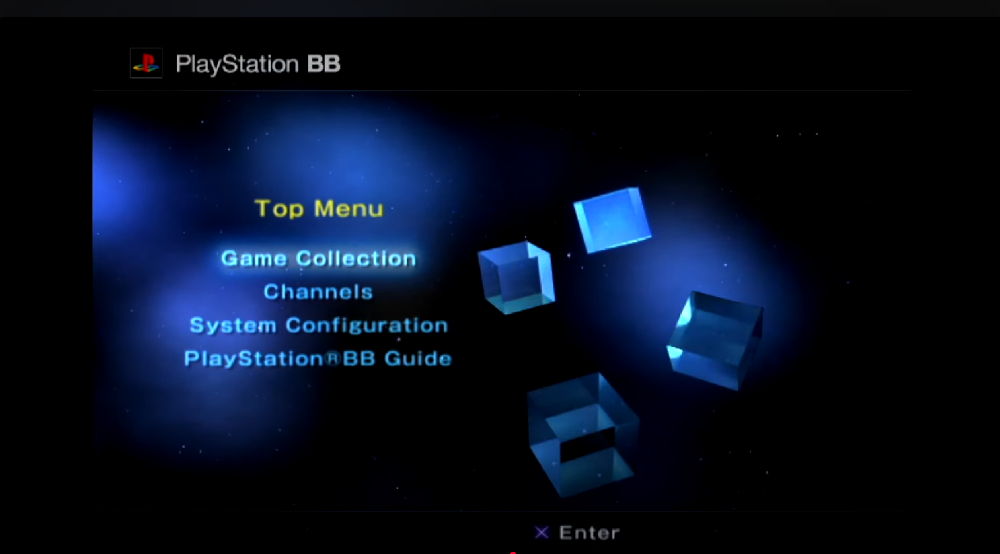

# ISO Loaders

-   __OPL 1.2.0 Betas__![sas-psu_pic][sas-psu]{ width="75" }

    ---

    

    Open PS2 Loader which supports MMCE, SMB, APA, Fat32, ExFat, NBD.  
    These extract to `APP_OPL`

    [:material-cloud-download: OPL 1.2.0 Beta 2241](https://downloads.ps2store.com/SAS/APP_OPL/APP_OPL120B2241.psu) RECOMMENDED  
    MMCE, SMB, APA, Fat32, ExFat, NBD

    [:material-cloud-download: OPL 1.2.0 Beta 2212](https://downloads.ps2store.com/SAS/APP_OPL/APP_OPL120B2212.psu)  
    SMB, APA, Fat32, ExFat, NBD

    [:material-cloud-download: OPL 1.2.0 Beta 2049](https://downloads.ps2store.com/SAS/APP_OPL/APP_OPL120B2049GID.psu)  
    SMB, APA, Fat32, ExFat, NBD

-   __OPL Previous Stable Builds__![sas-psu_pic][sas-psu]{ width="75" }

    ---

    

    Open PS2 Loader Older Builds. Compatibility ranges with all OPL but provided for games that break on newer versions and vice versa.  
    These extract to `APP_OPL`

    [:material-cloud-download: OPL 1.1.0 ](https://downloads.ps2homebrewstore.com/SAS/APP_OPL/APP_OPL-110.psu), [:material-cloud-download: OPL 1.0.0 ](https://downloads.ps2homebrewstore.com/SAS/APP_OPL/APP_OPL-100.psu)

    [:material-cloud-download: OPL 1.0.0 RC1 ](https://downloads.ps2homebrewstore.com/SAS/APP_OPL/APP_OPL-100RC1.psu), [:material-cloud-download: OPL 0.9.3 ](https://downloads.ps2homebrewstore.com/SAS/APP_OPL/APP_OPL-093.psu) 
    
    [:material-cloud-download: OPL 0.9.2 ](https://downloads.ps2homebrewstore.com/SAS/APP_OPL/APP_OPL-092.psu), [:material-cloud-download: OPL 0.9.1 ](https://downloads.ps2homebrewstore.com/SAS/APP_OPL/APP_OPL-091.psu)
    
    [:material-cloud-download: OPL 0.9.0 ](https://downloads.ps2homebrewstore.com/SAS/APP_OPL/APP_OPL-090.psu), [:material-cloud-download: OPL 0.8.0 ](https://downloads.ps2homebrewstore.com/SAS/APP_OPL/APP_OPL-080.psu)
    
    [:material-cloud-download: OPL 0.7.0 ](https://downloads.ps2homebrewstore.com/SAS/APP_OPL/APP_OPL-070.psu), [:material-cloud-download: OPL 0.6.0 ](https://downloads.ps2homebrewstore.com/SAS/APP_OPL/APP_OPL-060.psu)
    
    [:material-cloud-download: OPL 0.5.0 ](https://downloads.ps2homebrewstore.com/SAS/APP_OPL/APP_OPL-050.psu)

-   __Unofficial OPL__![sas-psu_pic][sas-psu]{ width="75" }

    ---

    

    KrahJohnlitos last ditch attempt to make OPL great again! 

    Fat32/ExFat USB, APA HDD, Exfat HDD, APA Jail, UDPBD, MMCE, MX4SIO and Neutrino frontend.  
    These extract to `APP_OPL`

    [:material-cloud-download: uOPL](https://downloads.ps2store.com/SAS/APP_OPL/APP_UOPL.psu)

    [:material-cloud-download: uOPL Betrayal](https://downloads.ps2store.com/SAS/APP_OPL/APP_UOPL-BETRAYAL.psu) 

-   __NHDDL__![sas-psu_pic][sas-psu]{ width="75" }

    ---

    

    Frontend for Neutrino that supports Fat32/ExFat USB, APA HDD, Exfat HDD, UDPBD, MMCE, MX4SIO. 

    PS2BBL hotkey pre-configured: `R1`

    [:material-file-document: Documentation](https://github.com/pcm720/nhddl)

    [:material-cloud-download: NHDDL](https://downloads.ps2homebrewstore.com/SAS/APP_NHDDL.psu)

-   __Neutrino__![nonsas-zip_pic][non-sas-zip]{ width="75" }

    ---

    

    Neutrino is a small, fast and modular PS2 device emulator. A frontend such as NHDDL, PS2BBN DEP, OSD-XMB, XEB+ or PS2 Link is needed. 

    Supports: MBR/GPT Fat32/ExFat USB, APA HDD, Exfat HDD, UDPBD, MMCE, MX4SIO

    This app cannot be packaged as a PSU due to subfolders. Extract to `mc?:/` or `mmce:/` It will self extract to a `NEUTRINO` folder. 

    [:material-file-document: Documentation](https://github.com/rickgaiser/neutrino)

    [:material-cloud-download: Neutrino](https://downloads.ps2homebrewstore.com/NON-SAS/NEUTRINO.zip)

-   __OSD-XMB__![nonsas-zip][non-sas-zip]{ width="75" }

    ---

    

    GUI resembling the PS3/PSP XMB Style.

    Supports: MBR/GPT Fat32/ExFat USB, APA HDD, Exfat HDD, MMCE, MX4SIO

    [:material-cloud-download: APP_OSDXMB](https://downloads.ps2homebrewstore.com/SAS/APP_OSDXMB.psu)  
    PSU paste to root of Memory Card  
    Edit `mc?:/APP-OSDXMB/athena.ini` as needed

    [:material-cloud-download: OSDXMB](https://downloads.ps2homebrewstore.com/NON-SAS/OSDXMB.zip)  
    Unzip to root of USB or MMCE SD Card.

-   __PSBBN DEP__![nonsas-ext_pic][non-sas-ext]{ width="75" }

    ---

    

    Playstation BroadBand Network Definitive English Patch brings PSBBN to the modern PS2 age, with ease of install, SAS Support and ISO loading.

    [:octicons-link-external-16: PSBBN-DEP](https://github.com/CosmicScale/PSBBN-Definitive-English-Patch)

-   __XEB+__![nonsas-ext_pic][non-sas-ext]{ width="75" }

    ---

    

    Fully Lua Scripted dashboard experience that is extensable.

    This app cannot be packaged as a PSU due to subfolders and licensing.

    [:octicons-link-external-16:: XEB+](https://www.psx-place.com/threads/xtremeeliteboot-s-dashboard-special-xmas-showcase.38959/)

    [:material-cloud-download: XEB+ USB folder](https://downloads.ps2homebrewstore.com/NON-SAS/XEBPLUS.zip) Place above contents in this folder and place at root of USB.

    [:octicons-link-external-16: XEB+ Neutrino Loader plugin by Sync On Luma](https://github.com/sync-on-luma/xebplus-neutrino-loader-plugin)

    

[sas-psu]: ../assets/badges/SASPSU.png
[sas-zip]: ../assets/badges/SASZIP.png
[sas-7z]: ../assets/badges/SAS7Z.png
[sas-7zip]: ../assets/badges/SAS7ZIP.png
[sas-rar]: ../assets/badges/SASRAR.png
[sas-ext]: ../assets/badges/SASEXTLINK.png

[non-sas-psu]: ../assets/badges/NOTSASCOMPLIANTPSU.png
[non-sas-zip]: ../assets/badges/NOTSASCOMPLIANTZIP.png
[non-sas-7z]: ../assets/badges/NOTSASCOMPLIANT7Z.png
[non-sas-7zip]: ../assets/badges/NOTSASCOMPLIANT7ZIP.png
[non-sas-rar]: ../assets/badges/NOTSASCOMPLIANTRAR.png
[non-sas-ext]: ../assets/badges/NOTSASCOMPLIANTEXTLINK.png

[umcs-psu]: ../assets/badges/UMCSPSU.png
[umcs-zip]: ../assets/badges/UMCS7ZIP.png
[umcs-7z:]: ../assets/badges/UMCS7Z.png
[umcs-7zip]: ../assets/badges/UMCS7ZIP.png
[umcs-rar]: ../assets/badges/UMCSRAR.png
[umcs-ext]: ../assets/badges/UMCSEXTLINK.png