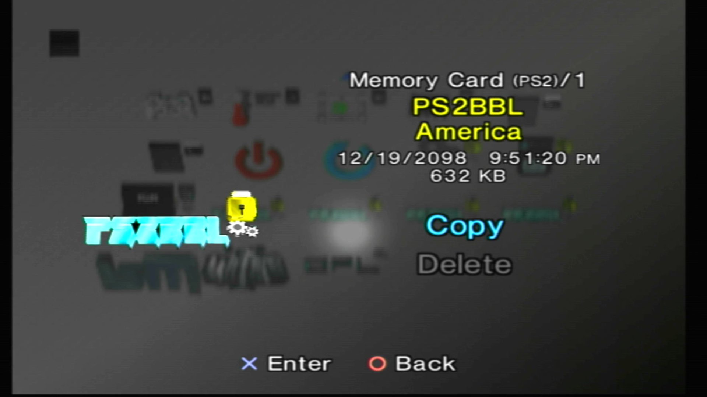
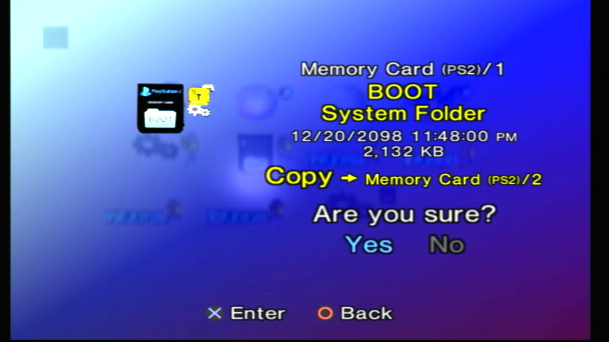
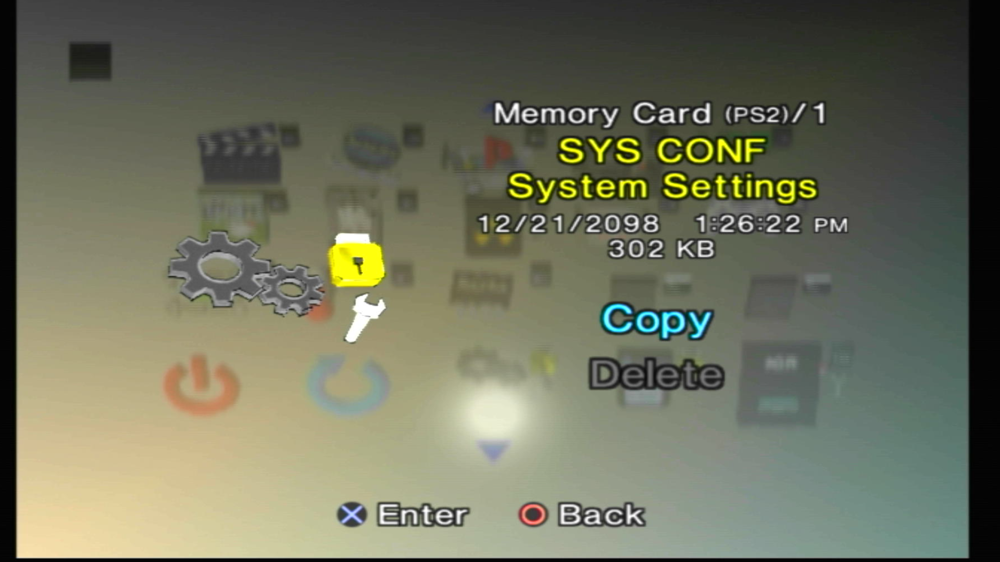
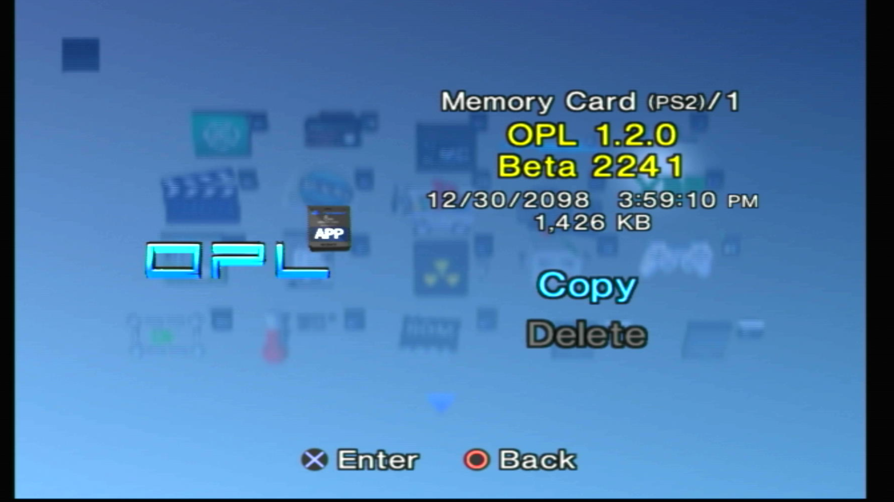
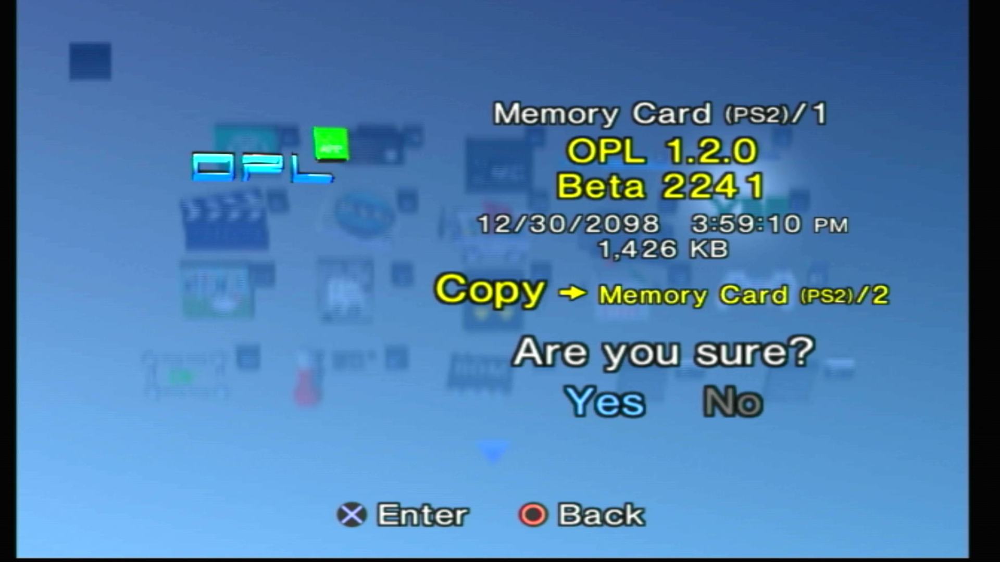
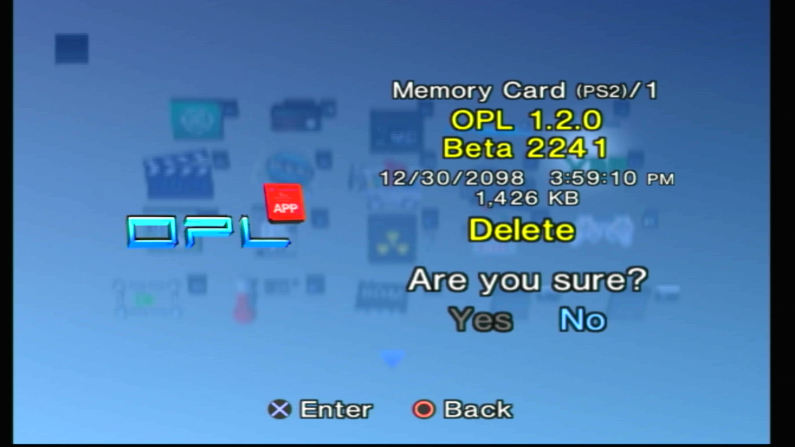
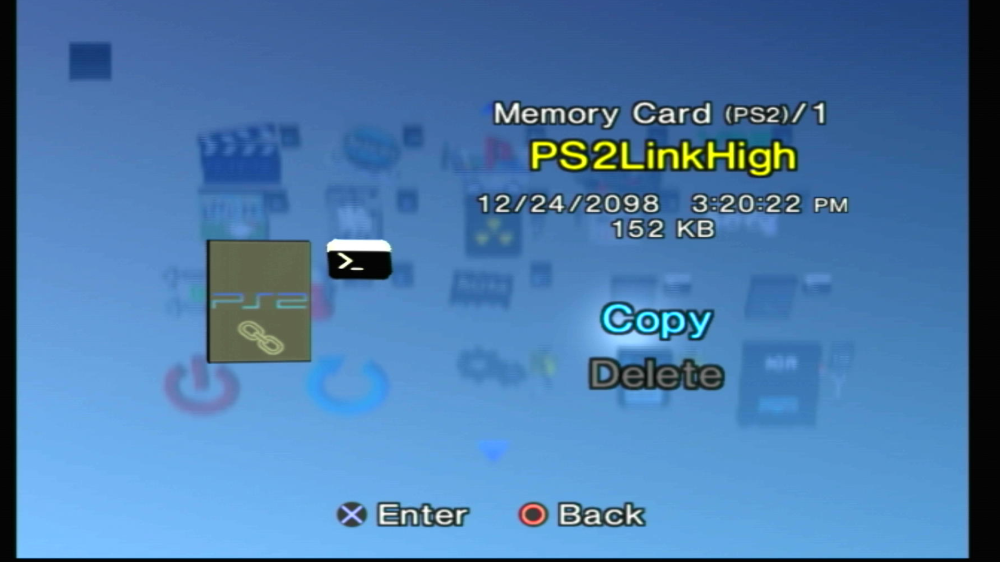

---
hide:
  - navigation
glightbox: true
---
# Icon Indicators and Warnings

## System Folders

!!! danger "Deletion of System Folders"

    Deleting System Folders such `BOOT`, `SYS-CONF`, and any exploit in `B?EXEC-SYSTEM`, `OPENTUNA`, `FUNTUNA` or `FORTUNA` can and will prevent your exploited memory card for booting! If you have an MMCE device, this is easily recoverable by grabbing another download [here](../exploits/index.md). If you have a normal Sony memory card, you will want another as backup or another exploited system to build your exploit again. So long as you have an exploit you can grab new installers [here as well](../exploits/index.md). You have been warned.

-   __Warning__

    ---

    { width="450" }

    !!! info "Warning"

        Deleting this folder will remove essential exploits, configs or files potentially causing your PS2 no longer be homebrew capable with this memory card until reinstalled.

-   __Mini Lock__

    ---

    { width="450" }

    !!! info "Warning"

        Deleting this folder will remove essential exploits, configs or files potentially causing your PS2 no longer be homebrew capable with this memory card until reinstalled.

    { width="450" }

    !!! info "Unlocked"

        Mini lock appears unlocked when copy is selected. Some folders cannot be copied to other memory cards. For example: PS2BBL exploit to another Sony memory card

    

## Gears and Wrench

-   __Gears / Mini Gears__

    ---

    { width="450" }

    !!! info "Config files"

        Configuration files, typcially ending in `.ini` or `.cfg`. Commonly used by PS2BBL, FMCB, OSDMenu, OPL etc.

-   __Mini Wrench__

    ---

    { width="450" }

    !!! info "System/App configurators"

        Apps that allow ease of configuringing `.ini` and `.cfg` files, such as FMCB Configurator
        
        Variants:

        - Green: Copy
        
        - Red: Delete

## Mini Memory Card

-   __Mini Memory Card__

    ---

    { width="450" }

    !!! info "Application"

        SAS compliant folder that contains a PS2 ELF. OSDMenu can launch these.

-   __Mini Memory Card: Copy__

    ---

    { width="450" }

    !!! info "Application/Folder Copy"

        Appears when copying the folder.

-   __Mini Memory Card: Delete__

    ---

    { width="450" }

    !!! info "Application/Folder Delete"

        Appears when deleting the folder.

## Other

-   __Mini-Run Time Environment (RTE)__

    ---

    { width="450" }

    !!! info "Run Time Application"

        Lua/Javascript application that has assets external to the main ELF.

-   __Mini Command Prompt__

    ---

    { width="450" }

    !!! info "Mini Command Prompt"

        Debugger application

