---
hide:
  - navigation
glightbox: true
---

# Tutorial: How to use this sites content

##  What is "SAS"

Otherwise known as `Save Application System`, SAS apps/folders are single directory folders that play nice with the memory card filesystem as subdirectories can easily break it.

__SAS Applications include:__

- [Memory Card icons](icon_meanings) for visual indicator as to apps purpose and critical status to your boot environment. 

- title.cfg for other apps such as OSDMenu, OPL, OSD-XMB and PSBBN DEP to list apps to run without user intervention.

- Prefix (if app supported) such as `APP_OPL` (_Application_) or `DST_ROMVERCHK` (_Diagnostic Service Tool_) for organization.

- Packaged via a container called a `psu`. This is used to transfer game saves, but adopted for SAS so that all assets are contained. Even date/time is preserved so that Apps are always in order alphabetically by type in the MC Browser!

## How to install SAS apps

### Step 1: Open wLaunchELF ISR exFAT

[:material-cloud-download: wLE ISR eXFAT](https://israpps.github.io/projects/wlaunchelf-isr)

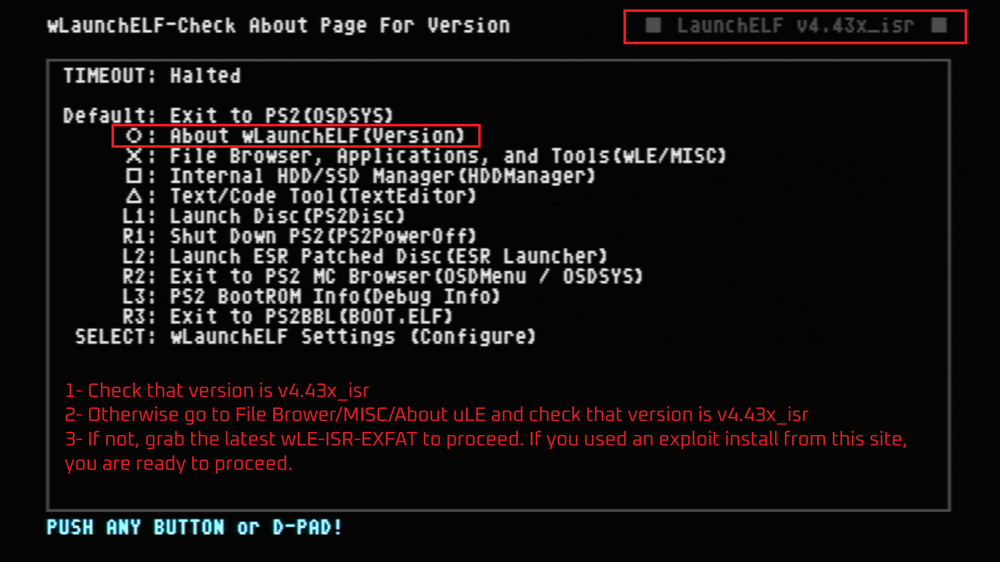{ width="800" data-gallery="tutorial"}

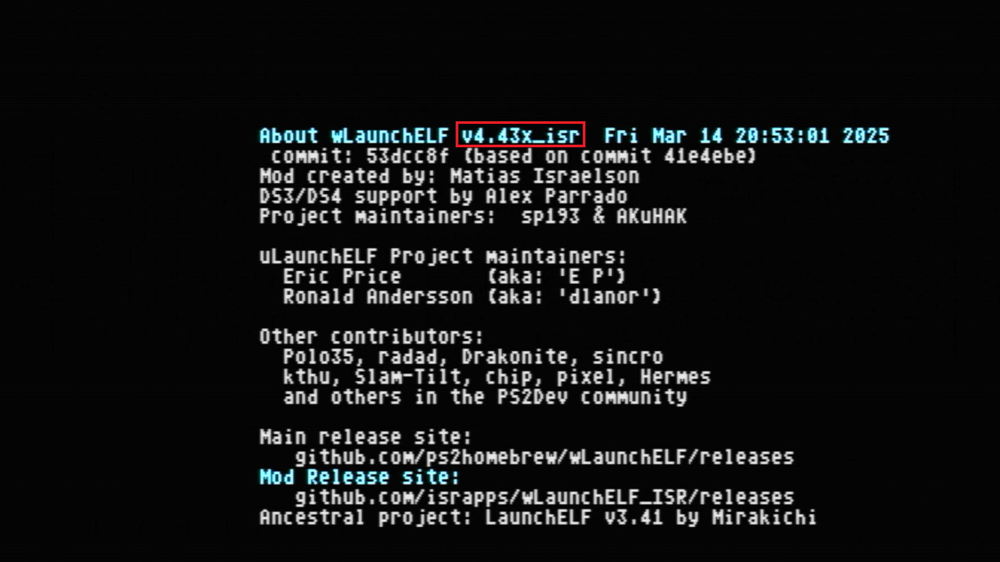{ width="800" data-gallery="tutorial"}

### Step 2: Navigate to USB and find the APP.psu
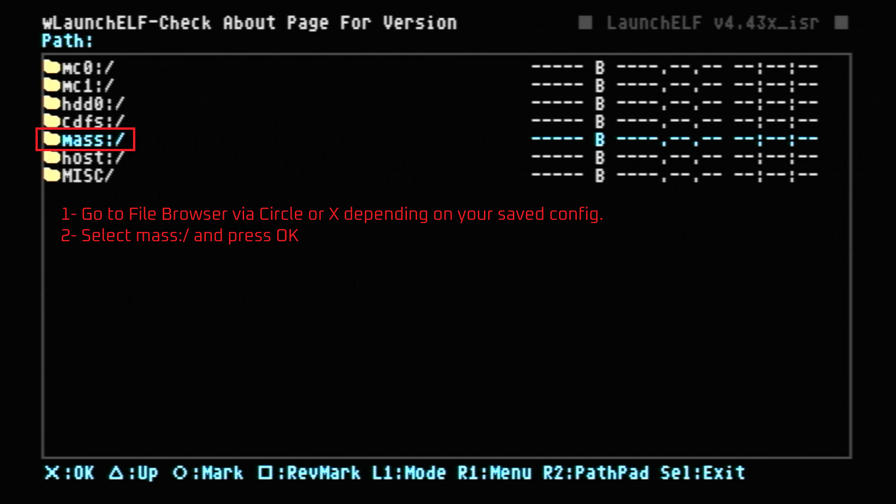{ width="800" data-gallery="tutorial"}

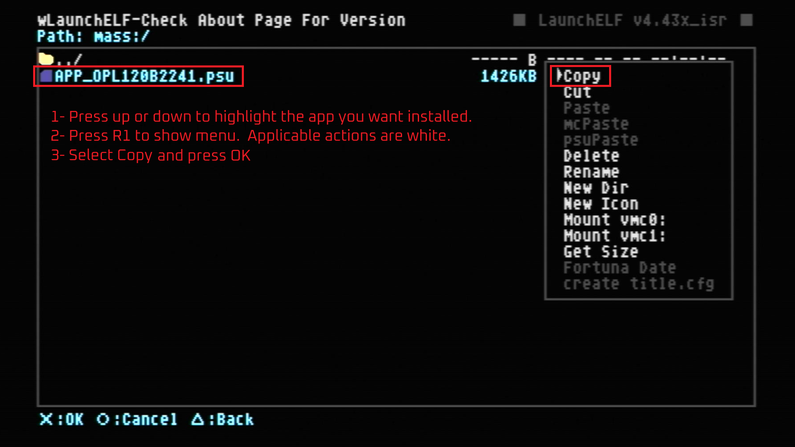{ width="800" data-gallery="tutorial"}

### Step 3: Installing the APP.psu
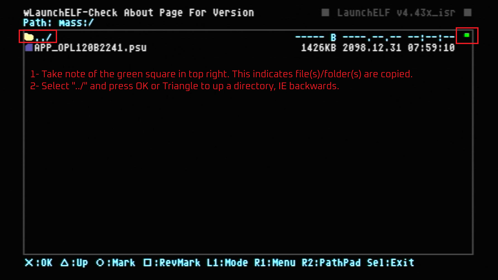{ width="800" data-gallery="tutorial"}

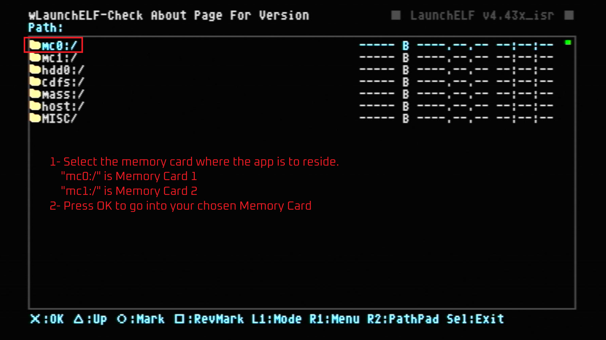{ width="800" data-gallery="tutorial"}

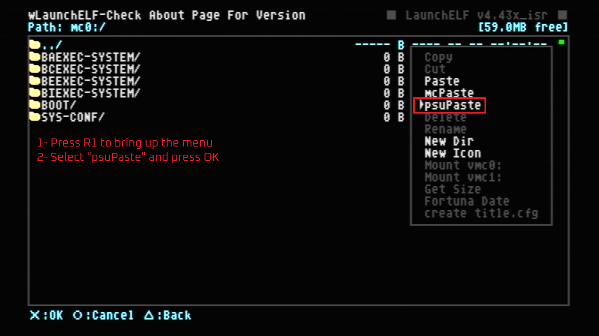{ width="800" data-gallery="tutorial"}

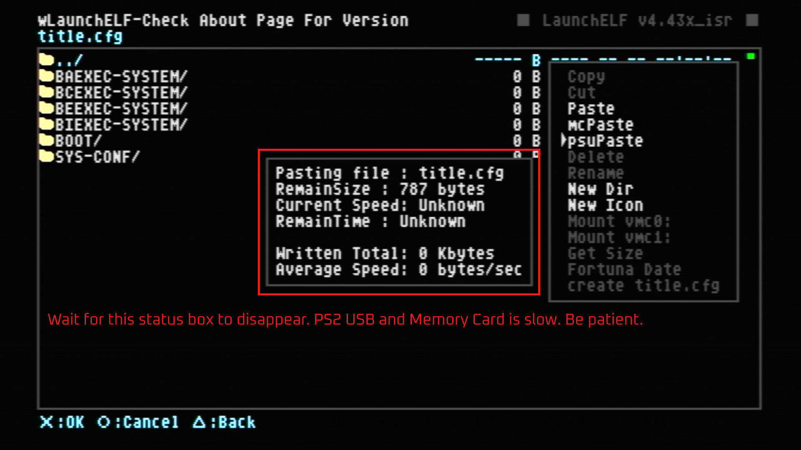{ width="800" data-gallery="tutorial"}

### Step 4: Verifying and understanding wLE icon colors
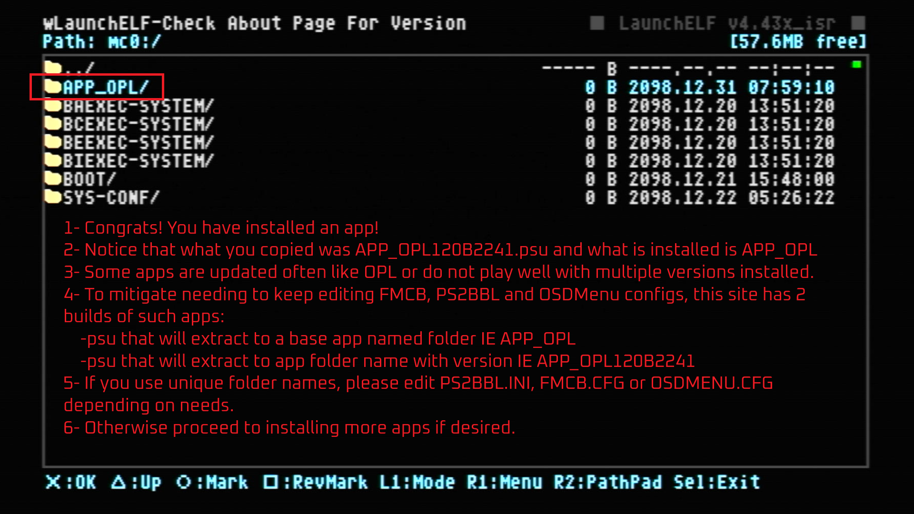{ width="800" data-gallery="tutorial"}

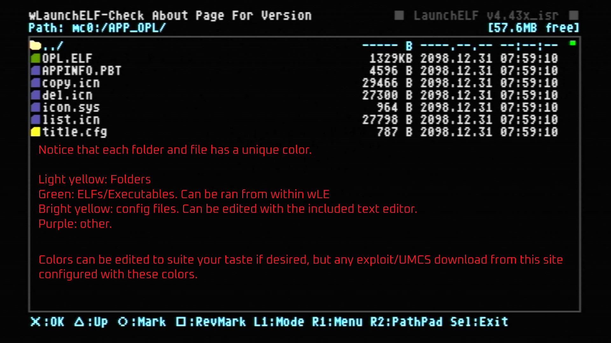{ width="800" data-gallery="tutorial"}

## BONUS: Launching from Browser! (with OSDMenu)
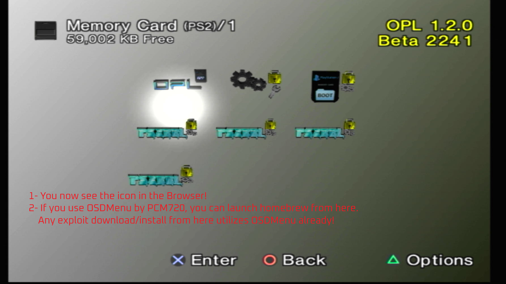{ width="800" data-gallery="tutorial"}

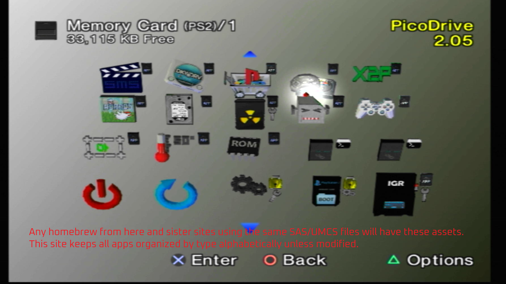{ width="800" data-gallery="tutorial"}

## Badges: indicators next to downloads

-   { width="75" } { width="75" }

    ---

    App follows [SAS](#what-is-sas)/[UMCS](https://ps2homebrewstore.com/umcs/) guidelines and will be PSU Pasted to root of MemCard

-   { width="75" } { width="75" }

    ---

    App follows [SAS](#what-is-sas)/[UMCS](https://ps2homebrewstore.com/umcs/) guidelines and must be "Unzipped", then PSU Pasted to root of MemCard

-   { width="75" } { width="75" } { width="75" } { width="75" }

    ---

    App follows [SAS](#what-is-sas)/[UMCS](https://ps2homebrewstore.com/umcs/) guidelines and must be "Un7zipped", then PSU Pasted to root of MemCard

-   { width="75" } { width="75" }

    ---

    App follows [SAS](#what-is-sas)/[UMCS](https://ps2homebrewstore.com/umcs/) guidelines and must be "UnRARed", then PSU Pasted to root of MemCard

-   { width="75" } { width="75" }

    ---

    App follows [SAS](#what-is-sas)/[UMCS](https://ps2homebrewstore.com/umcs/) guidelines and must be downloaded from source, then PSU Pasted to root of MemCard

-   { width="75" } { width="75" } { width="75" } { width="75" } 

    ---

    App __DOES NOT__ follow [SAS](#what-is-sas)/[UMCS](https://ps2homebrewstore.com/umcs/) guidelines!

    Badge still shows type of download file.

-   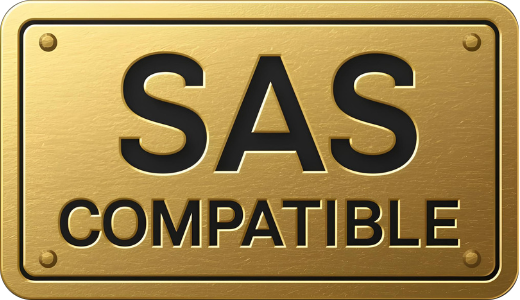{ width="60"}

    ---

    APP lists and launches SAS compatible homebrew. Thanks to each dev that adds this ability!

