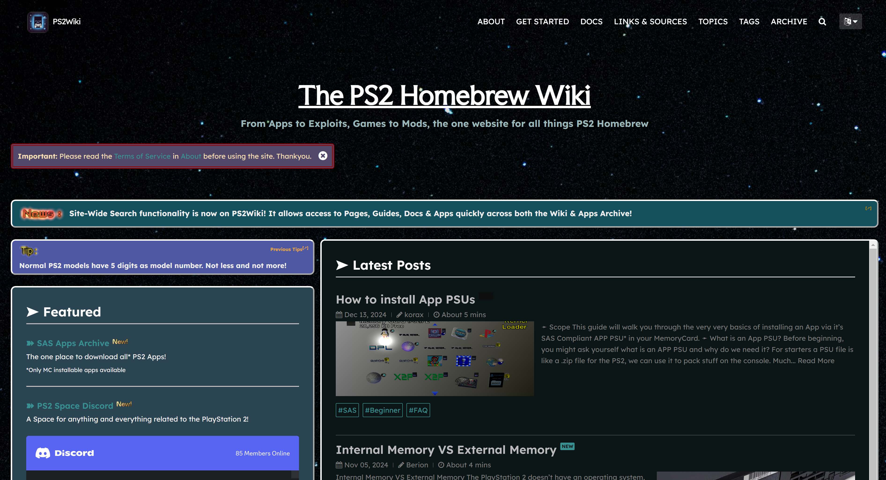
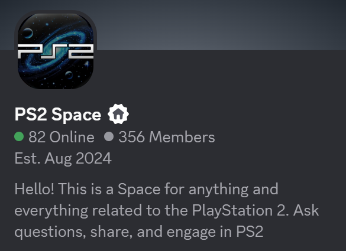
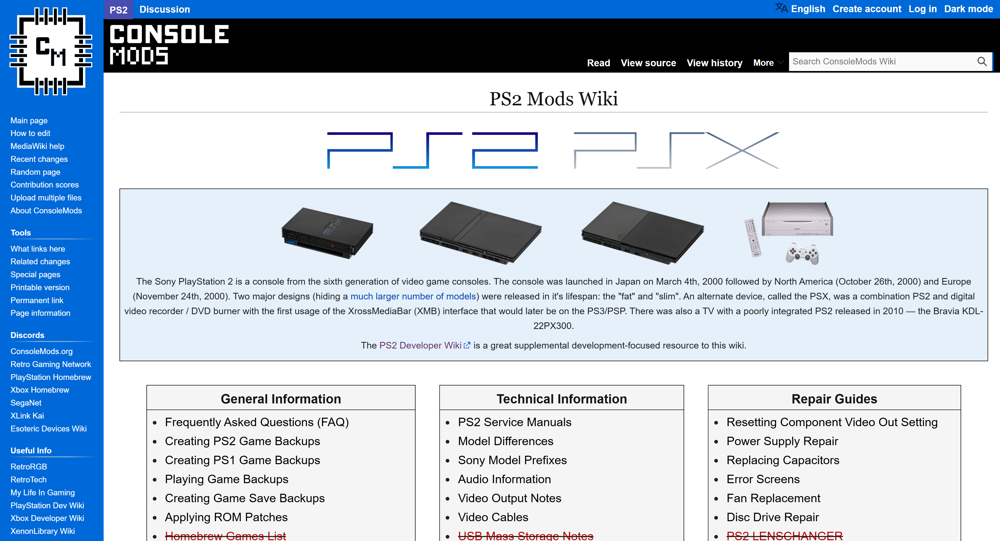
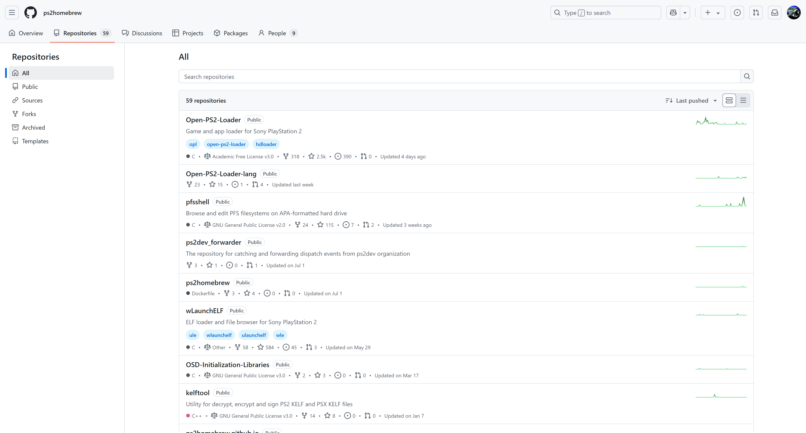

---
hide:
  - navigation
  - toc
---

# Thanks!

-   __PS2 Wiki__

    ---

    [{ height="75" align=middle }](https://ps2wiki.github.io)

    The inspiration for this fork, and the source of team who created such SAS/UMCS structure to make updating and supporting apps easy.

-   __PS2 Modchip Tutorials__

    ---

    [{ height="50" align=middle }](https://ps2modchiptutorials.com)

    Another site that tries to follow such structure, but directed more to the lucky modchip master race.

-   __PS2 Space Discord Server__

    ---

    [{ height="75" align=middle }](https://discord.com/invite/JNEeD77R?utm_source=Discord%20Widget&utm_medium=Connect)

    Discord server full of great people willing to help!

-   __Console Mods__

    ---

    [{ height="75" align=middle }](https://consolemods.org)

    Wiki full of console information

-   __PS2 Dev Wiki__

    ---

    [{ height="75" align=middle }](https://www.ps2devwiki.com)

    Wiki full of PS2 Specific information

-   __PS2 Homebrew Github__

    ---

    [{ height="75" align=middle }](https://github.com/ps2homebrew)

    ps2homebrew is a collection of free tools for the Sony PlayStation 2® videogame system and similar hardware.

## No Thanks to:

!!! danger "No Thanks to:"

    TnA Plastic of r/PS2Homebrew, psx-place.com and PS2 Scene Discord.
