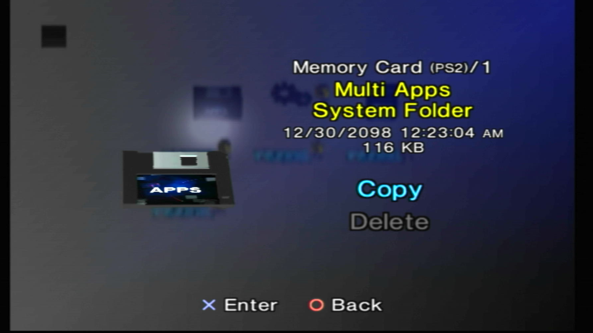
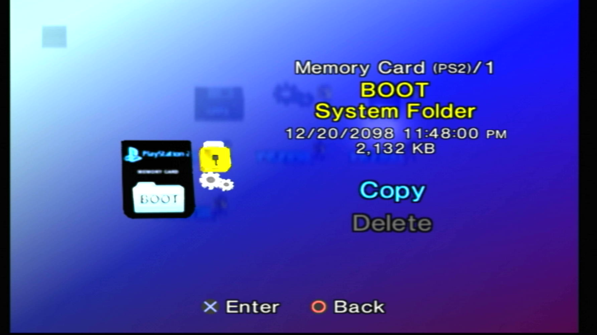
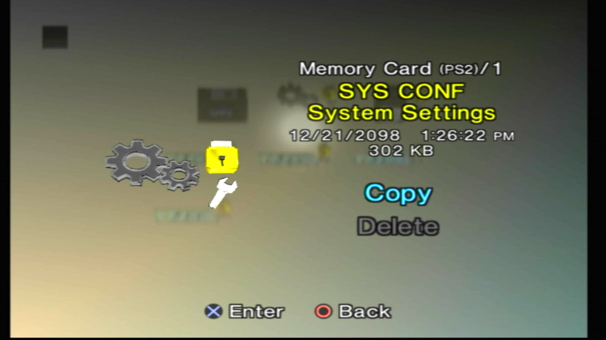

---
hide:
  - navigation
  - toc
---

# Universal Memory Card Structure

Abbreviated UMCS, this aims to provide a very robust structure that works for all exploits and hopefully all modchips that support memory card boot via `mc?:/BOOT/BOOT.ELF`[^1]

This is the core of SAS (Save Application Strucure) so that there is minimal configuration end users need to do to run memory card based exploits.

Should you ever mess up your config, here are backups to restore. Follow the site [tutorial](../site_tutorial/index.md) to restore these files, otherwise if your PS2 still shows the PS2BBL boot logo, try `R1+Start` to boot `mass:/RESCUE.ELF`

!!! tip "RESCUE.ELF"

    Download and Rename [wLE ISR exFAT](https://israpps.github.io/projects/wlaunchelf-isr) to `RESCUE.ELF` and place at root of USB stick.

-   __APPS__

    ---

    

    [:material-cloud-download: APPS](../assets/SAVE-APPLICATION-SYSTEM/APPS.psu)

    - `mc?:/APPS/` used for OpenTuna, Funtuna, Funtuna Fork and possibly more apps. Preferably not used as these all boot `mc?:/BOOT/BOOT.ELF`

-   __BOOT__

    ---

    

    [:material-cloud-download: BOOT](../assets/SAVE-APPLICATION-SYSTEM/BOOT.psu)

    - `mc?:/BOOT/` Where exploits look to boot from. 

        - `BOOT.ELF` PS2BBL hotkeys and autoboot. Used to standardize both for all exploit types.

        - `BOOT2.ELF` wLE ISR exFAT file browser / ELF launcher (Triangle during PS2BBL logo)

        - `osdmenu.elf` OSDMenu hacked OSDSYS (Autoboot if no key is pressed)

        - `ESR.ELF` ESR for running patched backup (in OSDMenu)

-   __SYS-CONF__

    ---

    

    [:material-cloud-download: SYS-CONF](../assets/SAVE-APPLICATION-SYSTEM/SYS-CONF.psu)

    - `mc?:SYS-CONF/` Configuration files for the `BOOT` folder and FMCB

???+ tip "Hotkeys"

    During the PS2BBL logo, you have 4 seconds to activate run these options. On some like R1, it will go down the list till one is found, else exit to OSDSYS.

    { width="800" .on-glb }
    ///caption
    Config @ mc?:/SYS-CONF/PS2BBL.INI and OSDMENU.CNF
    ///

## When is PS2BBL's config called?

```mermaid
graph LR
    A(["PS2 Power On/Reset"]) L_A_B_0@-- "BOOTROM 1.00-2.20" --> B["OSDSYS UPDATE<br>B?EXEC-SYSTEM<br>(PS2BBL/ProtoPwn)<br>./CONFIG.INI <br>DOES NOT EXIST!"]
    A L_A_n1_0@-- "BOOTROM 2.30,2.50" --> n1["OPENTUNA/DEV 1 CHIPS<br>mc?:/BOOT/BOOT.ELF<br>(PS2BBL)<br>./CONFIG.INI <br>DOES NOT EXIST!"]
    n5@{ label: "<pre style=\"font-family:\"><code style=\"font-family:\">mc?:/SYS-CONF/PS2BBL.INI</code></pre>" } -- Config Exists --> n6["AUTOLAUNCH or Hotkeys<br>mc?:/SYS-CONF/PS2BBL.INI"]
    B -- "Fall back to SYS-CONF" --> n5
    n1 -- "Fall back to SYS-CONF" --> n5
    n6 -- "User Exiits/Launches App that calls BOOT/BOOT.ELF<br>IE GSM/ IGR?" --> n7["BOOT/CONFIG.INI <br>DOES NOT EXIST"]
    n7 -- "Fall back to SYS-CONF" --> n5
    n6 --o n10@{ label: "PS2BBL.INI AUTOLAUNCH<br style=\"--tw-scale-x:\"><br style=\"--tw-scale-x:\">1: SYS_OSDMENU<br style=\"--tw-scale-x:\"><br style=\"--tw-scale-x:\">2: SYS_FMCBD-1966<br style=\"--tw-scale-x:\"><br style=\"--tw-scale-x:\">3: SYS_FMCBD-1965<br style=\"--tw-scale-x:\"><br style=\"--tw-scale-x:\">4: SYS_FMCBD-1955<br style=\"--tw-scale-x:\"><br style=\"--tw-scale-x:\">5: BOOT/BOOT2.ELF" }
    B@{ shape: rect}
    n1@{ shape: rect}
    n5@{ shape: proc}
    n6@{ shape: diam}
    n7@{ shape: rect}
    n10@{ shape: subproc}
     A:::Ash
     B:::Rose
     n1:::Ash
     n1:::Aqua
     n1:::Rose
     n5:::Ash
     n5:::Pine
     n6:::Ash
     n6:::Pine
     n7:::Rose
    classDef Ash stroke-width:1px, stroke-dasharray:none, stroke:#999999, fill:#EEEEEE, color:#000000
    classDef Pine stroke-width:1px, stroke-dasharray:none, stroke:#254336, fill:#27654A, color:#FFFFFF
    classDef Aqua stroke-width:1px, stroke-dasharray:none, stroke:#46EDC8, fill:#DEFFF8, color:#378E7A
    classDef Rose stroke-width:1px, stroke-dasharray:none, stroke:#FF5978, fill:#FFDFE5, color:#8E2236
    style A stroke:#00C853,fill:#00C853,color:none
    style B color:#000000
    style n1 color:#000000
    style n10 fill:#FFD600
    linkStyle 0 stroke:#00C853,fill:none
    linkStyle 1 stroke:#00C853,fill:none
    linkStyle 2 stroke:#00C853,fill:none
    linkStyle 7 stroke:#FFD600,fill:none
    L_A_B_0@{ animation: slow } 
    L_A_n1_0@{ animation: slow }
```

[^1]: Modchips usually require the BOOT folder to be in Memory Card Slot 1 (`mc0:/BOOT/BOOT.ELF`) such as Matrix Infinity, DMS3/4, Ghost 2 and Modbo/Mars Pro