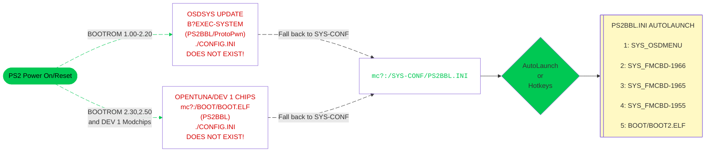

# Universal Memory Card Structure

Abbreviated UMCS, this aims to provide a very robust structure that works for all exploits and hopefully all modchips that support memory card boot via `mc?:/BOOT/BOOT.ELF`[^1]

This is the core of SAS (Save Application Strucure) so that there is minimal configuration end users need to do to run memory card based exploits.

Should you ever mess up your config, here are backups to restore. Follow the site [tutorial](../site_tutorial/index.md) to restore these files, otherwise if your PS2 still shows the PS2BBL boot logo, try `R1+Start` to boot `mass:/RESCUE.ELF`

!!! tip "RESCUE.ELF"

    Download and Rename [wLE ISR exFAT](https://israpps.github.io/projects/wlaunchelf-isr) to `RESCUE.ELF` and place at root of USB stick.

-   __APPS__{ width="75" }

    ---

    

    [:material-cloud-download: APPS](../assets/SAVE-APPLICATION-SYSTEM/APPS.psu)

    - `mc?:/APPS/`  
        Used by OpenTuna, Funtuna, Funtuna Fork and possibly more apps as hotkeys. Hoping to code out OpenTunas hotkeys and bad hardpaths.
    

    - A great place to put apps that do not have icons and define in your hacked OSDSYS config file!

-   __BOOT__{ width="75" }

    ---

    

    [:material-cloud-download: BOOT](../assets/SAVE-APPLICATION-SYSTEM/BOOT.psu), [:material-cloud-download: BOOT MMCE](../assets/SAVE-APPLICATION-SYSTEM/BOOT-MMCE.psu) or [:material-cloud-download: BOOT MX4SIO](../assets/SAVE-APPLICATION-SYSTEM/BOOT-MMCE.psu)

    - `mc?:/BOOT/`  
        Where exploits look to boot from. 

    - `mc:/BOOT/BOOT.ELF`  
        PS2BBL hotkeys and autoboot. Used to standardize both for all exploit types. May have additional MMCE or MX4SIO drivers.

    - `mc:/BOOT/BOOT2.ELF`  
        wLE ISR exFAT file browser / ELF launcher (Triangle during PS2BBL logo)

    - `mc:/BOOT/ESR.ELF`  
        ESR for running patched backup (in OSDMenu)

    !!! info "Pair the BOOT folder with your exploit"

        For consistency, use the correct BOOT, BOOT MMCE or BOOT MX4SIO download for the device you are using, same for the exploit you are using. MMCE downloads have MMCE drivers already. For [exploits that need installs](../exploits/), use the same device driver installer.

-   __SYS-CONF__{ width="75" }

    ---

    

    [:material-cloud-download: SYS-CONF](../assets/SAVE-APPLICATION-SYSTEM/SYS-CONF.psu)

    - `mc?:/SYS-CONF/`  
        Configuration files for the `BOOT` folder other apps that look here.

    - `mc:/SYS-CONF/PS2BBL.INI / PSXBBL.INI`  
        PS2BBL's config file. Supports 9 paths.

    - `mc:/SYS-CONF/LAUNCHELF.CNF`  
        wLE ISRs config file

    - `mc:/SYS-CONF/OSDMENU.CNF`  
        OSDMenu's config file

    - `mc:/SYS-CONF/FREEMCB.CNF`  
        FreeMCBoot's config file

    - `mc:/SYS-CONF/IPCONFIG.DAT`  
        Network config shared between many homebrew apps.

## When is PS2BBL's config called?

!!! info "Landing on your hacked OSDSYS of choice:"

    PS2BBL.INI and PSXBBL.INI have already been setup so that minimal config changes are needed if at all. To land on your hacked OSDSYS of choice, install the OSDMenu/ FMCB Version XXXX as needed. If multiple are installed (such as the MMCE AIO downloads), you can delete in order from first to last to land on the desired app. This is especially useful for modchip users as they may not play well or at all with some or all of the OSDSYS such as I believe Mars Pro. In that case, just delete all of the SYS_OSDMENU and SYS_FMCB-XXXX folders. Modchip users may need to disable chip to do so.

!!! tip "Hotkeys"

    During the PS2BBL logo, you have 4 seconds to activate run these options. On some like R1, it will go down the list till one is found, else exit to OSDSYS.

    { width="800" .on-glb }
    ///caption
    Config @ mc?:/SYS-CONF/PS2BBL.INI and OSDMENU.CNF
    ///

[^1]: Modchips usually require the BOOT folder to be in Memory Card Slot 1 (`mc0:/BOOT/BOOT.ELF`) such as Matrix Infinity, DMS3/4, Ghost 2 and Modbo/Mars Pro