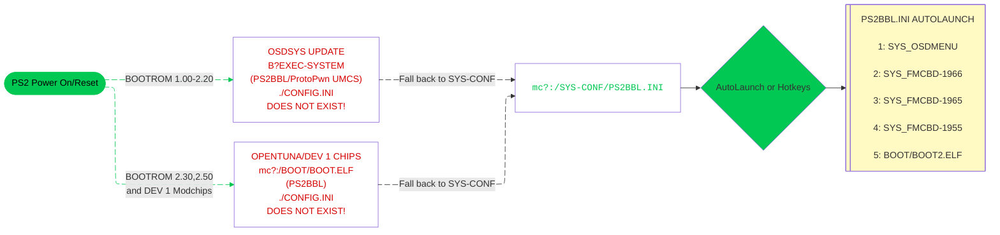

```mermaid
---
config:
  theme: mc
  layout: dagre
  look: classic
---
graph LR
    A(["PS2 Power On/Reset"]) L_A_B_0@-- "BOOTROM 1.00-2.20" --> B["OSDSYS UPDATE<br>B?EXEC-SYSTEM<br>(PS2BBL/ProtoPwn UMCS)<br>./CONFIG.INI <br>DOES NOT EXIST!"]
    A L_A_n1_0@-- "BOOTROM 2.30,2.50<br>and DEV 1 Modchips" --> n1["OPENTUNA/DEV 1 CHIPS<br>mc?:/BOOT/BOOT.ELF<br>(PS2BBL)<br>./CONFIG.INI <br>EXISTS!"]
    B L_B_n2_0@-- "Falls back to SYS-CONF" --> n2["mc?/SYS-CONF/PS2BBL.INI"]
    n1 L_n1_n3_0@-- Falls back to BOOT --> n3["mc?:/BOOT/CONFIG.INI"]
    n2 L_n2_n4_0@-- EXISTS! --> n4["AutoLaunch or Hotkeys<br>"]
    n3 L_n3_n5_0@-- EXISTS! --> n5["AutoLaunch or Hotkeys"]
    n4 --o n6@{ label: "<span style=\"color:\">PS2BBL.INI AUTOLAUNCH</span><br style=\"color:\"><br style=\"color:\"><span style=\"color:\">1: SYS_OSDMENU</span><br style=\"color:\"><br style=\"color:\"><span style=\"color:\">2: SYS_FMCBD-1966</span><br style=\"color:\"><br style=\"color:\"><span style=\"color:\">3: SYS_FMCBD-1965</span><br style=\"color:\"><br style=\"color:\"><span style=\"color:\">4: SYS_FMCBD-1955</span><br style=\"color:\"><br style=\"color:\"><span style=\"color:\">5: BOOT/BOOT2.ELF</span>" }
    n5 --o n7@{ label: "<span style=\"color:\">PS2BBL.INI AUTOLAUNCH</span><br style=\"color:\"><br>1: APP_WLE-ISR-XF<br><br style=\"color:\"><span style=\"color:\">2: SYS_OSDMENU</span><br style=\"color:\"><br style=\"color:\"><span style=\"color:\">3: SYS_FMCBD-1966</span><br style=\"color:\"><br style=\"color:\"><span style=\"color:\">4: SYS_FMCBD-1965</span><br style=\"color:\"><br style=\"color:\"><span style=\"color:\">5: SYS_FMCBD-1955</span><br style=\"color:\"><br style=\"color:\"><span style=\"color:\">6: BOOT/BOOT2.ELF</span>" }
    n4 L_n4_n1_0@-- "User/App calls:<br>mc?:/BOOT/BOOT.ELF" --> n1
    n5 L_n5_n1_0@-- "User/App calls:<br>mc?:/BOOT/BOOT.ELF" --> n1
    B@{ shape: rect}
    n1@{ shape: rect}
    n4@{ shape: diam}
    n5@{ shape: diam}
    n6@{ shape: lin-proc}
    n7@{ shape: lin-proc}
     A:::Ash
    classDef Ash stroke-width:1px, stroke-dasharray:none, stroke:#999999, fill:#EEEEEE, color:#000000
    style A stroke:#00C853,fill:#00C853,color:none
    style B color:#D50000,fill:transparent
    style n1 color:#00C853,fill:transparent
    style n2 color:#00C853
    style n3 color:#00C853
    style n4 fill:#00C853
    style n5 fill:#00C853
    style n6 color:#000000,fill:#FFF9C4
    style n7 fill:#FFF9C4
    linkStyle 0 stroke:#00C853,fill:none
    linkStyle 1 stroke:#00C853,fill:none
    linkStyle 4 stroke:#00C853,fill:none
    linkStyle 5 stroke:#00C853,fill:none
    L_A_B_0@{ animation: slow } 
    L_A_n1_0@{ animation: slow } 
    L_B_n2_0@{ animation: slow } 
    L_n1_n3_0@{ animation: slow } 
    L_n2_n4_0@{ animation: slow } 
    L_n3_n5_0@{ animation: slow } 
    L_n4_n1_0@{ animation: slow } 
    L_n5_n1_0@{ animation: slow }
```

---
hide:
  - navigation
  - toc
---

## When is PS2BBL's config called?

Different optons to present user. This page is not linked on website yet as I figure out best how to present to the end user.

### Option 1

1 Config:

- `mc?:SYS-CONF/PS2BBL.INI`

    - PS2BBL signed exploit, ProtoPwn UMCS, OpenTuna and Dev1 modchips land here

    - Pros

        - Only 1 config to edit, less confusing to users to "follow the path"

        - Every exploit/modchip treated the same

        - Simply "delete" down the list to land on hacked OSDSYS/wLE ISR exFAT

    - Cons

        - Apps such as GSM standalone that dont work with hacked ODSSYS or expect uLE, user will need to press triangle hotkey to get to wLE ISR exFAT @ `mc?:/BOOT/BOOT2.ELF`

        - Mars Pro (DMS4 clone), and other incompatible modchips will need to edit `mc?:SYS-CONF/PS2BBL.INI` as it does not support hacked OSDSYS

### Option 2

2 configs:

- `mc?:SYS-CONF/PS2BBL.INI`

    - PS2BBL signed exploit and ProtoPwn UMCS branch land here

- `mc?:/BOOT/CONFIG.INI`

    - ProtoPwn main branch lands here

    - This config calls `mc?:/APP_WLE-ISR-EXFAT` first for OpenTuna/Modchip Dev1 (if modchip doesnt support OSDSYS updates)

        - Pros: 

            - Apps that don't play well with hacked OSDSYS like GSM standalone

            - Mars Pro (and potentially other bad modchips) get a working starting app
            
            - Just like dropping users to other hacked OSDSYS (OSDMenu/FMCBD-XXXX) simply use MC browser to delete `mc?:/APP_WLE-ISR-EXFAT` which is already `mc?:/BOOT/BOOT2.ELF`

        - Cons: 

            - OpenTuna/Modchip Dev1 treated differently. 

            - OpenTuna users will be confused why they do not get hacked OSDSYS

### Option 3

2 configs:

- `mc?:SYS-CONF/PS2BBL.INI`

    - PS2BBL signed exploit and ProtoPwn UMCS branch land here

- `mc?:/BOOT/CONFIG.INI`

    - ProtoPwn main branch lands here

    - This config calls `mc?:/BOOT/BOOT2.ELF` first for OpenTuna/Modchip Dev1 (if modchip doesnt support OSDSYS updates)

        - Pros: 

            - Apps that don't play well with hacked OSDSYS like GSM standalone

            - Mars Pro (and potentially other bad modchips) get a working starting app

        - Cons: 

            - OpenTuna/Modchip Dev1 treated differently. 

            - OpenTuna/Modchips that support hacked OSDSYS,  users will be confused why they do not get hacked OSDSYS

            - Need to edit `mc?:/BOOT/CONFIG.INI` to choose initial landing app or drop down to different hacked OSDSYS

[^1]: Modchips usually require the BOOT folder to be in Memory Card Slot 1 (`mc0:/BOOT/BOOT.ELF`) such as Matrix Infinity, DMS3/4, Ghost 2 and Modbo/Mars Pro